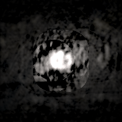

<p align="center">
  
</p>

<h1 align="center">holo</h1>

<p align="center"><b>Holographic computing on FHRR hypervectors</b><br>
data structures · splat scenes · learning · rendering · CRDT sync —
superposed in one complex vector</p>

<p align="center">
  <a href="https://github.com/squatch-stack/hdc-holo/actions/workflows/ci.yml"></a>
  <a href="LICENSE.md"></a>
  <a href="docs/README.md"></a>
  <a href="ROADMAP.md"></a>
  <a href="https://zenodo.org/badge/latestdoi/1347417619"></a>
</p>

Classical application data structures rebuilt as *holograms*: everything
lives superposed in one (or a few) high-dimensional complex64 vectors,
lookups are inner products instead of address decoding, and capacity is a
signal-to-noise budget instead of a table size.

**Start here: [docs/](docs/README.md)** — an architecture map, the one
law to internalize, and one page per proven technique with the math,
measured budgets, failure modes, and evidence figures inline. New
contributors: [CONTRIBUTING.md](CONTRIBUTING.md).

<p align="center">
  <br>
  <sub>A real 519k-splat capture orbited entirely from 135 cell
  bundles — no geometry at render time, no rasterizer: every pixel of
  every frame is one inner product against a complex64 vector.
  Evidence and error bars: <a href="docs/real-scenes.md">real
  scenes</a>.</sub>
</p>

The substrate is FHRR (Fourier Holographic Reduced Representation): a
hypervector is `d` unit phasors `e^{i theta}`. Binding is elementwise
complex multiply (phases add), unbinding by the conjugate is an *exact*
inverse, bundling is addition, and a fixed random permutation tags
order/roles. Two random hypervectors have similarity `0 +- 1/sqrt(2d)` —
the noise floor every structure below trades against: bundling N items
puts crosstalk of std `~sqrt(N/(2d))` under every readout.

## The structures

| Module | Replaces | Mechanism |
|---|---|---|
| `holo/hashmap.py` | hash map | `M = sum bind(K_i, V_i)`; get = unbind key + cleanup |
| `holo/sketch.py` | Bloom filter, count-min sketch | membership/frequency as one inner product against a bundle |
| `holo/record.py` | struct / DB row | role-filler bindings; includes Kanerva's "dollar of Mexico" analogy query |
| `holo/sequence.py` | stack, array/sequence | permutation powers as position tags; destructive pops |
| `holo/ngram.py` | trie / n-gram count table | trigram profiles; 4-language ID with one vector per language |
| `holo/graph.py` | adjacency list | edge set as `sum bind(U, rho(V))`; neighbors by unbinding |
| `holo/fsm.py` | transition table | whole DFA in one vector; step = unbind state & symbol |
| `holo/sdm.py` | RAM itself | Kanerva's Sparse Distributed Memory (1988), the ancestor |
| `holo/field.py` | the repo's namesake | Gaussian splats bundled via fractional power encoding |
| `holo/attribute_field.py` | scene graph / spatial DB | splats carry role-filler payloads; `what_is_at(p)`, `where_is(label)` by pure unbinding |
| `holo/spatial.py` | octree / LOD | per-splat covariance via frequency bands; one bundle per grid cell |
| `holo/phase.py` | — (storage layer) | phase-only + quantized codes: 2x/8x/16x smaller than complex64 |
| `holo/crdt.py` | replication layer | holographic state as CRDTs on [Loro](https://loro.dev) |
| `holo/fit.py` | training loop | the bundle IS a regression weight vector: ridge-fit holograms from data |
| `holo/render.py` | ray marcher | closed-form ray integrals: X-ray views straight out of a bundle |
| `holo/color.py` | color buffers | RGB as three channel bundles on one frequency basis; color fits & renders |
| `holo/orset.py` | delete/undo semantics | observed-remove: deletion as tombstone sets — idempotent, add-wins, stroke undo |
| `live_sync.py` | multiplayer netcode | two OS processes co-paint one scene over TCP via Loro deltas |
| `holo/accel.py` | the GPU | MLX/Metal backend, cos/sin real formulation: encode 37x, decode 106x on an M1 Max, NumPy-identical to 1e-7 |

`holo/field.py` is the bridge to Gaussian splatting: encoding a point as
`e^{i W p}` with frequency rows drawn from `N(0, Sigma^-1)` makes the
inner product of two encodings *equal* the Gaussian kernel (Bochner's
theorem / random Fourier features). A scene of N splats bundles into one
fixed-size complex vector; evaluating the mixture anywhere is a single
inner product. See `out/field_comparison.png` after running the demo.

The spectral strand (`holo/spectral.py`; drivers `run_prototype.py`,
`run_mog.py`) drops the shared-covariance restriction: a splat's hypervector is its
Fourier *spectrum* sampled at the shared codebook, so every splat keeps
its own anisotropic `Sigma` inside one bundle — paid for with an
importance-sampling variance penalty over the single-scale codebook.
`run_mog.py` shrinks that penalty by drawing the codebook from a mixture
of Gaussians spanning the splat-scale range. Complementary to
`holo/spatial.py`'s bands (discrete covariance classes, one bundle each):
bands quantize, the mixture keeps covariance continuous, and the two
compose. Figures land in `results/`.

`holo/capture.py` (driven by `run_real_scene.py`) runs the whole stack
on real captures. The recommended input is the raw Gaussian `.ply`
(INRIA 3DGS layout — what Scaniverse exports from a phone): full
per-splat covariance and color, nothing quantized away, and the best
slice numbers of any format so far (Red Rock, 547k splats: 19%/22%).
The same loaders take iPhone-LiDAR point-cloud `.ply`, antimatter15
`.splat` (Tanks & Temples "train"), and Niantic `.spz` v2 (the Tucson
saguaro scan; parser verified byte-for-byte against nianticlabs/spz).
Each scene: mass-centered crop, four scale bands x chunked cells x
mixture codebooks (reach follows each band's scale cap — the xfine
split is why), color slices against the exact mixture, and
orthographic X-ray views from a dedicated mip encode (blur is covariance
addition; a projection only uses frequencies perpendicular to the view,
so renders need their own dimension budget — and every band's codebook
must reach the *global* scale floor, or needle splats paint herringbone).
See `results/real_redrock.png`, `results/real_scan-tucson.png` and
`..._xray.png`.

[SDK.md](SDK.md) is the charter for packaging the proven parts into a
distributable SDK: the technique inventory with its evidence, the
documented failure modes, the target package shape, and the path to 0.1.
[docs/](docs/README.md) holds one page per proven technique — the math,
the API, the measured capacity budget, the failure modes, and pointers
to the evidence. CI (`.github/workflows/ci.yml`) runs the suite on
Linux with no MLX (the NumPy-fallback proof) and on Apple silicon with
MLX plus a forced-NumPy pass.

## Run it

```bash
python3 -m venv .venv && .venv/bin/pip install -e '.[dev]'
# numpy is pinned <2.0 (OpenBLAS wheels): the Accelerate-backed numpy 2.0
# wheels on macOS corrupt float32 GEMV with heap-dependent NaNs (holo/fit.py)
.venv/bin/hdc-demos                      # all demos, capacity tables
.venv/bin/hdc-demos fsm graph            # a subset
.venv/bin/hdc-demos --dim 16384          # more capacity
.venv/bin/python -m pytest tests/        # correctness suite
```

Extras: `.[crdt]` (Loro replication), `.[viz]` (figures), `.[gpu]`
(MLX/Metal backend, macOS). `run_demos.py` remains as a shim.

The `holo` package is both the SDK surface and the implementation home
(`import holo` — charter-named facade modules `core`, `encode`,
`structures`, `scene`, `query`, `render`, `fit`, `sync`, `storage`,
`backend` over one implementation file per concept). `hdc` is a
compatibility shim re-exporting the same objects — edit `holo/*.py`,
never the shims. Every field/scene/render/fit eval dispatches through
`holo.backend.readout` (and `cell_decode` for chunked scenes): MLX/Metal
when present, an identical cos/sin NumPy path otherwise (~65x at render
scale on an M1 Max, agreeing to float32 rounding).

Every demo prints a capacity curve — accuracy vs. load `N/d` — because
that is the honest engineering story: these structures fail *soft* (noise,
then errors) rather than hard (allocation), and the demos push each one
past its cliff on purpose.

## Replication: superposition is (almost) a CRDT

Bundling is commutative and associative, so replicas can accumulate
holographic state independently and merge in any order — but addition is
not *idempotent*, so redelivered updates would double-count. `holo/crdt.py`
closes the gap with the G-Counter recipe on [Loro](https://loro.dev):
each peer writes only its own running bundle under `container::peer` in a
Loro map, Loro's version vectors make delivery exactly-once, and the
merged hologram is the sum of all peers' blobs — bit-identical on every
replica that has seen the same updates. Two peers can paint halves of a
splat scene offline and delta-sync into one scene (`out/crdt_scene.png`) —
including *attributed* scenes (`ReplicatedAttributeScene`): labels ride
the grow-only registry, so a peer answers `what_is_at` and renders
`where_is` for labels it never used locally. Record payloads are
coordination-free too (`ReplicatedRecordSpace`): the registry carries
only role/filler *names* — hash-derivation supplies the vectors — so any
peer decodes any record, discovering the schema from the registry rather
than agreeing on it out of band.

Two things must be deterministic across peers for this to work with no
coordination: codewords (`FHRR.label_vector` hashes the label into its
vector — a sequential-RNG codebook would assign vectors by creation
order and replicas would silently disagree) and the field frequency
matrix `W` (drawn from the shared space seed). Retraction subtracts an
addend and republishes; that is counter semantics, not observed-remove —
two peers concurrently retracting the same item over-cancel into a
negative phantom. `holo/orset.py` fixes deletion by changing its type:
removals are tombstones in a grow-only set, and the subtraction is
derived once by every reader — so concurrent duplicate removal is
idempotent, a concurrent re-add wins (fresh id, never observed by the
remover), whole epochs (brush strokes) are removed by pure exclusion
(`ORStrokeScene.undo_stroke`), and owners `compact()` tombstones out of
their own blobs. `out/orset_undo.png` shows the contrast: concurrent
double-undo of a stroke, clean under observed-remove, a negative hole
under arithmetic retraction.

Requires `pip install loro`; everything else runs without it.

The sync story runs live: `python live_sync.py` spawns two OS processes
that co-paint one color scene over TCP, exchanging only length-prefixed
Loro delta frames (`HoloReplica.version()` / `updates_since()` — no
access to the peer's doc). Warm strokes come from painter A, cool from
painter B; each stroke is an `ORStrokeScene` epoch, and at the undo
round BOTH painters concurrently undo the same stroke — chosen
independently, tombstoned twice, subtracted once. After 10 rounds both
processes render the merged hologram and print matching state and
render digests (`out/live_sync.png`).

Color is not a symbol but an amplitude: `holo/color.py` gives a scene
three channel bundles sharing one frequency basis, so RGB point queries
reuse the same phasors ((n x d) @ (d x 3)), `render_orthographic`
accepts the (3, d) stack and returns color images (the rainbow trefoil
in `out/color_knot.png` / `.gif`), `HoloRegressor` fits all channels
against one shared factorization (`out/color_photo.png`), and
`ReplicatedColorScene` syncs each channel through the same Loro cells.

Tests are one file per module under `tests/` — see `tests/TESTING.md`
for the suite's rules (concurrent sessions must not share test files).

## Learning and rendering: data in, images out

The readout `f(p) = Re<e^{iWp}, conj(S)>/D` is linear in `S`, so the
bundle is literally the weight vector of a random-Fourier-features
regression model — `holo/fit.py` fits holograms to raw samples of any
target by exact ridge regression (primal or dual/kernel form, whichever
Gram is smaller), with multi-scale frequency bands for broadband targets
like photographs (`out/fit_photo.png`). On a known 200-splat mixture the
fitted `S` beats the forward-built bundle by ~70x held-out RMSE (0.005
vs 0.37) — regression finds the *optimal* vector in the same basis and
corrects crosstalk — and fitting from noisy samples denoises (0.024
under 0.1-sigma sample noise), which forward bundling cannot do. The
fitted vector is a first-class hologram: bind it, chunk it, sync it.

In the other direction, `holo/render.py` exploits that the bundle is the
scene's Fourier transform at random frequencies: by the projection-slice
theorem, the ray integral of the field estimator has a closed form, and
folding one per-frequency slice factor into `conj(S)` turns a whole
orthographic VIEW into just another bundle — every pixel is one inner
product, no ray marching, no depth sorting. `out/ray_render.png` and
`out/ray_render.gif` show a 240-splat trefoil knot rendered from a
single d=16384 vector next to the analytic projection (5-7% RMSE).
Emission/tomography only: occlusion is non-linear and stays out of
superposition's reach. Together the two close the loop:
**fit → store → sync → render**, all on one representation.

## A bug worth keeping

The first version of the FSM and directed graph encoded pairs as plain
`bind(a, b)`. Binding is commutative, so a directed edge couldn't tell
`(u, v)` from `(v, u)` — transitions *into* the queried state aliased
**exactly** (not noisily) to wrong answers, capping FSM accuracy near 67%
where theory predicted ~100%. The fix — permute the codeword filling the
"target" role — is the canonical VSA lesson: unordered composition is
free; *ordered* composition needs a role tag. The docstrings in
`holo/fsm.py` and `holo/graph.py` keep the story.

## Pointers

- Plate, *Holographic Reduced Representations* (FHRR)
- Kanerva, *Sparse Distributed Memory*; *Hyperdimensional Computing* (2009)
- Rahimi & Recht, *Random Features for Large-Scale Kernel Machines*
- Frady, Kleyko, Sommer, *Computing on Functions Using Randomized Vector
  Representations* (vector function architectures — the field encoding here)
- Komer & Eliasmith, Spatial Semantic Pointers
- Kleyko et al., *A Survey on Hyperdimensional Computing aka Vector
  Symbolic Architectures* (parts I & II)

## License

[FSL-1.1-Apache-2.0](LICENSE.md) (the Functional Source License, ALv2
future variant). In plain terms: use, read, modify, and redistribute
freely for anything except offering a competing commercial product or
service; internal use, education, non-commercial research, and
professional services are all explicitly permitted. Each release
automatically converts to plain **Apache-2.0 two years after
publication** — the protection is a fuse, not a wall. Sponsorship and
commercial licensing inquiries: see [ROADMAP.md](ROADMAP.md).
