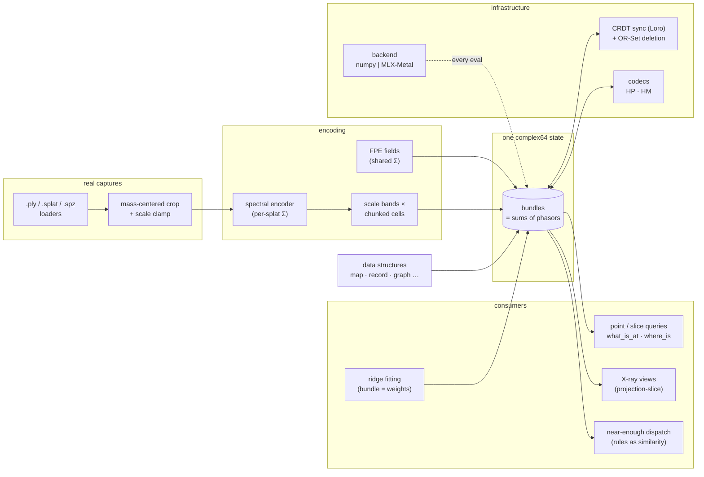

# holo documentation

**Start with [core.md](core.md) and [structures.md](structures.md)** —
the FHRR algebra and the data structures built on it (map, sketch,
record, sequence, ngram, graph, FSM, SDM, dispatch). They need no
captures, no GPU and no CRDT, and they are what most readers came for.
The splat-scene chain below is the flagship demonstration that the same
algebra carries real 3-D data; see the trade-off table in the
[README](../README.md#what-this-is-not) before treating it as a format.

One page per proven technique, per the SDK charter ([`../SDK.md`](../SDK.md)):
each page carries the math, the API, the capacity budget, the failure
modes, and the evidence (figures + tests) inline. A technique gets a
page only once it has a quantitative comparison against ground truth or
theory, a deterministic test, and a documented failure mode.

## The map

## The one law to internalize first

Everything in this SDK stores state as sums of d-dimensional random
unit phasors. Two independent codewords have similarity `0 +- 1/sqrt(2d)`,
so a readout against a bundle of N items sees its target at ~1 and
crosstalk noise of std

    sigma ~ sqrt(N R / (2 d))

where R is the component power of what was bundled (1 for plain
codewords; #fields for records-as-payloads; sum of squared weights for
weighted bundles). Capacity is that signal-to-noise budget — never a
table size. Structures fail SOFT: noise, then errors, no allocation
cliff. Every demo (`holo-demos`) prints the measured curve next to this
prediction; nearby items in dense scenes correlate their noise through
the shared frequencies, inflating sigma by ~1.5-3x over the i.i.d. law.

## Pages

**Foundations**

| Page | Technique | Implementation |
|---|---|---|
| [core.md](core.md) | FHRR algebra, codewords, cleanup | `holo/fhrr.py` |
| [structures.md](structures.md) | classical data structures as holograms | `holo/hashmap.py` … `holo/sdm.py` |
| [backend.md](backend.md) | NumPy / MLX-Metal dispatch | `holo/accel.py` |

**Fields and scenes**

| Page | Technique | Implementation |
|---|---|---|
| [fields.md](fields.md) | splat fields via fractional power encoding | `holo/field.py` |
| [spatial.md](spatial.md) | covariance bands + spatial chunking | `holo/spatial.py` |
| [spectral.md](spectral.md) | spectral encoder + mixture codebooks | `holo/spectral.py` |
| [attributes.md](attributes.md) | attribute & record payloads on splats | `holo/attribute_field.py` |
| [real-scenes.md](real-scenes.md) | real-capture pipeline (.splat/.spz) | `holo/capture.py` |
| [baselines.md](baselines.md) | fidelity per byte vs per-splat codecs | `examples/run_baseline_table.py` |
| [figures.md](figures.md) | how every figure regenerates | `tests/test_figures.py` |

**Learning and imaging**

| Page | Technique | Implementation |
|---|---|---|
| [fit.md](fit.md) | ridge-fitting holograms from data | `holo/fit.py` |
| [render.md](render.md) | closed-form X-ray rendering | `holo/render.py` |

**Applications**

| Page | Technique | Implementation |
|---|---|---|
| [dispatch.md](dispatch.md) | near-enough dispatch: rules as similarity, abstention as policy | `holo/dispatch.py` |

**Collaboration and persistence**

| Page | Technique | Implementation |
|---|---|---|
| [sync.md](sync.md) | CRDT replication on Loro | `holo/crdt.py`, `examples/live_sync.py` |
| [orset.md](orset.md) | observed-remove deletion & undo | `holo/orset.py` |
| [storage.md](storage.md) | phase-only + magnitude codecs | `holo/phase.py` |
| [facts.md](facts.md) | claims registry + stale-claim gate | `holo/facts/` |
| [quality.md](quality.md) | structure rules, lint ratchet, LSP | `holo/quality/` |

## Reading paths

- **"How does any of this work?"** — [core](core.md) →
  [structures](structures.md) → [fields](fields.md).
- **"I have a splat capture."** — [fields](fields.md) →
  [spectral](spectral.md) → [real-scenes](real-scenes.md) →
  [render](render.md).
- **"Multiplayer / offline-first."** — [core](core.md) →
  [sync](sync.md) → [orset](orset.md) → [storage](storage.md).
- **"Learning and fitting."** — [fields](fields.md) → [fit](fit.md).
- **"Rules and routing without Boolean logic."** —
  [core](core.md) → [structures](structures.md) →
  [dispatch](dispatch.md).

[related-work.md](related-work.md) positions the repo against the
literature (arXiv sweep with dates): theory anchors, nearest neighbors,
and which claims still appear to be open — re-swept before any external
claim. Contributor workflow lives in
[../CONTRIBUTING.md](../CONTRIBUTING.md); test-suite rules in
[../tests/TESTING.md](../tests/TESTING.md).
