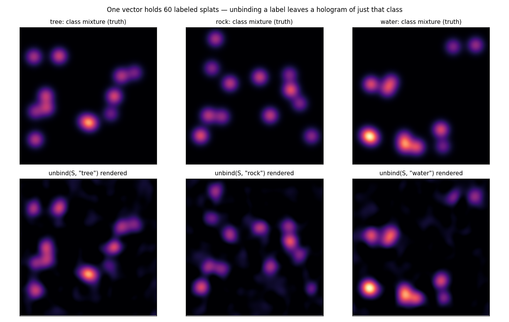
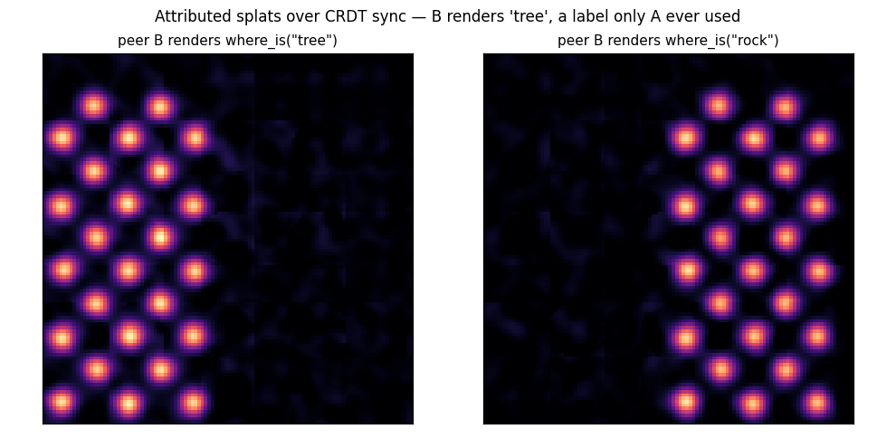

# Attribute and record payloads on splats

*[← docs index](README.md) · fields & scenes*

**What.** Splats that carry meaning: bind each position encoding with a
payload codeword (or a whole role-filler record) before bundling,

    S = sum_k alpha_k * bind(pos(mu_k), A_k),      pos(mu) = e^{i W mu}

and one vector answers three queries by pure algebra:

- `what_is_at(p)`: unbind `pos(p)` — the KERNEL does the addressing
  (only splats covering p vote), cleanup names the winner.
- `where_is(label)`: unbind the label — what remains is a positional
  hologram of ONLY that class, renderable like any field. Semantic
  filtering without a list traversal.
- `is_there(label, p)`: one joint inner product.

With records as payloads the composition goes a level deeper: unbind
the position, then unbind a role — "what COLOR is the thing here?" —
two exact inverses applied to one complex64 vector.

**Budget.** Every query pays `~sqrt(N R/(2d))` where R is the payload's
component power (1 for codewords, #fields for records). The demo's
cliff table: `what_is_at` holds 100% at N=400 splats (d=4096), degrades
through 1600, fails by 6400 — as predicted by the crosstalk column
printed beside it.

**Failure modes.** Overlapping same-class splats reinforce, overlapping
different-class splats split the vote near boundaries; record payloads
multiply R by the field count — budget d accordingly.

**API.**
```python
from holo import FHRR, AttributeSplatField, RecordSpace
space = FHRR(4096, seed=0)
f = AttributeSplatField(space, sigma=0.04)
f.add_splat([0.3, 0.7], "tree")
f.add_splat([0.6, 0.2], RecordSpace(space).encode(
    {"kind": "rock", "color": "gray"}))
f.what_is_at([0.3, 0.7])                 # ('tree', ~1.0)
img = f.eval_positions(f.where_is("tree"), grid_points)
```

**Evidence.** Class-filter renders — unbind a label and a hologram of
just that class remains:



`tests/test_attribute_field.py`; `holo-demos attribute`. Replicated
flavor: [sync.md](sync.md) — remote peers decode records they never
stored:


