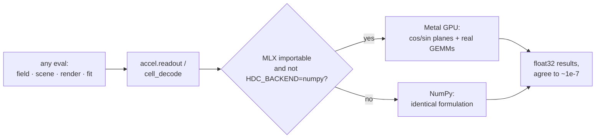

# Compute backend: NumPy / MLX-Metal dispatch

*[← docs index](README.md) · foundations*

**What.** Everything hot in this SDK is two primitives — cos/sin of a
big phase matrix, then real GEMMs — so the whole pipeline runs on any
backend with matmul + trig. Complex arithmetic is deliberately avoided
on the device (Metal's complex64 support is patchy): phasors travel as
cos/sin planes, every complex GEMM becomes two real ones.

Four kernels in `holo/accel.py`:

- `readout(points, W, S)` — the universal field readout
  `Re(E @ conj(S))/d = cos(ph) @ (Re S/d) + sin(ph) @ (Im S/d)`.
  EVERY eval path dispatches through it: splat fields, color scenes, OR
  stroke scenes, attribute holograms, fitted regressors, folded view
  bundles (a render is a readout of `conj(Sv)`).
- `cell_decode(W, points, cells)` — batched masked GEMMs for chunked
  scenes; pass `b = conj(S)/d` per cell and it IS the readout.
- `spectral_bundle` / `decode` — the spectral-strand encode/decode
  pair ([spectral.md](spectral.md)).

Backend selection: MLX on the default device when importable
(`pip install -e '.[gpu]'`); force with `HDC_BACKEND=mlx|numpy`. The
NumPy fallback computes the IDENTICAL real formulation.



**Measured (M1 Max, 24-core GPU).** Kernels: encode 37x, decode 106x at
d=32768. SDK-wide readout at render scale (n=25.6k, d=16384, RGB):
8.2s NumPy -> 0.13s MLX, 65x, max deviation 2.4e-8. The real-scene
pipeline's holographic stages: 13 min -> 24 s. Unified memory: no bus
copies.

**Failure modes / contract.** Public APIs take and return NumPy;
backends must match to float32 rounding (pinned by test, both paths vs
the complex-arithmetic definition).

**Platform precision gotchas** — defaults that silently trade accuracy,
each discovered by tests/bring-up rather than documentation:

- *macOS Accelerate float32 GEMV corruption*: the Accelerate-backed
  numpy 2.0 wheels produce heap-layout-dependent NaNs — hence the
  `numpy<2` pin (OpenBLAS wheels are clean).
- *CUDA TF32 by default* (found on an RTX 5090 during job-runner
  bring-up): fp32 matmuls use TF32 tensor cores on Ampere+/Blackwell,
  costing ~2 orders of magnitude (1e-7 -> ~1e-5 relative). Disable it
  (`torch.backends.cuda.matmul.allow_tf32 = False`; leave `CUPY_TF32`
  unset) or document the lower bar. With TF32 off, the verified
  cross-hardware bench (`bench/holo_bench_job.py`) agrees to 2.5e-8
  across M1 Max Metal, RTX 5090 CUDA, and CPU. Results are reproducible
semantically, not bitwise (~1 ulp between formulations and across
allocations) — see the determinism caveat in `SDK.md`. CI proves
graceful degradation: the Linux job runs the entire suite with no MLX
installed; the macOS job runs it twice, MLX and forced-NumPy.

**API.**
```python
from holo import backend
backend.backend_name()                  # 'mlx-gpu' | 'numpy'
out = backend.readout(points, W, S)     # (n,) or (n, c) float32
```

**Evidence.** `tests/test_accel.py` (matches complex definition,
chunk-invariant, MLX==NumPy when active); every demo's RMSE is
identical on both paths; `.github/workflows/ci.yml`.
