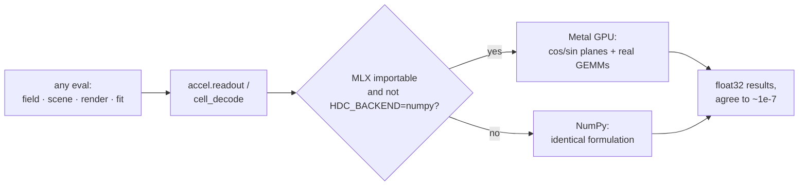

# Compute backend: NumPy / MLX-Metal dispatch

*[← docs index](README.md) · foundations*

**What.** Everything hot in this SDK is two primitives — cos/sin of a
big phase matrix, then real GEMMs — so the whole pipeline runs on any
backend with matmul + trig. Complex arithmetic is deliberately avoided
on the device (Metal's complex64 support is patchy): phasors travel as
cos/sin planes, every complex GEMM becomes two real ones.

Four kernels in `holo/accel.py`:

- `readout(points, W, S)` — the universal field readout
  `Re(E @ conj(S))/d = cos(ph) @ (Re S/d) + sin(ph) @ (Im S/d)`.
  EVERY eval path dispatches through it: splat fields, color scenes, OR
  stroke scenes, attribute holograms, fitted regressors, folded view
  bundles (a render is a readout of `conj(Sv)`).
- `cell_decode(W, points, cells)` — batched masked GEMMs for chunked
  scenes; pass `b = conj(S)/d` per cell and it IS the readout.
- `spectral_bundle` / `decode` — the spectral-strand encode/decode
  pair ([spectral.md](spectral.md)).

Backend selection: MLX on the default device when importable
(`pip install -e '.[gpu]'`); force with `HDC_BACKEND=mlx|numpy`. The
NumPy fallback computes the IDENTICAL real formulation.



**Measured (M1 Max, 24-core GPU).** Kernels: encode 37x, decode 106x at
d=32768. SDK-wide readout at render scale (n=25.6k, d=16384, RGB):
8.2s NumPy -> 0.13s MLX, 65x, max deviation 2.4e-8. The real-scene
pipeline's holographic stages: 13 min -> 24 s. Unified memory: no bus
copies.

**Failure modes / contract.** Public APIs take and return NumPy;
backends must match to float32 rounding (pinned by test, both paths vs
the complex-arithmetic definition). Runtime patching works: `holo/backend.py` and every `hdc/*` shim
resolve through a module `__getattr__` on each access rather than
binding accel's function objects at import, so an out-of-tree backend
that replaces `holo.accel.readout` is picked up by the facades and the
shims immediately. That was a real bug (issue #10) — an out-of-tree
CUDA backend patched in at import time had every facade-routed call
silently stay on NumPy, results still correct and the GPU never
engaged — and it is now pinned by
`tests/test_holo_facade.py::test_runtime_backend_patch_reaches_the_facade_and_the_shim`.

**Which backend ran is recorded.** `HDC_BACKEND=numpy` and MLX/Metal
give different results, so `holo.runlog` captures `backend_name()` in
every heavy run's start record — a measurement that does not say which
one produced it cannot be compared with another.

**The 5090 box is shared, so its clocks are not reproducible.** Five
`holo-bench` runs in one sitting on 2026-08-28 gave bit-identical
checksums — the numerics are genuinely deterministic — while `readout_s`
split 0.1705/0.1707 against 0.3606/0.3675/0.3747, a **2.1x swing**, and
`encode_s` ranged 0.1981-0.6435 (3.2x). A `gpu-probe` at the same moment
showed ~7.4 GB of the card held by another tenant. Checksum and
cross-backend agreement claims from that box are sound; single-run
timings are not. `gpu-probe` is cheap, so record GPU occupancy alongside
any timing you intend to cite rather than inferring load afterwards.

**Platform precision gotchas** — defaults that silently trade accuracy,
each discovered by tests/bring-up rather than documentation:

- *macOS Accelerate float32 GEMV corruption*: the Accelerate-backed
  numpy 2.0 wheels produce heap-layout-dependent NaNs — hence the
  `numpy<2` pin (OpenBLAS wheels are clean).
- *CUDA TF32 by default* (found on an RTX 5090 during job-runner
  bring-up): fp32 matmuls use TF32 tensor cores on Ampere+/Blackwell,
  costing ~2 orders of magnitude (1e-7 -> ~1e-5 relative). Disable it
  (`torch.backends.cuda.matmul.allow_tf32 = False`; leave `CUPY_TF32`
  unset) or document the lower bar. With TF32 off, the verified
  cross-hardware bench (`bench/holo_bench_job.py`) agrees to 2.5e-8
  across M1 Max Metal, RTX 5090 CUDA, and CPU. Results are reproducible
semantically, not bitwise (~1 ulp between formulations and across
allocations) — see the determinism caveat in `SDK.md`. CI proves
graceful degradation: the Linux job runs the entire suite with no MLX
installed; the macOS job runs it twice, MLX and forced-NumPy.

**What Metal can and cannot run** (`bench/precision_battery.py`, B1).
The projection solve stays on NumPy, and the reason is not precision:

| MLX op | GPU |
|---|---|
| `matmul` | ok at float16, float32 and **complex64** — float64 refused |
| `eigh`, `inv`, `solve`, `cholesky`, `qr`, `svd` | **unsupported at every dtype** |

MLX has no GPU linear algebra at all, so the factorisation cannot move
whatever precision it is asked for. What CAN move is applying an
already-built operator, and that is worth doing: at the shapes the
per-cell solve uses, Metal complex64 runs it in 0.396 s against NumPy
float64's 2.657 s — **6.7x** — agreeing to 5.8e-7.

**float32 is enough to apply the operator, and which settings are safe
is calculable in advance.** The full Gram is conditioned 6.3e14 and its
smallest eigenvalue is *negative* (-3.1e-18): it is numerically
rank-deficient, so that number measures noise. What the pipeline
actually inverts is the truncated operator, and its effective
conditioning is what decides the precision:

| operator | kappa_eff | float32 application error |
|---|---|---|
| TSVD keep 25% (shipped) | 3.9e3 / 5.6e4 | 1.4e-5 / 5.2e-5 |
| TSVD keep 10% | 2.3e2 | 8.8e-7 |
| Tikhonov lam=1e-1 | 2.6e3 | 1.2e-4 |
| Tikhonov lam=1e-3 | 2.6e5 | 8.3e-3 |
| Tikhonov lam=1e-6 | 2.6e8 | **0.71 - destroyed** |

`kappa_eff * eps_f32` predicts each row, so a setting can be screened
for float32 safety without running it. Against a slice error of 0.2170
the shipped truncation costs 1.4e-5; lam=1e-6, which wins on saguaro,
cannot be applied in float32 at all.

**Factorising in float32 costs no more than applying in it.** The table
above casts a float64 operator down; computing the operator in float32
to begin with — `eigh` and `inv` themselves in single precision — lands
in the same place: 1.38e-5 at the shipped truncation against the
1.38e-5 of the cast, and 4.9e-5 on the fine band. lam=1e-6 fails the
same way (0.14 to 0.32). So the constraint on moving the whole solve to
a low-precision device is not numerical at all — it is that MLX has no
GPU linear algebra. Somewhere that does (cuSOLVER's `ssyevd`, or MLX on
the CPU) could own the factorisation in float32, which matters because
consumer NVIDIA parts run float64 at a fraction of their float32 rate.

**float16 is out of RANGE here, not out of precision.** Measured spans:
the Gram covers 213-222 decades with **100%** of its nonzero entries
below float16's smallest normal (6.1e-5), and the operator's largest
entry is 4.9e6 — past float16's 65504 ceiling. Naive `complex32`
(2x float16) therefore underflows at one end and overflows at the
other. Giving each block its own exponent fixes exactly that, and at
identical bytes:

| codec | bytes/component | median round-trip error |
|---|---|---|
| BFP16, block 64 | 4 | **1.9e-4** |
| complex32 (2x float16) | 4 | 7.5e-3 |
| HG-8 (`pack_polar`) | 2 | 8.0e-3 |
| HG-4 | 1 | 1.3e-1 |

Block floating point is **39x** more accurate than complex32 for the
same space, and block size barely matters (64 against 256 differs by
3%) — which is why `pack_polar`'s single whole-vector scale already
does most of the work. float32's range covers all of it, so the small
end underflowing is harmless: those entries are Gaussian tails.

**API.**
```python
from holo import backend
backend.backend_name()                  # 'mlx-gpu' | 'numpy'
out = backend.readout(points, W, S)     # (n,) or (n, c) float32
```

**Evidence.** `tests/test_accel.py` (matches complex definition,
chunk-invariant, MLX==NumPy when active); every demo's RMSE is
identical on both paths; `.github/workflows/ci.yml`.
