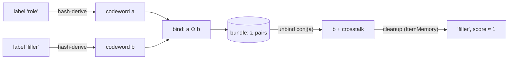

# FHRR algebra

*[← docs index](README.md) · foundations*

**What.** The substrate for everything: a hypervector is `d` unit
phasors `e^{i theta_j}` (complex64). Four operations make it an algebra
for building data structures:

| op | implementation | meaning |
|---|---|---|
| `bind(a, b)` | elementwise multiply (phases add) | associate two things |
| `unbind(a, b)` | multiply by `conj(b)` | EXACT inverse of bind (`|b_j| = 1`) |
| `bundle(...)` | complex addition | superpose many things |
| `Permutation` | fixed random index shuffle, signed powers | tag order / roles |

`sim(a, b) = Re<a, b>/d` reads a bundle: ~1 for a stored item, `0 +-
1/sqrt(2d)` for a random one. `ItemMemory` is the decoder half: a
codebook mapping labels to codewords with nearest-codeword *cleanup*
that snaps noisy vectors back to symbols.



**Determinism contract.** Codewords are hash-derived, never drawn from
sequential RNG state: `FHRR.label_vector(label)` seeds PCG64 from
blake2b(label, keyed by (dim, seed)). Any replica derives the identical
vector for `"alice"` in any creation order — this is what makes
replication coordination-free (see [sync.md](sync.md)), and it is a
compatibility surface: changing the hash, the RNG, or the phase
distribution is a wire-format break. Determinism is *semantic, not
bitwise*: NumPy's complex multiply reproduces only to ~1 ulp across
calls, so compare recomputed vectors with `allclose` and digest only
bytes.

**Two lessons the tests keep.**
- *Role protection*: binding is commutative, so ordered pairs need a
  role tag — a directed edge stored as plain `bind(U, V)` aliases
  `(v, u)` EXACTLY, not noisily. Permute the codeword filling the
  "target" slot (`holo/graph.py`, `holo/fsm.py` docstrings tell the
  original bug story: FSM accuracy capped at 67% where theory said 100%).
- *Capacity is SNR*: bundling N items puts `sqrt(N/(2d))` crosstalk
  under every readout. Margins in tests sit 3-4 sigma inside that.

**API.**
```python
from holo import FHRR, ItemMemory, Permutation
space = FHRR(dim=4096, seed=0)      # (dim, seed) names your universe
a, b = space.label_vector("role"), space.label_vector("filler")
pair = FHRR.bind(a, b)
assert space.sim(FHRR.unbind(pair, a), b) > 0.999
```

**Evidence.** `tests/test_fhrr.py` (exact unbind, quasi-orthogonality,
order-free deterministic codewords); every capacity table in
`holo-demos` is a measurement of the `sqrt(N/2d)` law.
