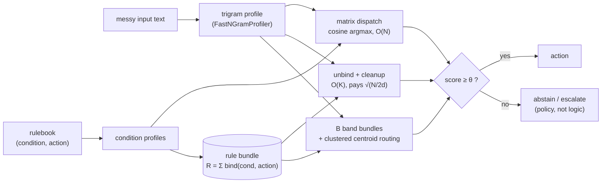

# Near-enough dispatch

*[← docs index](README.md) · applications*

*(implementation: `holo/dispatch.py`, exported via `holo.structures`
and flat off `holo`; demo `hdc-demos dispatch`)*



**What.** A rule engine with no Boolean gates: conditions are
hypervector patterns over messy text, dispatch is similarity, and the
acceptance threshold is *policy* — below it the engine abstains
("route to a human"), an outcome an if-table cannot express. This is
the first *application* built on the SDK's substrate rather than a new
substrate technique: it composes the trigram encoder
([structures.md](structures.md)), bind/bundle/cleanup
([core.md](core.md)), and the banding medicine from spatial chunking
([spatial.md](spatial.md)) — and demonstrates that the capacity law
and its cure transfer unchanged from geometric scenes to rule tables.

Three engines, one algebra:

- **matrix** — cosine of the input's trigram profile against per-rule
  condition profiles, argmax over rules. The shape of an embedding
  "semantic router", but algebraic: deterministic, hash-derived, no
  learned model. Cost O(N) inner products.
- **bundle** — the whole rule table is ONE vector,
  `R = Σ_rules bind(cond̂, action_codeword)`; dispatch is
  `cleanup(unbind(R, input̂))` over the action codebook — K inner
  products regardless of N.
- **banded** — split the table into B bundles (random, or k-means
  clustered so top-r centroid routing consults only bands the query is
  near). The spatial-cells analog for rule space: per-readout load
  drops from N to N/B.

Because bundles add, banded rule tables MERGE: two peers' rulebooks
superpose per band with no coordination — [sync.md](sync.md)'s
writer-sharded recipe applies verbatim, since action codewords are
hash-derived from labels.

```python
from holo import NearEnoughDispatcher, BandedDispatcher

rules = [("balance inquiry account statement", "route-billing"),
         ("password reset locked out login", "route-auth"), ...]
d = NearEnoughDispatcher(rules, dim=4096)
d.dispatch_matrix("cant lgoin — passwrd locked??")   # ('route-auth', 0.61)
d.dispatch_matrix("qwerty zzzz", threshold=0.3)      # (None, 0.08) — abstain
banded = BandedDispatcher(d, n_bands=32, clustered=True)
banded.dispatch("balance stmt pls", top_r=2)         # routes 2 bands only
```

**Budget (capacity is API).** Matrix accuracy is limited only by
condition confusability under corruption — trigram cosine margins, not
any bundle law. Flat-bundle accuracy pays the one law: crosstalk std
`~sqrt(N/(2d))` under every readout, so a flat bundle past its budget
dispatches near-randomly. Banding restores `sqrt((N/B)/(2d))` per
readout, minus a slowly growing max-over-readouts penalty
(`~sqrt(2 ln BK)`). The capacity test pins the cliff and the rescue at
N = d = 1024 (floor 0.71): flat ≤ 0.70 accuracy, 64 bands ≥ 0.87, with
a ≥ 15-hit separation (`tests/test_dispatch.py`).

**Failure modes.** A flat bundle past `sqrt(N/2d)` dispatches
near-randomly — use bands or matrix mode. Clustered routing degrades
toward random-band behavior on rulebooks with *no topic structure*,
exactly the way spatial cells need scenes with spatial locality.
Trigram profiles ignore word ORDER beyond the trigram horizon
("transfer to savings" ≈ "savings to transfer") — order-sensitive
conditions need permuted position tags in the condition encoding
(the sequence recipe in [structures.md](structures.md)).
`FastNGramProfiler` drops non-ASCII characters (near enough for
routing; not for multilingual conditions).

**Evidence** (`hdc-demos dispatch`, d=4096, deterministic seed).
The brittleness cliff — corrupted inputs (typos, one keyword dropped,
distractor words) against a 256-rule book:

| typo rate | exact keyword-AND | matrix | bundle |
|---|---|---|---|
| 0.0 | 0.01 | 1.00 | 1.00 |
| 0.1 | 0.00 | 1.00 | 0.96 |
| 0.3 | 0.00 | 0.97 | 0.75 |

Banding rescues the bundle (typo 0.1): at N=2048 rules, flat 0.94 →
B=32 bands 1.00, clustered top-1 routing 0.99 — the clustered router
answers from ONE band bundle plus 32 centroid probes instead of 2048
rule comparisons. At 4096 rules and d=2048 — flat-bundle floor
exactly 1.00 — flat collapses to 0.44 while clustered top-1 holds
0.98 at 43x less compute than matrix and 64x fewer stored vectors
(`examples/near_enough_rules.py --scale`). Abstention as policy: at θ=0 the matrix engine
answers 100% of heavily-corrupted inputs at 69% precision; θ=0.2
answers 21% of them at 96% precision and escalates the rest — the
threshold moved precision/coverage without touching any rule.

Positioning ([related-work.md](related-work.md)): HDC text
classification and semantic embedding routers exist; the engineered
synthesis — hash-derived determinism, an explicit capacity contract,
abstention as policy, and CRDT-mergeable rule tables — appears open.
