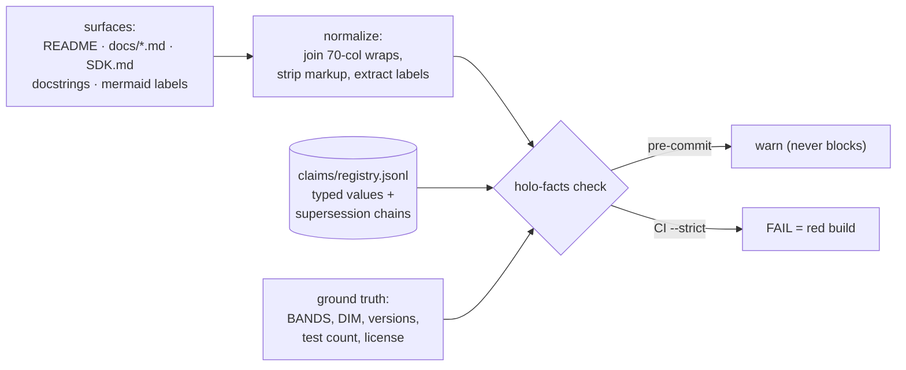

# Facts: the claims registry and stale-claim gate

*[← docs index](README.md) · infrastructure (`holo/facts/`, driver
`holo-facts`)*

**What.** Every measured number this repo states in prose — error
rates, speedups, band counts, capacity laws — is a **registered claim**
in [claims/registry.jsonl](../claims/registry.jsonl): a typed value
with provenance, a supersession chain, and the files that cite it.
`holo-facts check` verifies the prose against the registry, and the
registry against code/tree ground truth (derivations like
`len(capture.BANDS)`), so a number can no longer change in one place
and quietly survive in five others. This system exists because that
happened: docs said "three scale bands" — prose *and* a mermaid label —
after the code moved to four.
<!-- claims: allow capture.bands@0.2.0 -->



**The tiers.** FAIL (blocks CI): a superseded/retracted value outside a
historical context; a cite file stating a different value than the
claim (or dropping it); a missing evidence figure; a registry value
that disagrees with what the tree derives ("the registry is stale, not
the docs"); version skew between `holo.__version__`, CHANGELOG, and
CITATION.cff. WARN (never blocks): floor-form citations lagging >10%,
high-signal numbers registered to no claim, orphan figures, gitignored
evidence. `tests/test_claims.py` runs the same gate under pytest, so
the suite alone catches drift.

**Historical contexts.** Old numbers are data, not errors. Four
mechanisms keep them legal, mirroring conventions the repo already
had: SDK.md's running log is a **dated-record zone** (entries were
correct at their date and are never rewritten); CHANGELOG sections are
version-scoped against each claim's `as_of`; prose carrying a
historical marker ("Historical note", "retraction", …) passes; and
`<!-- claims: allow id@version -->` grants an explicit exception.
Supersession is how values change: the old line becomes
`base.id@<version>` with `status: "superseded"` and stays forever.

**The fuzzy layer (dogfooding, honest math).** One L2-normalized
trigram-profile hypervector per doc chunk
(`holo.dispatch.FastNGramProfiler`, d=2048, seed 0; 274 chunks at this
writing), ranked by `Re(mat.conj() @ q)`, persisted through the SDK's
own HG-8 codec (`pack_polar`; never HP — profiles carry magnitudes)
with a plaintext-free sidecar whose per-chunk sha256 detects a stale
index at read time. It is a *matrix*, never a bundle: at N≈274-900
chunks a flat bundle's crosstalk floor `sqrt(N/(2d))` at d=2048 is
0.26-0.47 — at or above any usable threshold — and with K=N the
bundle's O(K) readout advantage is zero anyway. Our own capacity law
forbids the romantic design. Fuzzy recall is WARN-only in the gate:
trigram cosine cannot distinguish a corrected restatement from a stale
one (measured: the ROADMAP line that *fixes* the license question
scores 0.21 against the retracted claim), so exact value matching owns
the failure decision.

**Calibration (measured on this corpus, `holo-facts calibrate`).**
Signal = each current claim's rendered statement vs its best own-cite
chunk: min 0.295, median 0.392, max 0.485. Noise = the same statements
character-scrambled, best chunk anywhere: median 0.072, p95 0.101, max
0.130. The threshold (0.18, `claims/config.json`) sits in the gap —
~1.8x the noise p95, ~0.6x the weakest signal. Negative result worth
keeping: word-shuffled statements are NOT a noise model — trigram
profiles largely ignore word order, so shuffled probes scored 0.54 at
p95, *above* real signal; noise must scramble characters. The first
calibration run also exposed a chunking defect (consecutive bullets
merged into one 216-line paragraph, which was silently masking the
SDK dated-record zone behind marker proximity) — both fixed, both
test-pinned.

**Failure modes.** The checker sees only registered claims — an
unregistered number drifts freely until someone registers it (the WARN
tier exists to surface candidates). Patterns run over *normalized*
text: a restatement that shares no matchable token with any pattern
(pure paraphrase, digits spelled out in new units) is invisible to the
exact tier — that gap is precisely what the phase-2 fuzzy layer warns
on. Derivations import `holo`; environments that cannot import it
degrade those checks to WARNs rather than failing falsely.

**API.**
```bash
holo-facts check               # warn mode (pre-commit)
holo-facts check --strict      # CI gate: exit 1 on FAIL findings
holo-facts check --strict --fuzzy   # + WARN-only paraphrase probes
holo-facts index               # (re)build the fuzzy chunk index
holo-facts search "query" -k 8 # rank chunks; (abstain) below threshold
holo-facts calibrate           # signal/noise histograms + advice
holo-facts check --json        # machine-readable findings
holo-facts new                 # print a registry line template
git config core.hooksPath .githooks   # opt into the warn hook
```

**The MCP server.** `holo-facts mcp` serves the registry and the fuzzy
corpus to any MCP client over stdio — three Context7-shaped tools:
`search_claims(query, status, limit)` (registry keyword ranking
unioned with fuzzy chunk hits mapped back through cite files),
`get_claim(id)` (record + supersession chain + LIVE derivation + cite
sites with line numbers), and `search_kb(query, limit)` (the same
matrix search over a `knowledge-base` checkout at `HOLO_KB_PATH` or config
`kb_path`; answers honestly when none is configured). The `mcp`
dependency is the `facts` extra and needs Python >= 3.10 — the checker
itself stays 3.9-compatible, and the tool logic lives in
`holo/facts/query.py`, stdlib-tested without the extra.

Register for Claude Code (from a 3.10+ environment with
`pip install 'hdc-holo[facts]'`):

```bash
claude mcp add holo-facts -- holo-facts mcp
```

or per-project in `.mcp.json`:

```json
{"mcpServers": {"holo-facts": {"command": "holo-facts",
  "args": ["mcp"], "env": {"HOLO_KB_PATH": "../knowledge-base"}}}}
```

**Evidence.** `tests/test_claims.py` (registry validity, derivations
vs tree, normalization units incl. the mermaid-label case, historical
mechanisms, and the zero-FAIL-on-HEAD gate); the first run against
HEAD caught real drift: test-count claims at 56/72+/actual, a
"LICENSE: none chosen yet" bullet outliving the license decision, and
a ~1.5-2x/~1.5-3x split on the coherent-noise inflation figure —
each resolved or annotated in the registry.
<!-- claims: allow project.license.open-question -->
