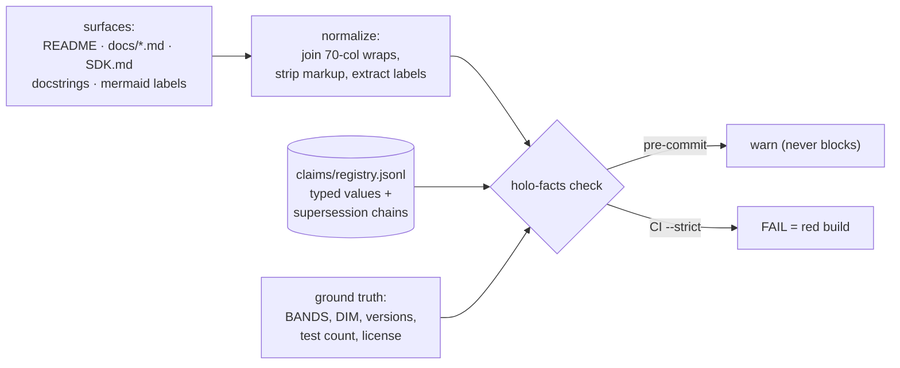

# Facts: the claims registry and stale-claim gate

*[← docs index](README.md) · infrastructure (`holo/facts/`, driver
`holo-facts`)*

**What.** Every measured number this repo states in prose — error
rates, speedups, band counts, capacity laws — is a **registered claim**
in [claims/registry.jsonl](../claims/registry.jsonl): a typed value
with provenance, a supersession chain, and the files that cite it.
`holo-facts check` verifies the prose against the registry, and the
registry against code/tree ground truth (derivations like
`len(capture.BANDS)`), so a number can no longer change in one place
and quietly survive in five others. This system exists because that
happened: docs said "three scale bands" — prose *and* a mermaid label —
after the code moved to four.
<!-- claims: allow capture.bands@0.2.0 -->



**The tiers.** FAIL (blocks CI): a superseded/retracted value outside a
historical context; a cite file stating a different value than the
claim (or dropping it); a missing evidence figure; a registry value
that disagrees with what the tree derives ("the registry is stale, not
the docs"); version skew between `holo.__version__`, CHANGELOG, and
CITATION.cff. WARN (never blocks): floor-form citations lagging >10%,
high-signal numbers registered to no claim, orphan figures, gitignored
evidence. `tests/test_claims.py` runs the same gate under pytest, so
the suite alone catches drift.

**Historical contexts.** Old numbers are data, not errors. Four
mechanisms keep them legal, mirroring conventions the repo already
had: SDK.md's running log is a **dated-record zone** (entries were
correct at their date and are never rewritten); CHANGELOG sections are
version-scoped against each claim's `as_of`; prose carrying a
historical marker ("Historical note", "retraction", …) passes; and
`<!-- claims: allow id@version -->` grants an explicit exception.
Supersession is how values change: the old line becomes
`base.id@<version>` with `status: "superseded"` and stays forever.

**Dogfooding budget (phase 2, honest math).** The fuzzy layer — one
L2-normalized trigram-profile hypervector per doc chunk, ranked by
`Re(mat.conj() @ q)` — is a *matrix*, never a bundle. At the ~600-900
chunks this corpus produces, a flat bundle's crosstalk floor
`sqrt(N/(2d))` at d=2048 would be ~0.42-0.47 — above any usable
threshold, and with K=N the bundle's O(K) readout advantage is zero
anyway. Our own capacity law forbids the romantic design. Fuzzy recall
is WARN-only in the gate: trigram cosine cannot distinguish a
corrected restatement from a stale one, so exact value matching owns
the failure decision.

**Failure modes.** The checker sees only registered claims — an
unregistered number drifts freely until someone registers it (the WARN
tier exists to surface candidates). Patterns run over *normalized*
text: a restatement that shares no matchable token with any pattern
(pure paraphrase, digits spelled out in new units) is invisible to the
exact tier — that gap is precisely what the phase-2 fuzzy layer warns
on. Derivations import `holo`; environments that cannot import it
degrade those checks to WARNs rather than failing falsely.

**API.**
```bash
holo-facts check               # warn mode (pre-commit)
holo-facts check --strict      # CI gate: exit 1 on FAIL findings
holo-facts check --json        # machine-readable findings
holo-facts new                 # print a registry line template
git config core.hooksPath .githooks   # opt into the warn hook
```

**Evidence.** `tests/test_claims.py` (registry validity, derivations
vs tree, normalization units incl. the mermaid-label case, historical
mechanisms, and the zero-FAIL-on-HEAD gate); the first run against
HEAD caught real drift: test-count claims at 56/72+/actual, a
"LICENSE: none chosen yet" bullet outliving the license decision, and
a ~1.5-2x/~1.5-3x split on the coherent-noise inflation figure —
each resolved or annotated in the registry.
<!-- claims: allow project.license.open-question -->
