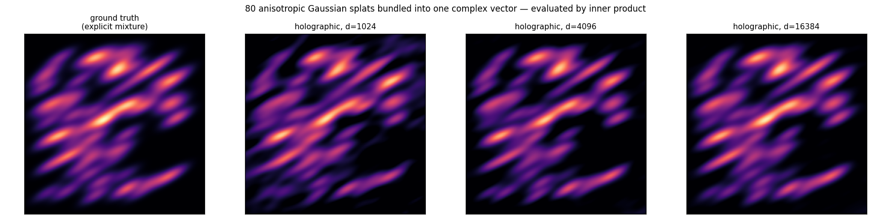

# Splat fields via fractional power encoding

*[← docs index](README.md) · fields & scenes*

**What.** The bridge between hyperdimensional computing and Gaussian
splatting: a continuous point `p` becomes the phasor codeword
`e^{i W p}`, and with frequency rows drawn `w_j ~ N(0, Sigma^-1)`,
Bochner's theorem makes the inner product of two encodings EQUAL the
Gaussian kernel:

    (1/d) Re< e^{i W p}, e^{i W mu} >  ~  exp(-1/2 (p-mu)^T Sigma^-1 (p-mu))

This is Rahimi & Recht's random Fourier features in VSA clothing. A
scene of N splats bundles into ONE fixed-size complex vector
`S = sum_k alpha_k e^{i W mu_k}`; evaluating the whole mixture anywhere
is a single inner product (`accel.readout`).

**Budget.** Per-point Monte Carlo noise `~sqrt(sum alpha_k^2/(2d))` —
error shrinks as `1/sqrt(d)`, verified by test. Overlapping splats share
frequencies, so their noise adds COHERENTLY: dense scenes measure
~1.5-3x the i.i.d. prediction (a 200-splat overlapping mixture at
d=4096 reads at 0.37 RMSE where naive theory says 0.12). Fitting beats
forward bundling here — see [fit.md](fit.md).

**Failure modes.** One shared `W` bakes in one shared `Sigma`
(per-splat covariance needs bands — [spatial.md](spatial.md) — or the
spectral encoder — [spectral.md](spectral.md)); the additive field is
the linear part of splatting only — alpha compositing/occlusion is
outside superposition ([render.md](render.md)).

**API.**
```python
import numpy as np
from holo import GaussianSplatField
field = GaussianSplatField(dim=16384, sigma=np.eye(3) * 0.03**2, seed=0)
field.add_splat([0.5, 0.5, 0.5], alpha=1.0)
values = field.eval(points)          # (n,) — one inner product per point
truth  = field.exact(points)         # analytic mixture, ships in-tree
```

**Evidence.** 80 anisotropic splats, ground truth vs holographic — the
grain fades as `1/sqrt(d)`:



`tests/test_field.py`; `holo-demos field`.
