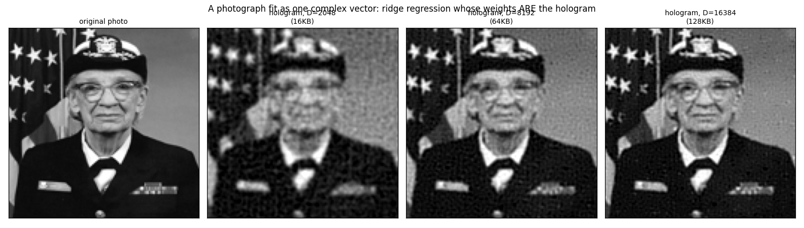

# Ridge-fitting holograms from data

*[← docs index](README.md) · learning & imaging*

**What.** The readout `f(p) = Re<e^{i W p}, conj(S)>/D` is LINEAR in S:
a hologram is the weight vector of a random-Fourier-features regression
model, and the codeword map is the feature map. So S can be FIT to raw
samples `{(p_i, y_i)}` of any target — no splats, no mixture model —
by exact ridge regression. This is the holographic analog of 3DGS's
training loop, except the problem is convex with a closed form.

In real coordinates the features are `[cos(Wp), sin(Wp), 1]` and the
solver picks whichever Gram matrix is smaller:

    primal:  (A^T A + lam n I) theta = A^T y        (features <= samples)
    dual:    theta = A^T (A A^T + lam n I)^{-1} y   (otherwise; same optimum)

Multi-channel targets (RGB) are extra right-hand sides on ONE
factorization. `FrequencyBands` concatenates W blocks at several kernel
scales for broadband targets like photographs.

**Results.** On a known 200-splat mixture, the fitted S beats the
forward-built bundle ~70x on held-out RMSE (0.005 vs 0.37): regression
finds the OPTIMAL vector in the same basis and corrects the coherent
crosstalk that bundling just accepts. Fitting from noisy samples
denoises (0.024 under 0.1-sigma noise) — bundling can't, it never sees
data. Grace Hopper's portrait fits recognizably at D=2048 (equal bytes
to the 128x128 image), improving monotonically with D.

**Where the win stops transferring** (0.2 finding; `fit_cells` in
`holo/capture.py`, `ridge_cell_fit(prior=)` in `holo/accel.py`). The
~70x result above is a sparse-scene, matched-basis outcome; per-cell
fitting of REAL captures behaves differently. (1) Under mixture
codebooks a spectral prior is NECESSARY: naive minimum-norm ridge is
12x worse than forward encoding — energy spreads into the codebook's
finest frequencies and samples are memorized as kernel-width bumps;
with the prior `exp(-1/2 (0.35 cap)^2 |w|^2)` the fit ties forward on
sparse scenes (0.037 vs 0.036). (2) At dense-capture scale the fit is
SAMPLING-LIMITED and loses (saguaro: fitted 0.72/0.53 vs forward
0.52/0.38, with dropout speckle where sampling starved): hundreds of
floor-scale splats per cell need target coverage at their own kernel
width — tens of thousands of samples per cell, beyond the dual solve.
**The analytic L2 projection, measured** (`examples/run_analytic_projection.py`,
issue #2). The sampling limit above is a property of *fitting to
samples*; projecting the exact mixture onto the codebook needs none.
`spectral_bundle` already computes the projection's right-hand side —
it IS the mixture's Fourier transform — so the whole difference from
forward encoding is replacing the diagonal importance weighting with a
Gram solve. Median relative error over the six most populated xfine
cells of the saguaro capture, d=2048:

| objective | interior splats only | whole cell |
|---|---|---|
| forward encoding | 0.1464 | 0.1879 |
| box + TSVD | **0.0273** (5.4x better) | 0.2052 (*worse*) |
| Gaussian window, s = h/2 | 0.0609 | **0.0739** (2.5x better) |

Read those two columns together, because the story is entirely in the
difference. **The box is the better objective and the window is the
usable one.** The box's right-hand side is the whole-space transform,
which is only correct for splats well inside the cell; the exact
box-restricted transform of an anisotropic Gaussian needs the complex
error function, does not separate for non-diagonal covariance, and is
not available in numpy. Real cells hold splats at their boundaries, so
that approximation costs more than the method wins. The window has no
such problem — a Gaussian window times a Gaussian splat is another
Gaussian, so its right-hand side is exact at any splat position, which
is why it barely degrades between the columns (0.0609 -> 0.0739) where
the box collapses (0.0273 -> 0.2052).

**One eigendecomposition serves a whole band**, because both Grams
factorise as `G_c = D G0 D^H` with `D` a unitary diagonal of
cell-centre phases — cell position enters only as a phase, so the
expensive step is per band, not per cell. Measured at production
d=8192: 63 s per band, amortised over thousands of cells.

**Truncation is mandatory, and this is where a smaller study misleads.**
At d=2048 the window is stable at full rank while the box detonates if
under-truncated (0.0273 at keep=1536, 8.6 at 2048), which reads like
the window needing no tuning. It is an artifact of the dimension. At
the production d=8192 the window Gram's condition number is 1.6e20 to
3.2e20 across the four bands — past what float64 can invert — and
solving at full rank returns garbage of order 1e5 rather than a
degraded answer. Keeping **25%** of the spectrum is safe on every band
and sits near the ~3,300 space-bandwidth degrees of freedom a cell of
this size actually supports.

## Through the whole pipeline

The per-cell numbers above are a different quantity from the slice
error the rest of this repo reports. Encoding EVERY cell analytically
and decoding the same evidence slices against the same exact-mixture
referee (`examples/run_projection_pipeline.py`):

| capture | forward encoding | analytic projection | change |
|---|---|---|---|
| saguaro | 0.3501 / 0.2132 | 0.2170 / 0.1367 | **+38.0% / +35.9%** |
| train (dense) | 0.9591 / 0.4948 | **0.3765 / 0.1716** | **+60.7% / +65.3%** |

The gain is **largest on the dense capture** — the case where doubling
`d` bought 2-4% for +600 MB and where orthogonal coupling bought 1.9%
([spatial.md](spatial.md)). Train's top-down slice goes from an error
as large as its signal (0.96) to 0.38.

**What it costs.** Encoding is ~15x slower (770 s against 51 s on
train, dominated by the per-band eigendecomposition and the per-cell
solve). Decode and storage are unchanged: the output is an ordinary
bundle, so everything downstream — codecs, replication, rendering — is
untouched.

Window WIDTH is a real knob and not a forgiving one: s = h/2 gives
0.0739, s = h gives 0.1587, and wider is worse still, because a wide
window weights territory the cell's own splats do not describe.

*Positioning.* This is the classical Fourier extension problem (see
[related-work.md](related-work.md)) with the smooth-window variant
being the partition-of-unity method familiar from meshfree
approximation. Our frequencies are RANDOM (mixture-drawn) rather than a
lattice, so the plunge structure smears — but the Adcock-Huybrechs
frames theory covers arbitrary frames, and the stability guarantees
survive. Not promoted to the SDK surface: this is a measured spike, and
`SDK.md`'s charter wants a deterministic test and a documented failure
mode before an API exists.

**Failure modes.** The finest band must stay >= the sample spacing or
the model memorizes training points and rings between them (train PSNR
47dB, test 17dB — the classic signature); lam is a real knob in the
interpolation regime (features > samples). Platform: NumPy is pinned
<2.0 because macOS Accelerate float32 GEMV corrupts with heap-dependent
NaNs — the OpenBLAS wheels are clean (`holo/fit.py` NOTE).

**API.**
```python
from holo import FrequencyBands, HoloRegressor
bands = FrequencyBands(dims=[1024, 2048, 4096, 9216],
                       sigmas=[0.12, 0.04, 0.016, 0.008], ndim=2, seed=0)
reg = HoloRegressor(bands).fit(points, values, lam=1e-2)  # values (n,) or (n,c)
pred = reg.eval(anywhere)     # the fitted S is a first-class hologram
```

**Evidence.** A photograph fit as one complex vector:



The per-cell real-scene comparison (the honest negative at density):


`tests/test_fit.py` (recovers-from-samples, beats-bundle, denoises,
multichannel); `holo-demos fit color`.
