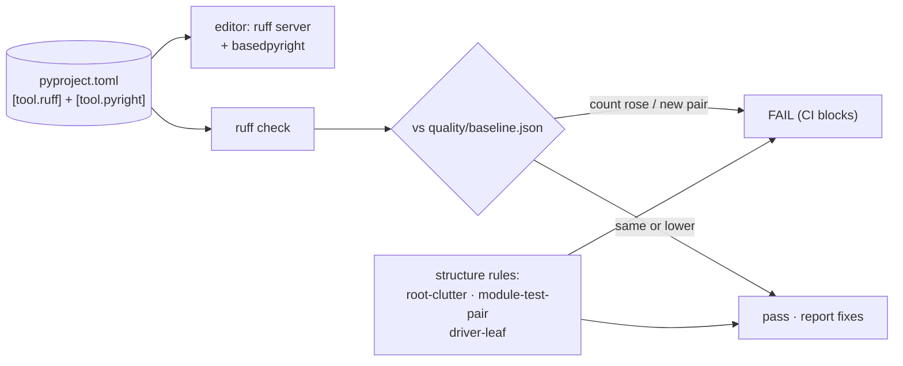

# Quality: structure rules, the lint ratchet, and the language server

*[← docs index](README.md) · infrastructure (`holo/quality/`, driver
`holo-quality`)*

**What.** Three things that keep a multi-session repo from silting up:
project-structure rules that are checked rather than merely written
down, a lint gate that can only ever tighten, and a language-server
setup so an editor shows the same opinions the gate holds. Install the
tooling with `pip install -e '.[quality]'` (ruff, kuzu); the core SDK
stays stdlib+numpy.



**The ratchet, and why not a clean sweep.** Adopting a linter into an
existing codebase offers two bad choices: block on all 291 existing
violations, or report forever and change nothing.
`quality/baseline.json` records the count of every *(file, rule)* pair
at adoption; `holo-quality check` fails only when a count **rises** or
a new pair appears. Existing debt is frozen and visible, new debt is
impossible, and paying debt down is a deliberate act (`ruff check
--fix`, then `holo-quality baseline` — which should only ever record a
decrease). The baseline is keyed by file and rule, never by line
number: lines churn constantly, counts do not.

**Rules that are wrong here, and are OFF rather than baselined.** A
baseline full of rules the project deliberately violates trains people
to ignore the gate. So `[tool.ruff.lint]` disables, with reasons in
the config: `N803/N806` (the domain language is mathematical — `W` is
the frequency matrix, `S` a bundle), `PLC0415` (lazy imports are
load-bearing: every optional extra is imported inside the function
that needs it), `UP031/UP032` (house style is %-formatting, applied
consistently), `RUF001-003` (docstrings are prose and use typographic
characters), `PLR2004` (numeric code compares against literals
constantly). Complexity is capped at **10** (`C901`), arguments at 8.

**Structure rules** (`holo/quality/structure.py`), each a written
convention that drifted anyway:

- `root-clutter` (FAIL) — the root is metadata, config, and entry
  documents. Exactly one `.py` may live there, the `hdc_splat` shim;
  drivers belong in `examples/`.
- `module-test-pair` (WARN) — `tests/TESTING.md` requires one test
  file per module: `holo/foo.py` ↔ `tests/test_foo.py`. Facades are
  exempt; their implementation's tests are the coverage.
- `driver-leaf` (FAIL) — nothing in `holo/` may import from
  `examples/`, or an example becomes a dependency of the library it
  demonstrates.

**The language server.** `[tool.pyright]` in `pyproject.toml`
configures **basedpyright** (types, hover, go-to-definition, rename;
it bundles its own node, so there is no system dependency), and
`ruff server` supplies diagnostics, import sorting, and formatting
from the same `[tool.ruff]` rules the gate uses — one config source,
so the editor and CI never disagree. Type checking is intentionally
*not* in CI: this codebase is untyped by design, and gradual typing is
a separate decision to make deliberately rather than by accident.

```bash
pip install -e '.[quality]' basedpyright   # basedpyright is opt-in
ruff server                                # LSP: diagnostics + format
basedpyright --outputjson holo             # one-shot type report
```

Editors: VS Code — the Ruff and BasedPyright extensions read this
`pyproject.toml` with no further settings. Neovim/Helix/Zed — point
their LSP config at `ruff server` and `basedpyright-langserver
--stdio`.

**Failure modes.** The ratchet is blind to violations that move
*between* files (delete a bad line in `a.py`, write it in `b.py`, and
the new pair is caught — but a same-file swap of one rule for another
nets out only if both rules already have entries). Structure rules see
placement, never intent: they cannot tell a well-named driver from a
misfiled library module. And a baseline regenerated carelessly locks
in whatever exists at that moment — the only legitimate reason to run
`holo-quality baseline` is to record a decrease.

**API.**
```bash
holo-quality check        # structure + ratchet (CI and the hook run this)
holo-quality structure    # layout rules only
holo-quality lint         # ratchet only, with the debt total
holo-quality baseline     # re-record debt (only ever to shrink it)
```

**Evidence.** `tests/test_quality.py` — ratchet semantics on synthetic
counts (increase fails, new pair fails, decrease reports as an
improvement), baseline round-trip and sorted keys, both FAIL rules
caught on synthetic trees, and the repo checked against its own rules.
Adoption numbers: 291 violations across 187 (file, rule) pairs, after
disabling six rule families as wrong-for-this-codebase and fixing the
nine violations the gate found in its own implementation.
