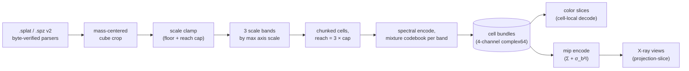

# Real-capture pipeline

*[← docs index](README.md) · fields & scenes*

*(implementation: `holo/capture.py`, exported via `holo.scene`;
example driver `run_real_scene.py`)*

**What.** The whole stack pointed at real pretrained Gaussian-splatting
scenes: antimatter15 `.splat` (Tanks & Temples "train") and Niantic
`.spz` v2 (the Tucson saguaro capture, ~519k splats). Both parsers are
byte-verified against the reference implementations (`.splat`: 32
B/splat pos/scale/RGBA/quaternion; `.spz` v2: gzip, 24-bit fixed-point
positions, log-encoded scales, sigmoid alpha — byte counts must match
the header exactly).

The encode composes three documented techniques: the spectral encoder
([spectral.md](spectral.md)) so every splat keeps its own anisotropic
covariance; a mixture-of-Gaussians codebook per band with the finest
component AT the global scale floor; and three scale bands x chunked
cells ([spatial.md](spatial.md)) with reach = 3x the band's scale cap,
so query crosstalk follows LOCAL density, not N_total. Channels are
premultiplied color (`alpha, alpha*R, alpha*G, alpha*B`) so decoded
slices render in color; ground truth is the exact mixture evaluated
cell-locally; slice planes sit at the mode of the alpha-weighted mass
histogram.

**Rendering real scenes.** X-ray views ([render.md](render.md)) come
from a DEDICATED mip encode — blur is covariance addition, so the mip
is just fatter splats — because a projection uses only the spectrum
slice perpendicular to the view and needs its own dimension budget.

**Performance.** The holographic stages ran 13 min on NumPy and 24 s
with the MLX backend ([backend.md](backend.md)) — the pipeline that
motivated the GPU work.

**Failure modes.** Every band's codebook must reach the GLOBAL scale
floor or needle splats paint herringbone ([spectral.md](spectral.md));
mass-centered cropping matters (captures put most splats in a shell of
background); projections without a mip encode are noise-dominated.

**Evidence.** The Tucson saguaro capture (519k splats), color slices
against the exact mixture:

X-ray projections straight from the cell bundles, with the mip level
they target:

The same scan orbited entirely from 135 cell bundles — no geometry at
render time ([render.md](render.md)):

Tanks & Temples "train" through the same fixed pipeline:
`results/real_train.png`, `results/real_train_xray.png` (the
superseded pre-fix figure showing the herringbone failure mode is
preserved as `results/failure_herringbone.png` —
[spectral.md](spectral.md)). Per-cell fitting comparison:
[fit.md](fit.md), `results/real_fit.png`.
