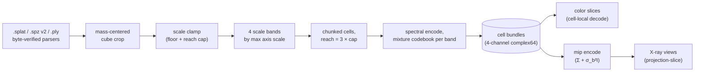
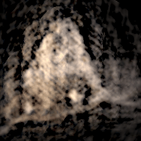
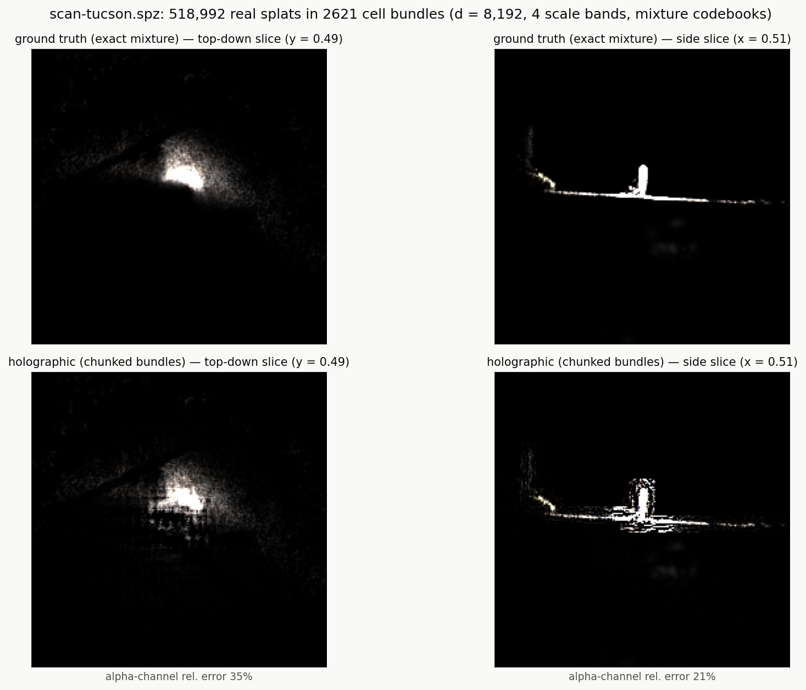
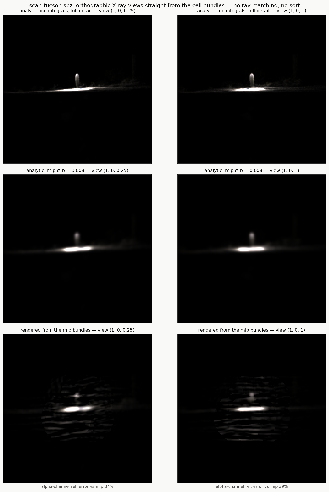

# Real-capture pipeline

*[← docs index](README.md) · fields & scenes*

*(implementation: `holo/capture.py`, exported via `holo.scene`;
example driver `examples/run_real_scene.py`)*



**What.** The whole stack pointed at real pretrained Gaussian-splatting
scenes. The *recommended* interchange is the raw Gaussian `.ply` (the
INRIA 3DGS layout: SH DC color, sigmoid opacity, log scales, wxyz
quaternions — what Scaniverse exports straight from a phone): it
carries full per-splat covariance and color with nothing quantized
away, and it produced the best Gaussian-capture numbers so far (Red
Rock, below). The same loaders take `.ply` point clouds (iPhone
LiDAR, encoded as density-matched isotropic splats), antimatter15
`.splat` (Tanks & Temples "train"), and Niantic `.spz` v2 (the Tucson
saguaro capture, ~519k splats — note `.spz` stores 24-bit fixed-point
positions and log-encoded scales, i.e. a lossy export of the same
scene the raw `.ply` keeps exact). All parsers are byte-verified
against reference implementations or synthetic-bytes tests
(`.splat`: 32 B/splat pos/scale/RGBA/quaternion; `.spz` v2: gzip,
24-bit fixed-point positions, log-encoded scales, sigmoid alpha —
byte counts must match the header exactly). Loaders normalize every
format to one y-up world: 3DGS `.ply` and `.splat` arrive in the
COLMAP-style y-down convention and are rotated 180° about x on load
(positions AND per-splat rotations — a covariance-congruence test
pins it); `.spz` and LiDAR clouds are already y-up.

## Interop: export, compress, view

`save_ply` and `save_spz` are the bridge back OUT — anything this
pipeline loads, crops, cleans, or merges can flow into the standard
display chain. `examples/run_viewer.py` renders any of it in real time
([examples/viewer](../examples/viewer/index.html), Spark/three.js
from CDN, occlusion-correct compositing — the display complement to
the X-ray *evidence* renderer, which deliberately stays linear):

```bash
python examples/run_viewer.py data/iphone/redrock.ply    # any .ply/.spz/.splat
```

**What a "raw" capture actually contains** (Red Rock, measured):
681,748 splats x 62 float32 = 161 MB, but the precision is not
uniform. Higher-order spherical harmonics occupy **73% of the file**
while carrying **9.9% of the color energy** (view-dependent shine);
the `nx/ny/nz` normals are **all zero** — 8 MB of nothing. And the
capture app already quantized before export: only **208 distinct
scale values** and **252 distinct alphas** across 682k splats, i.e.
u8 grids inside float32 containers. A raw 3DGS PLY is a *lossless
container*, not a high-precision measurement.

**What compression costs.** That anatomy is why SPZ is nearly free
here: `save_spz` writes SPZ v2 (24-bit fixed-point positions, log-u8
scales, u8 color/alpha, u8 rotations) at **10.3 MB — 16.4x smaller**
than the PLY, and the field it reconstructs differs from the original
mixture by **0.04-0.07% relative error** (exact-mixture referee,
20k-splat subsample). The quantization grid mostly lands on values
the capture had already rounded to. The honest losses: higher-order
SH is dropped (SPZ v2 is DC-only — the 9.9% view-dependent term), and
rotation error grows as ~grid/w for rotations near 180 degrees (an
intrinsic property of storing xyz and recovering w). Both are
test-pinned; both are invisible in the viewer side by side.

Beyond SPZ, the ecosystem's tools take over:
[splat-transform](https://github.com/playcanvas/splat-transform)
(SOG — ~95% smaller via image-coded attribute grids — plus LOD chunks
and standalone HTML viewers), [SuperSplat](https://superspl.at) for
hand editing, engine plugins for Unity/Unreal. Note the layering:
those formats compress *per-splat attribute arrays*, while
[storage.md](storage.md)'s HP/HM/HG codecs compress *holographic
bundles* — different representations, complementary jobs.

Round trips are test-pinned: `save_ply` -> `load_ply` is lossless to
float32 rounding (verified on the full 682k-splat capture);
`save_spz` -> `load_spz` reproduces splats on the format's
quantization grid.

The encode composes three documented techniques: the spectral encoder
([spectral.md](spectral.md)) so every splat keeps its own anisotropic
covariance; a mixture-of-Gaussians codebook per band with the finest
component AT the global scale floor; and four scale bands x chunked
cells ([spatial.md](spatial.md)) with reach = 3x the band's scale cap —
the xfine/fine split exists because reach follows the cap — so query
crosstalk follows LOCAL density, not N_total. Channels are
premultiplied color (`alpha, alpha*R, alpha*G, alpha*B`) so decoded
slices render in color; ground truth is the exact mixture evaluated
cell-locally; slice planes sit at the mode of the alpha-weighted mass
histogram.

**Rendering real scenes.** X-ray views ([render.md](render.md)) come
from a DEDICATED mip encode — blur is covariance addition, so the mip
is just fatter splats — because a projection uses only the spectrum
slice perpendicular to the view and needs its own dimension budget.

**Performance.** The holographic stages ran 13 min on NumPy and 24 s
with the MLX backend ([backend.md](backend.md)) — the pipeline that
motivated the GPU work.

**Failure modes.** Every band's codebook must reach the GLOBAL scale
floor or needle splats paint herringbone ([spectral.md](spectral.md));
mass-centered cropping matters (captures put most splats in a shell of
background); projections without a mip encode are noise-dominated.

**Evidence.** Red Rock — a raw Scaniverse 3DGS `.ply` export off a
phone, 547k splats after crop, through the fixed pipeline. The best
Gaussian-capture slice numbers so far (19%/22%), from the format that
keeps every splat exact:


Red Rock orbited entirely from 189 cell bundles — no geometry at
render time (`examples/run_turntable.py --crop 0.5 --elev 0.7`; phone scans of
a single subject concentrate their mass in a small core, so the
turntable wants a tighter crop than the slice evidence):



The Tucson saguaro capture (`.spz`, 519k splats), color slices against
the exact mixture:



X-ray projections straight from the cell bundles, with the mip level
they target:



The same scan orbited entirely from 135 cell bundles — no geometry at
render time ([render.md](render.md)):


An iPhone LiDAR room cloud (291k points as density-matched isotropic
splats) decodes at 22%/30% with sub-second slices:
`results/real_lidar-dense.png`.

Tanks & Temples "train" through the same fixed pipeline:
`results/real_train.png`, `results/real_train_xray.png` (the
superseded pre-fix figure showing the herringbone failure mode is
preserved as `results/failure_herringbone.png` —
[spectral.md](spectral.md)). Per-cell fitting comparison:
[fit.md](fit.md), `results/real_fit.png`.
