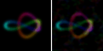

# Closed-form X-ray rendering

*[← docs index](README.md) · learning & imaging*

**What.** The bundle IS the scene's Fourier transform sampled at random
frequencies — so the projection-slice theorem applies, and the ray
integral of the field estimator has a closed form:

    integral_0^T e^{i w.(o + t v)} dt = e^{i w.o} (e^{i (w.v) T} - 1)/(i (w.v))

Fold the per-frequency slice factor `F_j = (e^{i a_j T}-1)/(i a_j)`,
`a_j = w_j . v` (with `F -> T` as `a -> 0`), into `conj(S)` once per
view direction and **a whole view is just another bundle**: every pixel
is one inner product with an ordinary point codeword on the image
plane. No ray marching, no depth sampling, no sorting. Color rides as
stacked channel bundles through the same product.

**Budget.** `|F_j| <= min(T, 2/|a_j|)`: frequencies steep along the
view are suppressed, so only the ~perpendicular slice of the spectrum
carries signal — renders are noisier than point queries at equal d.
Measured: a 240-splat trefoil renders at 5-7% RMSE from one d=16384
vector (128KB); real scenes need dedicated mip encodes with their own
dimension budget ([real-scenes.md](real-scenes.md)).

**Failure modes.** Emission/tomography only: line integrals are linear,
occlusion is not — alpha compositing's ordered transmittance product is
outside superposition, permanently. `exact_projection` (analytic
ground truth) assumes isotropic Sigma.

**API.**
```python
from holo import render_orthographic, exact_projection
img = render_orthographic(field.S, field.W, view=[1, 1, 0],
                          center=[.5, .5, .5], half_width=0.45,
                          res=160, t_extent=1.6)   # (res,res) or (res,res,3)
truth = exact_projection(field.splats, field.sigma_inv, [1, 1, 0],
                         [.5, .5, .5], 0.45, 160)
```

**Evidence.** X-ray views of a 240-splat trefoil straight from one
d=16384 vector, next to the analytic projection:




A real capture orbited entirely from its cell bundles — 519k splats,
135 cells, no geometry at render time (gamma-0.5 tone map; the
display-quality gap is occlusion, which is outside superposition —
structural evidence, not eye candy):


`tests/test_render.py` (matches analytic; zero-frequency limit is `T`,
not 0/0); `holo-demos render color`; `examples/run_turntable.py`.
