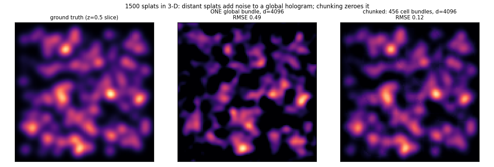
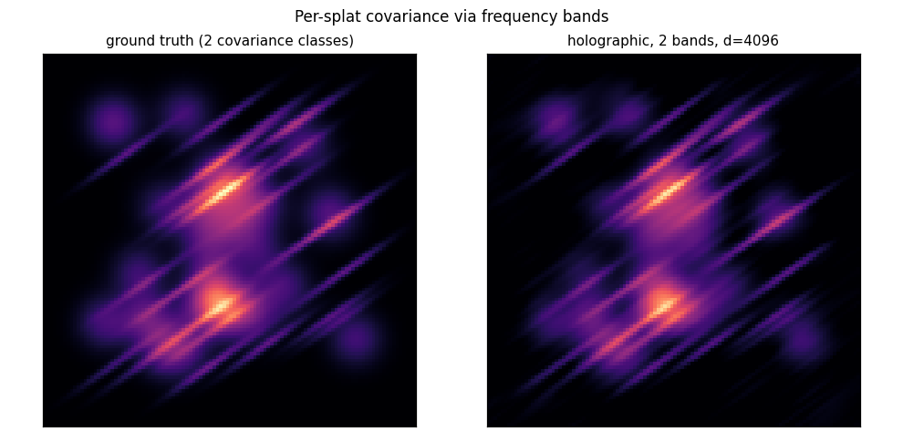

# Covariance bands and spatial chunking

*[← docs index](README.md) · fields & scenes*

**What.** Two spatial organizations layered on the FPE field.

*Bands* (`MultiBandSplatField`): per-splat covariance, quantized. Each
band has its own `W ~ N(0, Sigma_b^-1)` and its own bundle; a splat
lands in the band matching its covariance; a query costs one inner
product per band. The continuum limit (every splat its own Sigma) is
the spectral encoder ([spectral.md](spectral.md)).

*Chunking* (`ChunkedSplatField`): one bundle per occupied grid cell. A
Gaussian kernel is ~zero a few sigma out, but in a single global bundle
every distant splat still contributes FULL-POWER noise to every query.
Chunking makes distant crosstalk exactly zero: a query consults only
cells whose box lies within `reach` of the point.

**Budget.** Chunked crosstalk is `sqrt(N_local/(2d))` instead of
`sqrt(N_total/(2d))`: 1500 splats in 456 cells at d=4096 reads at 4.7%
of peak where the global bundle reads at 19.5% — 4.2x lower error for
~9 consulted cells per query. The honest trade: at EQUAL total bytes a
single giant-d bundle is statistically stronger, but every query and
update then touches the whole hologram; cells keep compute, mutation,
and replication local (a cell is the CRDT sync unit — [sync.md](sync.md)).

**Failure modes.** Bands quantize covariance (a splat between bands
takes the nearest); cell size must exceed the kernel reach or queries
consult many cells; per-cell GPU dispatch is batched through
`accel.cell_decode` to amortize launches.

**API.**
```python
from holo import ChunkedSplatField, MultiBandSplatField
mb = MultiBandSplatField(4096, [sigma_broad, sigma_needle], seed=0)
mb.add_splat(mu, alpha, band=1)
ch = ChunkedSplatField(4096, sigma, cell_size=0.125)
ch.add_splat(mu, alpha); ch.eval(points)
```

**Evidence.** Global-bundle noise soup vs the clean chunked slice —
distant crosstalk zeroed by locality:





`tests/test_spatial.py` (chunked beats global at equal d);
`holo-demos spatial`.
