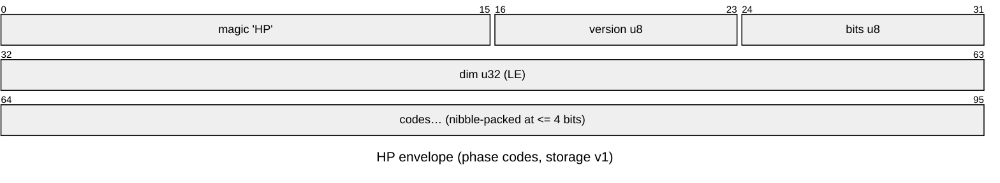
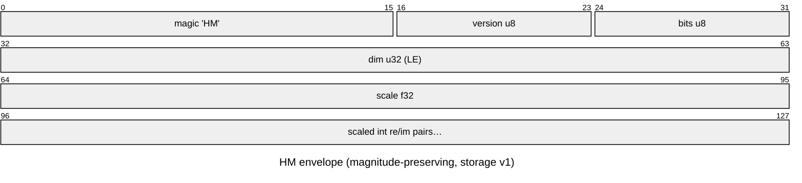

# Phase-only and quantized storage

*[← docs index](README.md) · collaboration & persistence*

**What.** An FHRR *codeword* is all phase — unit magnitude by
construction — so complex64 (8 bytes/dim) wastes half its bits. Store
angles instead:

| format | bytes/dim | vs complex64 | fidelity |
|---|---|---|---|
| float32 phases | 4 | 2x | lossless in practice |
| uint8 codes (256 levels) | 1 | 8x | sim ~0.9997 |
| 4-bit codes (16 levels) | 0.5 packed | 16x | sim ~0.994 |

Quantization to b bits adds uniform phase noise of std
`(2pi/2^b)/sqrt(12)`, scaling similarity by `~1 - sigma^2/2` — nearly
free even at 4 bits, which is why phasor VSAs suit analog and photonic
hardware where phase precision is physically limited.

**The asymmetry that matters.** A *bundle* is different: superposition
gives components varying magnitudes, and phase-projecting a bundle
discards real information. Measured on a HoloMap: quantized-to-uint8
bundles retrieve identically to full complex64 at moderate load and
diverge only near the capacity cliff. Quantize codewords freely; think
before phase-projecting bundles.

**Failure modes.** Magnitude loss near the cliff (above); the (bits,
level-mapping) pair is a compatibility surface — which is why persisted
codes go through the tagged envelope, never raw arrays.

**Width is validated on both sides, because it used to wrap in silence.**
Codes ride in uint8/int8 at <= 8 bits and uint16/int16 above, so 16 is the
widest this layer can represent. Past that the cast wrapped with no error:
on a 1024-component bundle, 17-bit round-tripped at 1.051 relative and
24- and 32-bit at 1.000 — output carrying none of the input. Asking for
MORE precision returned garbage. `bits=0` divided by zero into NaN behind
a RuntimeWarning. All three codecs now refuse anything outside [1, 16].

The decode side is checked too, and that is the half that matters for
replication: `bits` is read back OUT of the header, so on a blob that
arrived from a peer it is untrusted input. A forged width is refused
rather than decoded — the whole point of the tagged envelope.

Width buys bytes in three steps, not smoothly: <= 4 bits nibble-pack, 5-8
take a byte, 9-16 take two. So 5, 6 and 7 bits cost exactly what 8 costs,
and 9 through 15 cost what 16 costs — pick the top of each step. Below 4
bits there is no rate point at all without a sub-nibble packer.

**Format tags (storage v1).** `pack`/`unpack` wrap the codes in an
8-byte `HP` header (version, bits, dim) and nibble-pack two codes per
byte at <= 4 bits — a 4-bit codeword really is dim/2 bytes on disk.
Untagged or foreign bytes are refused; layout changes bump
`STORAGE_VERSION`. `quantize`/`dequantize` remain the raw-array layer
for in-memory use.





**The magnitude-preserving codec (`HM`).** The rate-distortion curve
(`hdc-demos codec`, `out/codec_curve.png`) shows the two tasks SPLIT:
symbol retrieval survives phase-only codes spectacularly (3-bit d=4096
reaches 100% retrieval in 2KB — 16x fewer bytes than complex64), but
amplitude FIELDS floor at ~0.24 relative RMSE at any bit depth, because
a weighted mixture's signal lives in component magnitudes and the
projection — not the quantization — is the loss. `pack_complex`/
`unpack` fix this with scaled signed-integer re/im (`HM` header:
version, bits, dim, float32 scale): 8-bit re/im MATCHES complex64's
field fidelity at 4x fewer bytes on synthetic bundles; 4-bit halves
that again and still beats equal-byte phase codes. (The measured
per-codec rules, refined on real capture bundles, are at the end of
this page.)

**The gamma-companded polar codec (`HG`).** HM's residual weakness at
low bits is dynamic range: linear re/im with max-scaling spends most
levels on the magnitude distribution's tail. `pack_polar(v, bits,
gamma=0.5)` codes each component in polar form — magnitude through a
compressive power curve, phase uniformly — at the same bytes as HM per
bit depth (`HG` header adds the gamma; shipped as a NEW magic because
v0.1.0 froze HM's layout). On synthetic demo bundles the field tasks
tie (crosstalk dominates quantization there); real capture bundles are
where the codecs separate.

**Measured on real capture bundles** (saguaro, 4 premultiplied
channels at d=8192; `examples/run_codec_capture.py`, ~120s).
Round-tripping every cell bundle and decoding the evidence slices,
against the exact mixture (top-down / side):

| codec | bytes/cell | of c64 | vs ground truth | drift |
|---|---:|---:|---|---:|
| complex64 | 262,144 | 1.00x | 0.350 / 0.213 | — |
| HM-8 | 65,568 | 0.25x | 0.345 / 0.211 | 0.094 |
| HG-8 | 65,568 | 0.25x | 0.350 / 0.213 | 0.010 |
| HM-4 | 32,800 | 0.13x | 0.347 / 0.223 | 0.414 |
| HG-4 | 32,800 | 0.13x | 0.384 / 0.232 | 0.134 |

**HG-8 is the faithful codec**: drift vs the uncompressed decode 0.010
where HM-8 drifts 0.094 at identical bytes, and against ground truth it
is indistinguishable from complex64.

**HM-4's "accidental denoiser" has largely evaporated, and the reason
is instructive.** These numbers are post-reach-split; the earlier
measurement (pre-split: HM-4 0.502/0.342 against an uncompressed
0.522/0.379, with a 987x dynamic range) recorded a truncation that beat
the uncompressed decode on BOTH axes. After the split the fine band's
dynamic range is 28x rather than 987x, and HM-4 now wins only the
top-down slice (0.347 vs 0.350) while losing the side (0.223 vs 0.213).
Those old figures were correct at their date — see SDK.md's log — but
they described a band configuration that no longer exists, which is why
this page now carries the table rather than a headline.

What the effect pointed at was real, though, and taking it deliberately
recovers far more than the accident ever did — see
[the shrinkage denoiser](#denoising-before-you-persist) below.

**The refined rules**: `HP` for codeword/symbol stores. `HG-8` when
fidelity TO THE BUNDLE is the contract — fitted holograms, mid-edit
sync payloads, anything still being computed with, and anything already
denoised. `HM-4` only where bytes dominate and a single-axis
ground-truth score is the goal; on current bands it is no longer a free
win.

## Denoising before you persist

A forward-encoded bundle carries crosstalk that a fitted one would not,
and more dimension does not remove it. Shrinkage does: `holo.shrink`
thresholds components in magnitude with phase preserved, and on the
saguaro capture **soft shrinkage at the 25th magnitude percentile
reaches 0.298 / 0.203 against the unshrunk 0.350 / 0.213** — a 14.8%
improvement on the top-down slice and 4.8% on the side, better on both
axes than anything in the table above, and better than HM-4's accident
ever was.

Soft against hard is regime-dependent, which is worth stating because
the naive reading is that soft is simply better. Where signal is sparse
and strong against weak noise there is a real gap to cut at and hard
wins; where magnitudes OVERLAP — the capture case, because a mixture
codebook weights frequencies unequally and leaves no gap — hard
discards signal along with noise and soft wins (0.298/0.203 against
hard's 0.344/0.209 at the same threshold). Both directions are pinned
by test.

**Denoise then persist.** The two compose without interference: shrink
first, then HG-8, and the codec preserves the gain exactly
(0.298/0.203 at 0.25x bytes). Shrinking into HM-4 instead gives back
most of what shrinkage won (0.339/0.230) — 4-bit quantization
re-introduces error of the same order that was just removed, so pair
shrinkage with the faithful codec, not the lossy one.

**Failure mode.** Past its optimum shrinkage trades the slice axes
against each other: on this capture the top-down slice keeps improving
out to the 60th percentile (0.320 hard / 0.237 soft) while the side
slice degrades from the 25th onward. Sweep against your own evidence
slices and prefer the setting that improves every axis over the one
that improves the headline.

```python
from holo import shrink, percentile_threshold
S = shrink(S, percentile_threshold(S, 25))     # soft is the default
```

The measured rate-distortion curve behind the HP/HM/HG split:


**API.**
```python
from holo.storage import pack, unpack, quantize, dequantize
buf = pack(bundle, bits=8)                # tagged: 8 + dim bytes
approx = unpack(buf)                      # back to complex64
codes = quantize(bundle, bits=8)          # raw-array layer (in-memory)
```

**Evidence.** `tests/test_phase.py` (round-trip similarity; 8-bit
bundle still retrieves 200 pairs perfectly; envelope sizes and foreign-
byte refusal); `holo-demos phase` prints the accuracy-vs-load table for
all four formats side by side.
