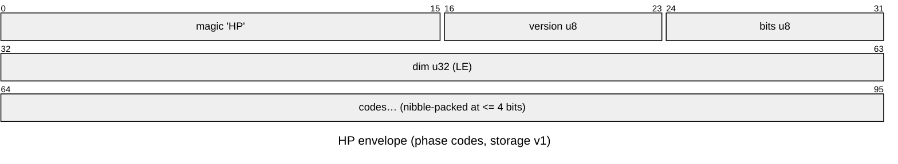
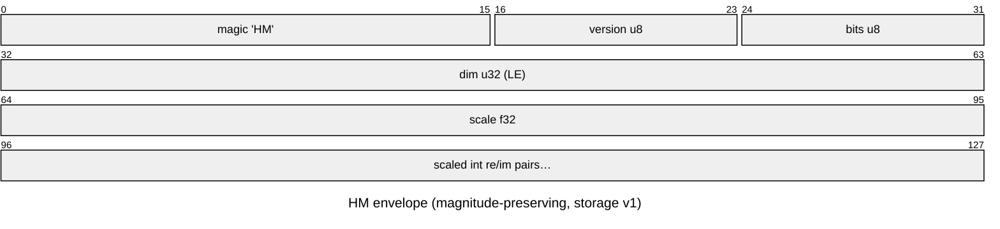

# Phase-only and quantized storage

*[← docs index](README.md) · collaboration & persistence*

**What.** An FHRR *codeword* is all phase — unit magnitude by
construction — so complex64 (8 bytes/dim) wastes half its bits. Store
angles instead:

| format | bytes/dim | vs complex64 | fidelity |
|---|---|---|---|
| float32 phases | 4 | 2x | lossless in practice |
| uint8 codes (256 levels) | 1 | 8x | sim ~0.9997 |
| 4-bit codes (16 levels) | 0.5 packed | 16x | sim ~0.994 |

Quantization to b bits adds uniform phase noise of std
`(2pi/2^b)/sqrt(12)`, scaling similarity by `~1 - sigma^2/2` — nearly
free even at 4 bits, which is why phasor VSAs suit analog and photonic
hardware where phase precision is physically limited.

**The asymmetry that matters.** A *bundle* is different: superposition
gives components varying magnitudes, and phase-projecting a bundle
discards real information. Measured on a HoloMap: quantized-to-uint8
bundles retrieve identically to full complex64 at moderate load and
diverge only near the capacity cliff. Quantize codewords freely; think
before phase-projecting bundles.

**Failure modes.** Magnitude loss near the cliff (above); the (bits,
level-mapping) pair is a compatibility surface — which is why persisted
codes go through the tagged envelope, never raw arrays.

**Format tags (storage v1).** `pack`/`unpack` wrap the codes in an
8-byte `HP` header (version, bits, dim) and nibble-pack two codes per
byte at <= 4 bits — a 4-bit codeword really is dim/2 bytes on disk.
Untagged or foreign bytes are refused; layout changes bump
`STORAGE_VERSION`. `quantize`/`dequantize` remain the raw-array layer
for in-memory use.





**The magnitude-preserving codec (`HM`).** The rate-distortion curve
(`hdc-demos codec`, `out/codec_curve.png`) shows the two tasks SPLIT:
symbol retrieval survives phase-only codes spectacularly (3-bit d=4096
reaches 100% retrieval in 2KB — 16x fewer bytes than complex64), but
amplitude FIELDS floor at ~0.24 relative RMSE at any bit depth, because
a weighted mixture's signal lives in component magnitudes and the
projection — not the quantization — is the loss. `pack_complex`/
`unpack` fix this with scaled signed-integer re/im (`HM` header:
version, bits, dim, float32 scale): 8-bit re/im MATCHES complex64's
field fidelity at 4x fewer bytes on synthetic bundles; 4-bit halves
that again and still beats equal-byte phase codes. (The measured
per-codec rules, refined on real capture bundles, are at the end of
this page.)

**The gamma-companded polar codec (`HG`).** HM's residual weakness at
low bits is dynamic range: linear re/im with max-scaling spends most
levels on the magnitude distribution's tail. `pack_polar(v, bits,
gamma=0.5)` codes each component in polar form — magnitude through a
compressive power curve, phase uniformly — at the same bytes as HM per
bit depth (`HG` header adds the gamma; shipped as a NEW magic because
v0.1.0 froze HM's layout). On synthetic demo bundles the field tasks
tie (crosstalk dominates quantization there); real capture bundles are
where the codecs separate.

**Measured on real capture bundles** (saguaro fine band: 1624 cells,
d=8192, 4 premultiplied channels; `run_codec_capture.py`, ~60s). The
dynamic-range prediction holds: cell-bundle |S| spans p99.9/p50 =
987x. Round-tripping every bundle and decoding the evidence slices:

- **HG-8 is the faithful codec**: drift vs the uncompressed decode
  0.013, where HM-8 drifts 0.124 at identical bytes; against exact
  ground truth HG-8 is indistinguishable from complex64.
- **HM-4 is an accidental denoiser**: it BEATS the uncompressed decode
  against ground truth (0.502/0.342 vs 0.522/0.379) at 0.13x the
  bytes — max-scaling truncation zeroes small components, and on
  forward-encoded bundles the small components are mostly crosstalk.
  HG-4 faithfully preserves that noise (drift 0.17) and so loses on
  GT (0.589/0.411; 4-bit phase also bites).

**The refined rules**: `HP` for codeword/symbol stores. `HG-8` when
fidelity TO THE BUNDLE is the contract — fitted holograms, mid-edit
sync payloads, anything still being computed with. `HM-4` when the
bundle is a finished forward encode and ground-truth-per-byte is the
goal. Open item (unclaimed, logged): principled component thresholding
at the crosstalk noise level as a post-encode denoiser — if accidental
truncation helps, deliberate shrinkage should do better.

The measured rate-distortion curve behind the HP/HM/HG split:


**API.**
```python
from holo.storage import pack, unpack, quantize, dequantize
buf = pack(bundle, bits=8)                # tagged: 8 + dim bytes
approx = unpack(buf)                      # back to complex64
codes = quantize(bundle, bits=8)          # raw-array layer (in-memory)
```

**Evidence.** `tests/test_phase.py` (round-trip similarity; 8-bit
bundle still retrieves 200 pairs perfectly; envelope sizes and foreign-
byte refusal); `holo-demos phase` prints the accuracy-vs-load table for
all four formats side by side.
