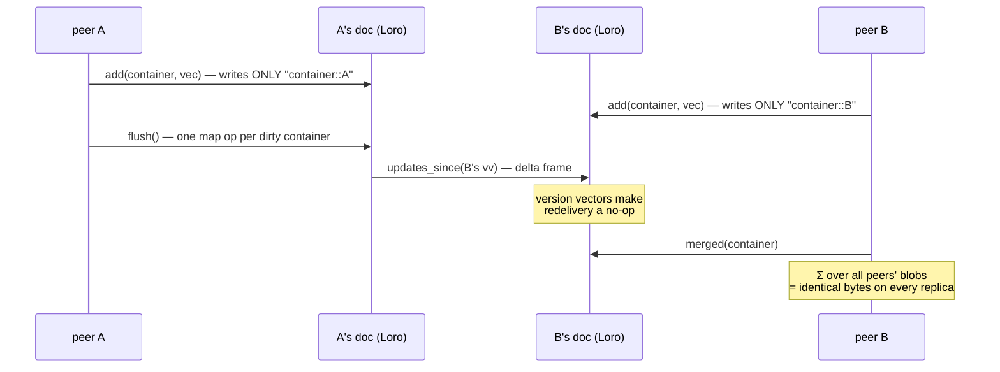

# CRDT replication on Loro

*[← docs index](README.md) · collaboration & persistence*

**What.** Superposition is *almost* a CRDT merge: bundles add, addition
commutes and associates, so replicas accumulate independently and any
merge order converges. What addition is NOT is idempotent — naive
"send me your bundle" double-counts on redelivery. The G-Counter recipe
closes the gap: shard each container's accumulator BY WRITER,

    Loro map "bundles":  "<container>::<peer>" -> complex64 blob

Each peer only writes its own keys (single-writer LWW is trivially
safe); Loro's version vectors make delivery exactly-once; the merged
hologram is the SUM over peers' blobs at read time — order-free, so
replicas that saw the same updates read the same bytes. Loro
contributes exactly what the algebra lacks: causal versioning, delta
sync, snapshots, key-set convergence.

**Coordination-free by construction.** Codewords are hash-derived from
labels and `W` from the space seed ([core.md](core.md)), so peers agree
on the entire algebra with NO negotiation; labels/roles replicate as
*names* in a grow-only registry. Consequences with tests behind them:
a peer answers `what_is_at` and renders `where_is` for labels it never
used; a peer decodes every field of records it never stored,
discovering the schema from the registry.



**Wire protocol.** `version()` snapshots the vv after each exchange;
`updates_since(vv)` exports exactly what the peer lacks — no access to
the peer's doc. `examples/live_sync.py` runs it for real: two OS processes
co-paint one scene over TCP with length-prefixed delta frames
(~100KB/round, one stroke epoch), ending with identical state and
render digests.

**Format tags (wire v1).** Every blob carries a 12-byte `HB` header
(version, dtype, channels, dim) — `pack_bundle`/`unpack_bundle` are the
only codec, and untagged bytes are refused. Every doc carries a format
record (`format` map, key `holo`: JSON `{wire, dim, seed}` — the
universe), validated on every flush and after every `apply()`: peers
from a different universe are refused loudly instead of decoding
garbage. The record rides in the same commit as the doc's first content
ops so delta sync never strands it. Key schemes are part of v1;
changing any layout bumps `WIRE_VERSION`.

**Failure modes.** Retraction here is arithmetic (counter semantics):
concurrent duplicate retraction over-cancels into a negative phantom —
single-owner removal only; multi-writer deletion belongs to
[orset.md](orset.md). Concurrent same-key writes superpose (multi-value
register; the app picks and retracts). Digest bytes, not recomputed
sums. Batch writes (`flush()` per sync); trim long docs with
`trim_history()`, under the contract below.

**Trimming history, and the one way it goes wrong.** A doc's size is
its state times its edit history, and only the state is worth keeping.
`checkpoint()` exports the state with the history discarded:

| replica | full `Snapshot()` | `checkpoint()` |
|---|---|---|
| 64 containers, 30 edit rounds, d=2048 | 31.0 MB | 1.0 MB |
| 64 containers, 20 edit rounds, d=8192 | 84.0 MB | 4.1 MB |

**The ratio is the edit-round count, not a constant** — 30 rounds gives
30x, 20 rounds gives 21x, and in both cases the trimmed size is the
state's own size. A trimmed doc costs its state; an untrimmed one costs
its state once per round, so the win grows without bound on a doc that
keeps being edited.

The price is a coordination requirement, and Loro enforces it in only
one direction. Trim past a version **every peer already holds**:

- A peer at or after the cut syncs normally, and converges.
- A peer **behind** the cut cannot be caught up by a delta — and asking
  for one is not an error. Loro returns a plausible, non-empty frame;
  the peer imports it **without raising**; and the peer then holds
  *nothing*. Measured, not inferred: a 6-container replica trimmed to
  its frontier hands a stale peer a frame it accepts and reads zero
  containers from.
- Only the write-back direction is loud. Once that peer writes on top of
  what it appeared to receive, pushing back fails with "the
  dependencies of the importing updates are not included in the shallow
  history of the doc" — by which point it has been stranded for a while.

So `updates_for`/`updates_since` **refuse** when this doc's history was
trimmed past the requesting version (`vv.includes_vv(shallow_since_vv)`
— vacuously true on a doc that was never trimmed, so ordinary replicas
never meet the check). The recovery is in the message and is not a
retry: **re-onboard that peer with `snapshot()`**, which on a trimmed
doc is complete and leaves the newcomer able to write back normally.

`trim_history()` rebuilds this replica from its own checkpoint and
**restores its peer id** — a fresh id would strand every
`<container>::<peer>` blob it had already written under a name it no
longer writes to. The shallow snapshot carries the op counter, so
writing resumes at the next sequence number instead of colliding with
the history that was discarded.

```python
cut = A.doc.vv_to_frontiers(A.doc.oplog_vv)   # "everyone has seen this"
A.sync(B)                                     # ...make sure they have
before, after = A.trim_history(cut)           # 31.0 MB -> 1.0 MB
A.updates_for(B)                              # B is at the cut: fine
A.updates_for(stale)                          # ValueError, naming snapshot()
```

**API.**
```python
from holo import FHRR, HoloReplica, ReplicatedHoloMap
A = HoloReplica(FHRR(4096, seed=0))   # same (dim, seed) on every peer
B = HoloReplica(FHRR(4096, seed=0))
kv_a, kv_b = ReplicatedHoloMap(A), ReplicatedHoloMap(B)
kv_a.put("k", "v"); A.sync(B)         # in-process
frame = A.updates_since(last_vv)      # over a socket
```

**Evidence.** Two peers paint halves of a scene offline and delta-sync
into one hologram:


`tests/test_crdt.py` (convergence, idempotent redelivery, remote record
decode, and the trim contract — including a regression pin on the
silent zero-container import the guard exists to prevent), `tests/test_live_sync.py` (blob-only wire assembly on a third
replica; the two-process subprocess test); `holo-demos crdt`.
