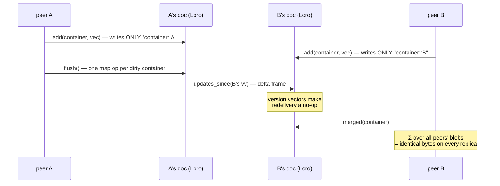
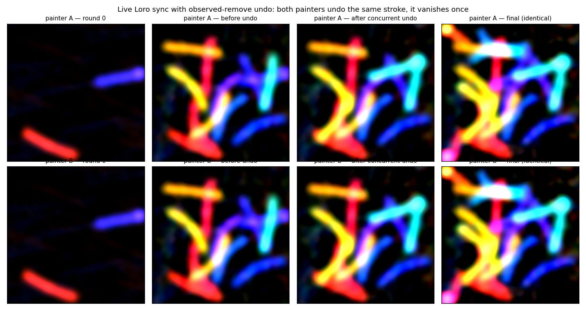

# CRDT replication on Loro

*[← docs index](README.md) · collaboration & persistence*

**What.** Superposition is *almost* a CRDT merge: bundles add, addition
commutes and associates, so replicas accumulate independently and any
merge order converges. What addition is NOT is idempotent — naive
"send me your bundle" double-counts on redelivery. The G-Counter recipe
closes the gap: shard each container's accumulator BY WRITER,

    Loro map "bundles":  "<container>::<peer>" -> complex64 blob

Each peer only writes its own keys (single-writer LWW is trivially
safe); Loro's version vectors make delivery exactly-once; the merged
hologram is the SUM over peers' blobs at read time — order-free, so
replicas that saw the same updates read the same bytes. Loro
contributes exactly what the algebra lacks: causal versioning, delta
sync, snapshots, key-set convergence.

**Coordination-free by construction.** Codewords are hash-derived from
labels and `W` from the space seed ([core.md](core.md)), so peers agree
on the entire algebra with NO negotiation; labels/roles replicate as
*names* in a grow-only registry. Consequences with tests behind them:
a peer answers `what_is_at` and renders `where_is` for labels it never
used; a peer decodes every field of records it never stored,
discovering the schema from the registry.



**Wire protocol.** `version()` snapshots the vv after each exchange;
`updates_since(vv)` exports exactly what the peer lacks — no access to
the peer's doc. `examples/live_sync.py` runs it for real: two OS processes
co-paint one scene over TCP with length-prefixed delta frames
(~100KB/round, one stroke epoch), ending with identical state and
render digests.

**Format tags (wire v1).** Every blob carries a 12-byte `HB` header
(version, dtype, channels, dim) — `pack_bundle`/`unpack_bundle` are the
only codec, and untagged bytes are refused.

**Blobs can ship gamma-companded.** `HoloReplica(space, codec="hg8")`
puts epoch and container blobs through HG-8 ([storage.md](storage.md)'s
faithful codec) instead of raw complex64: a 64-container replica after
20 edit rounds at d=8192 is **84.0 MB raw against 21.0 MB, 0.25x**, for
2 bytes per component instead of 8. This is a NEW DTYPE CODE, not a new
layout, so `WIRE_VERSION` does not move and a build that predates it
refuses the blob with "unknown dtype code 1" rather than reading the
payload as complex64.

**Peers need not agree on it.** What replicates is the blob, so every
replica decodes the same bytes to the same values and convergence is
untouched: a peer writing `hg8` and a peer writing `raw` read each
other's containers identically. The codec is a local bytes-versus-
fidelity trade, not part of the compatibility surface, and needs no
coordination — unlike the trim point, which does.

**Compaction quantises an exact value, never an approximation.**
`ORStore.compact()` folds tombstoned items out of an owner's own epoch
blobs. It used to decode the stored blob, subtract the doomed items and
re-pack — fine while blobs are exact, and accumulating once they are
not, because the subtract moves values off the quantisation grid so the
next compaction re-quantises an adjusted approximation. Six staged
tombstone batches on one epoch: **0.0119 rising to 0.0271, 2.3x and
still climbing**, against a flat **0.0079** when the value quantised is
always a true one.

The rule is therefore about WHAT is quantised, not how the doomed items
leave, and compaction takes the cheapest route that keeps it:

| codec | route | cost |
|---|---|---|
| lossless (`raw`) | decode, subtract, re-pack — exact already | per doomed item |
| lossy, epoch in hand | subtract from the retained EXACT blob | per doomed item |
| lossy, cold | re-encode the survivors from the descriptor index | per live item |

The exact blob is the running sum `_publish` already holds, kept for the
64 most recent own epochs (`EXACT_CACHE_EPOCHS`); a long editing session
would otherwise retain one array per stroke forever. Only the cold route
is O(epoch), and it is the one a freshly started process takes: **1.53 s
against 0.0097 s on a 5,000-item epoch, 158x**. All three quantise a
true value, so the drift is the codec's one-shot error whichever runs.

The cheap and cold routes agree to float32 rounding rather than byte for
byte — they add the same terms in different orders, and about one code
in two thousand lands the other side of a quantisation boundary. That
divides no peers: only the OWNER compacts its own epochs, so there is
one writer and its bytes are what everyone reads.

Worth knowing which shape the drift bites at all: it needs ONE epoch
compacted repeatedly, which is the `ORStrokeScene` case. `ORHoloMap`
seals every 16 adds, so no single epoch is compacted often enough for it
to show — and a test written against that shape passes over the bug. Every doc carries a format
record (`format` map, key `holo`: JSON `{wire, dim, seed}` — the
universe), validated on every flush and after every `apply()`: peers
from a different universe are refused loudly instead of decoding
garbage. The record rides in the same commit as the doc's first content
ops so delta sync never strands it. Key schemes are part of v1;
changing any layout bumps `WIRE_VERSION`.

**Failure modes.** Retraction here is arithmetic (counter semantics):
concurrent duplicate retraction over-cancels into a negative phantom —
single-owner removal only; multi-writer deletion belongs to
[orset.md](orset.md). Concurrent same-key writes superpose (multi-value
register; the app picks and retracts). Digest bytes, not recomputed
sums. Batch writes (`flush()` per sync); compact long docs with
`ExportMode.ShallowSnapshot`.

**API.**
```python
from holo import FHRR, HoloReplica, ReplicatedHoloMap
A = HoloReplica(FHRR(4096, seed=0))   # same (dim, seed) on every peer
B = HoloReplica(FHRR(4096, seed=0))
kv_a, kv_b = ReplicatedHoloMap(A), ReplicatedHoloMap(B)
kv_a.put("k", "v"); A.sync(B)         # in-process
frame = A.updates_since(last_vv)      # over a socket
```

**Evidence.** Two peers paint halves of a scene offline and delta-sync
into one hologram:




`tests/test_crdt.py` (convergence, idempotent redelivery, remote record
decode), `tests/test_live_sync.py` (blob-only wire assembly on a third
replica; the two-process subprocess test); `holo-demos crdt`.
