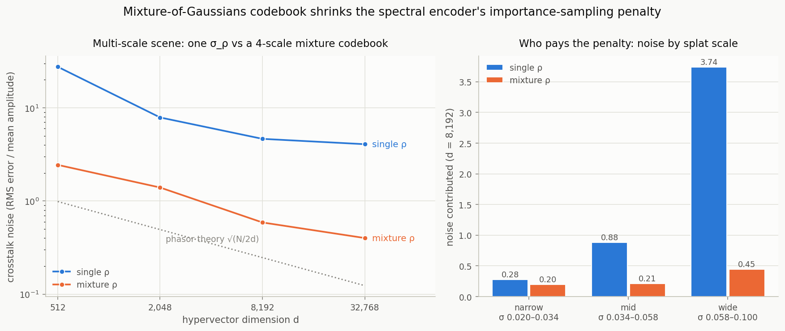
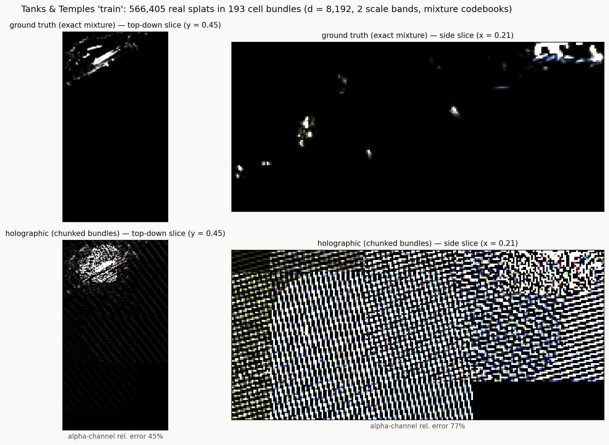
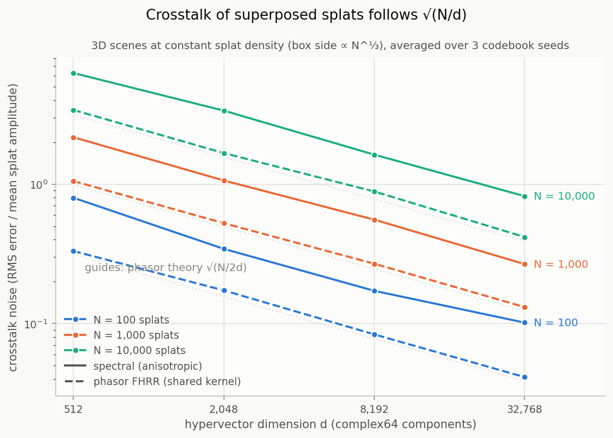
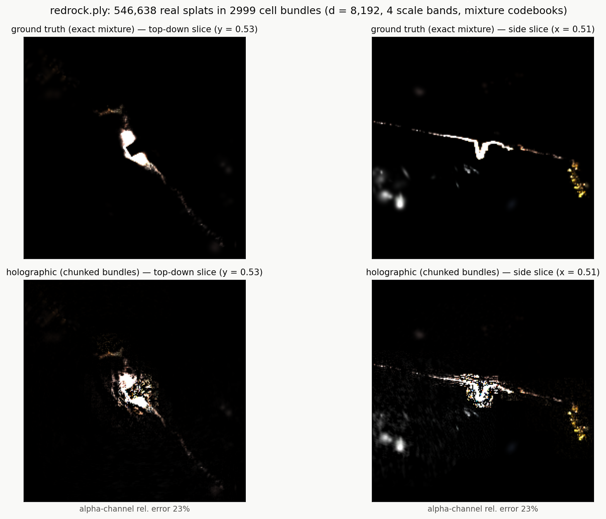
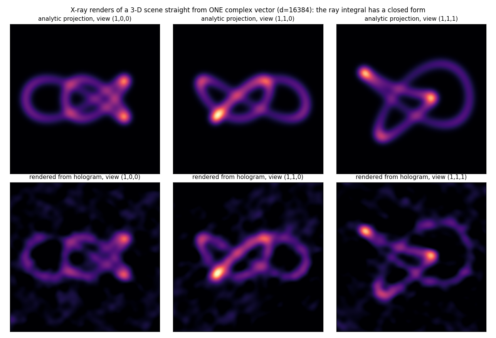
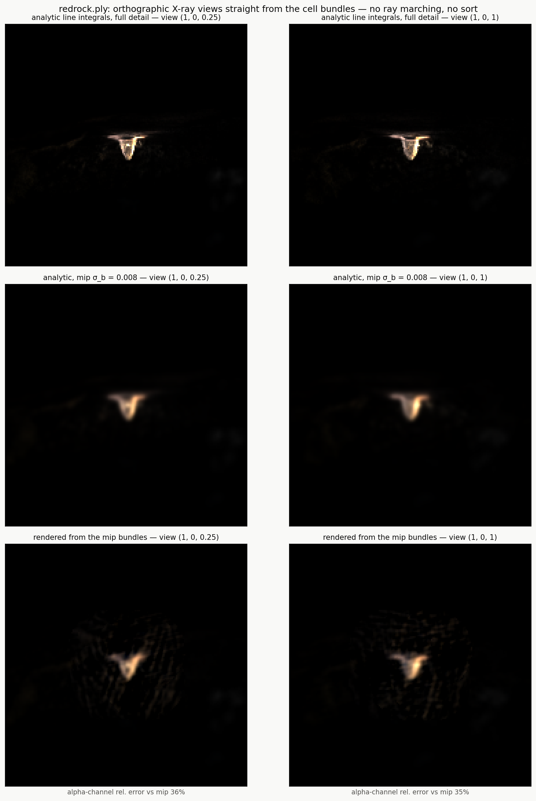
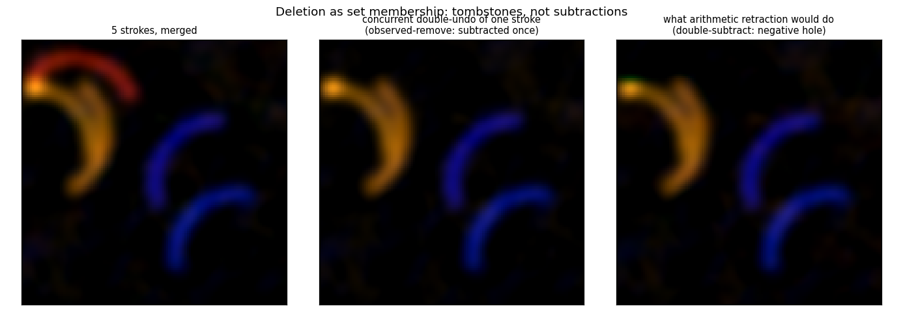
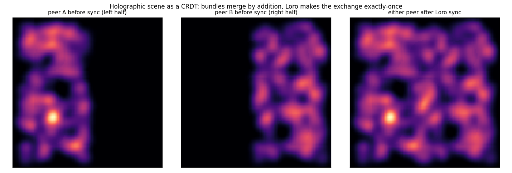
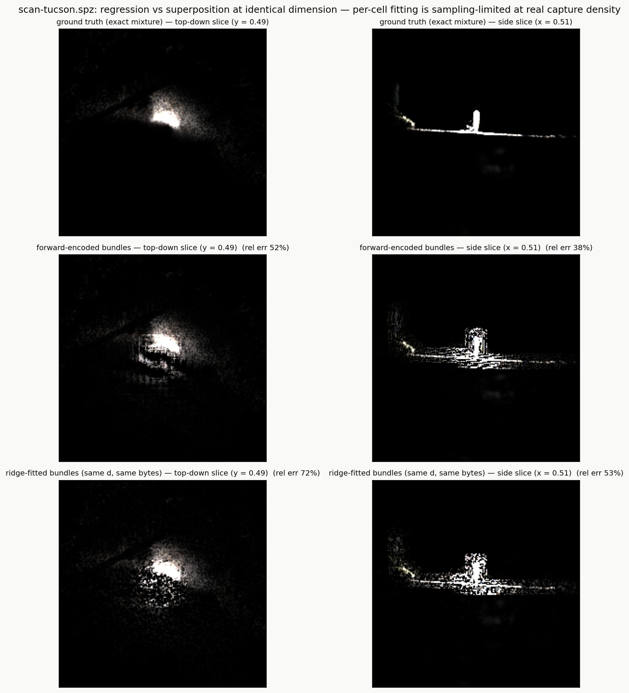
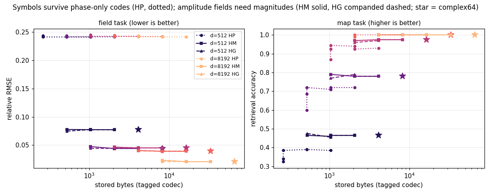

# Holographic Scene Representation: Gaussian Splats as Hypervectors

*Draft v0 — prose against [PAPER.md](../PAPER.md)'s three claims.
Markdown by choice, not by default: no LaTeX toolchain here would let
me verify a `.tex` compiles, and drafting in a gated surface means the
claims checker drift-tests every number below against
`claims/registry.jsonl`. Conversion is mechanical once a toolchain
exists.*

**Status.** Complete draft, ~4,100 words of body: every section is
prose, ten evidence figures are placed at the claims they carry, and
citations are formatted from [`references.bib`](references.bib) —
machine-resolved against the arXiv and Crossref APIs, with four book
and proceedings entries marked UNVERIFIED that still need a human
check. The numbers are gated by the claims checker, so the draft cannot
drift from the measurements it rests on.

Before submission: conversion to the venue's format, and two things
arXiv itself will care about. Its plain-text abstract field renders
neither the backticks nor the non-ASCII math glyphs (`σ`, `√`, `Σ⁻¹`)
the abstract currently uses, and at 1,333 characters against arXiv's
1,920 limit there is room to spell them out rather than cut. Section 6
also runs longer than any single claim section (731 words against
387/315/337), which is defensible — it is where the law is tested —
but is the first place to look if a venue imposes a length cap.

---

## Abstract

A 3D Gaussian splatting scene is a list of primitives: fast to
rasterize, awkward to query, merge, or carry. We show that such a scene
can instead be *superposed* into a single fixed-size complex vector,
and that three capabilities then follow from one algebra rather than
from three mechanisms. Encoding a point as `e^{iWp}` with frequency
rows drawn from `N(0, Σ⁻¹)` makes the inner product of two encodings
equal a Gaussian kernel, so a mixture of anisotropic Gaussians is a
random-feature bundle: evaluating the field anywhere is an inner
product, symbolic attributes attached by binding are recovered by
unbinding, an entire orthographic view folds into another vector of the
same kind, and independently-edited replicas merge by addition. A
single capacity law, `σ ~ √(N·R / 2d)`, predicts the noise of every one
of those readouts and states where each stops working. We demonstrate
the representation on real captures of up to 682,000 splats, evaluated
against exact analytic ground truth rather than against images, and we
report the cost plainly: a bundle is roughly two orders of magnitude
larger than a modern splat codec at the same scene. The contribution is
not compression. It is that query, view synthesis, and coordination-free
merge become the *same operation* on the same object, with a measurable
budget attached.

## 1. Introduction

3D Gaussian splatting represents a scene as an explicit collection of
anisotropic Gaussian primitives, and that explicitness is the source of
both its speed and its awkwardness. Rasterizing a list of primitives is
fast. Asking a question of it — *what is at this point?*, *where are the
objects labelled "chair"?* — means iterating the list. Merging two
independently-edited copies means reconciling two lists. Carrying a
scene means carrying every primitive.

Vector-symbolic architectures (VSAs) make composition algebraic:
structures are built by binding and bundling high-dimensional vectors,
and questions are answered by inverse operations rather than by
traversal. They are usually applied to symbols. The bridge to geometry
is fractional power encoding: representing a position `p` as the
hypervector `e^{iWp}` with frequency rows `w ~ N(0, Σ⁻¹)` makes the
inner product of two such encodings equal the Gaussian kernel
`exp(−½(p−q)ᵀΣ⁻¹(p−q))` — Bochner's theorem, in the form Rahimi and
Recht made practical as random Fourier features and Frady et al.
developed as Vector Function Architectures.

The consequence we build on is small to state and large in effect: **a
Gaussian splat mixture is already a random-feature bundle.** Summing the
encodings of N splats, weighted by their amplitudes, produces one vector
whose inner product with the encoding of any query point returns the
mixture's value there. The scene stops being a list.

This paper reports what that buys, what it costs, and where it fails.

**Three claims.**

1. **A splat scene is one vector, and queries are algebra.** With
   importance-sampled mixture spectral codebooks, every splat keeps its
   own anisotropic covariance inside a shared basis, and role-filler
   payloads attached by binding answer attribute queries by unbinding.
2. **A view is also just a bundle.** By the projection-slice theorem,
   folding one per-frequency factor into the conjugate bundle turns an
   entire orthographic render into another bundle of the same kind:
   every pixel is one inner product, with no ray marching, no depth
   sort, and no geometry present at render time.
3. **Superposition is almost a CRDT, and the "almost" is exactly one
   axiom.** Bundling is commutative and associative but not idempotent;
   two standard recipes close that single gap and make holographic
   scene state mergeable without coordination.

**Two things we state up front rather than in a discussion section.**

*The boundary.* This is an emission — tomographic — representation.
Alpha compositing is non-linear and therefore outside superposition's
reach. We render X-ray projections and evaluate them against analytic
line integrals; we do not perform novel-view synthesis, and we do not
compete with rasterizers on photorealism.

*The cost.* On the same capture, a holographic bundle is approximately
400× larger and 50× less accurate at reproducing the field than a
current splat codec (§7). If the task is to store a scene and rasterize
it later, the correct advice is to use the codec. The claims above are
about capabilities the codecs do not provide, and the paper is written
so that a reader can weigh that trade with real numbers.

## 2. Background

**FHRR.** A hypervector is `d` unit-magnitude complex phasors. Binding
is elementwise complex multiplication (phases add) and is exactly
invertible by the conjugate; bundling is addition; a fixed random
permutation tags order or role. Two independent random hypervectors have
similarity `0 ± 1/√(2d)`, which is the noise floor everything else
trades against.

**Capacity as a contract.** Bundling N items puts crosstalk of standard
deviation `σ ~ √(N·R / 2d)` under every readout, where R is the
component power of what was bundled. Capacity is therefore a
signal-to-noise budget, never a table size, and structures fail *soft* —
noise, then errors — rather than by allocation failure. We treat this
law as an API: every constructor documents its budget, and every
experiment reports measurement against prediction.

**Fractional power encoding.** Raising a hypervector to a real power
multiplies its phases, extending binding from a discrete operator to a
continuous one and giving the `e^{iWp}` encoding above. Komer and
Eliasmith's Spatial Semantic Pointers develop this for continuous space,
including the shift property we use in §5.

**3D Gaussian splatting.** A scene is a set of anisotropic Gaussians
with position, covariance, opacity, and view-dependent colour, rendered
by projecting and alpha-compositing them front-to-back.

## 3. Claim 1 — A splat scene is one vector

### 3.1 Encoding

The naive route — one shared covariance for all splats — fails
immediately on real data, where axis scales span five decades. We
instead store each splat's *Fourier spectrum* sampled at a shared random
codebook, which keeps per-splat anisotropic covariance inside one
bundle at the cost of an importance-sampling variance penalty.

Drawing the codebook from a **mixture of Gaussians** spanning the
scene's scale range reduces that penalty from 16–33× to 2.4–3.2×. Two
rules were learned the expensive way, and both are visible as structured
artifacts rather than as noise when violated: the finest mixture
component must sit at the global scale floor, and *every* band's
codebook must reach that floor — because bands are assigned by maximum
axis scale, while a mid-band needle splat still has thin axes at the
floor. Violating the second rule paints herringbone (Figure 2).

**Figure 1.** Why the codebook is a mixture. *Left:* crosstalk noise against hypervector dimension on a multi-scale scene, encoded against a single shared frequency scale versus a four-scale mixture; the dotted guide is the i.i.d. phasor prediction. *Right:* which splats pay for it at d = 8,192 — the widest scale band contributes 3.74 with a single codebook and 0.45 with the mixture. The mixture buys back importance-sampling variance, not capacity.

**Figure 2.** The second codebook rule, violated: a band whose codebook does not reach the global scale floor. The error is a structured herringbone rather than noise, which is what makes the rule diagnosable by eye instead of by metric.

Real captures then require two more mechanisms. **Scale bands** group
splats by maximum axis scale, each band with its own codebook; **spatial
cells** chunk each band, so a query's crosstalk follows *local* density
rather than N. Query reach follows the band's scale cap, which is why
splitting the finest band cut slice error by 33–44%.

### 3.2 Queries

Evaluating the encoded field at a point is one inner product. Attaching
role-filler records to splats by binding, and recovering them by
unbinding, gives `what_is_at(p)` and `where_is(label)` directly — the
second returning a *field* over space rather than a list of matches.
Because the codewords are hash-derived from `(dim, seed)` rather than
from sequential RNG state, any process reconstructs them independently,
which is what makes §5 possible.

### 3.3 Evidence

Capacity curves fit `d^-0.50` exactly, matching the law. Four real
captures — two phone-scanned outdoor scenes, an indoor LiDAR cloud, and
a Tanks & Temples scene, from 244k to 682k splats after cropping — pass
through one fixed pipeline, and slices decode at 19%/22% relative error
against the *exact Gaussian mixture* evaluated cell-locally. Kernels
agree across three compute backends to 2.5e-8.

**Figure 3.** The law, measured. Crosstalk noise against dimension at constant splat density for N = 100 / 1,000 / 10,000, comparing the anisotropic spectral encoder (solid) against shared-kernel phasor FHRR (dashed); dotted guides are the √(N/2d) prediction. Both families track the law's d^(-1/2) slope over six octaves. The spectral encoder sits above the guide by the importance-sampling penalty of Figure 1 — the price of per-splat covariance.

**Figure 4.** Red Rock, the flagship capture: 547k splats after cropping, encoded through scale bands and spatial cells, and scored against the exact Gaussian mixture evaluated cell-locally. Three further captures — a second phone scan, an indoor LiDAR cloud, and a Tanks & Temples scene — pass through the same fixed pipeline.

*Positioning.* VSA-OGM is the closest published relative: SSP-encoded
occupancy fields with sparse local updates, but scalar occupancy only —
no per-splat covariance, colour, rendering, learning, or replication.
GVKF independently validates the "splatting is a kernel mixture" bridge
from the graphics side while keeping per-Gaussian parametric storage.

## 4. Claim 2 — A view is also just a bundle

### 4.1 Folding a view into the vector

The bundle is the scene's Fourier transform sampled at random
frequencies. By the projection-slice theorem, the integral of the field
along a ray has a closed form in that domain: the ray integral depends
only on the spectrum in the plane perpendicular to the view direction.
Folding the corresponding per-frequency factor into the conjugate bundle
therefore turns an entire orthographic view into another bundle, and
every pixel becomes a single inner product against it.

There is no ray marching, no depth sort, and — the part that surprises
people — no geometry present at render time. The renderer's input is a
vector.

Because blur is covariance addition, mip levels are free: convolving the
scene with an isotropic Gaussian is adding `σ²I` to every covariance.
This matters, because a projection uses only the spectrum slice
perpendicular to the view, so renders need their own dimension budget;
we encode a dedicated mip for rendering.

### 4.2 Evidence

On a synthetic 240-splat trefoil knot with analytic line integrals as
ground truth, views rendered from a single vector reach 5–7% RMSE. On
real captures, a full turntable orbit is rendered entirely from 135 cell
bundles with no geometry at render time. Colour rides as amplitude on
one shared frequency basis, so RGB renders reuse the same phasors.

**Figure 5.** A view folded into the vector: the synthetic trefoil knot rendered from a single bundle against analytic line integrals as ground truth, at 5–7% RMSE. There is no ray marching, no depth sort, and no geometry present at render time — the renderer's input is a vector.

**Figure 6.** The same operation on real data: an X-ray view of Red Rock rendered from cell bundles, against the analytic mip as referee.

### 4.3 The boundary, stated as a result

Emission and tomography only. Occlusion requires ordering and
compositing, which are non-linear operations that superposition does not
admit. We consider this worth stating precisely rather than hedging: the
representation renders what integrates, and a scene where visibility
matters needs a compositing pass outside the algebra.

*Positioning.* CryoSplat and R2-Gaussian both exploit the Fourier slice
theorem for closed-form Gaussian projection — per primitive. Folding a
whole *view* into one random-feature vector appears to be new.

## 5. Claim 3 — Superposition is almost a CRDT

### 5.1 The one missing axiom

A conflict-free replicated data type requires a merge that is
commutative, associative, and idempotent. Bundling — vector addition —
is trivially commutative and associative. It is not idempotent: adding
the same contribution twice double-counts it, so redelivered updates
corrupt state.

That single gap has a standard fix. Each writer accumulates only its own
bundle, and the merged hologram is the sum over writers, so redelivery
is absorbed by the underlying delta protocol's version vectors. Merges
are then bit-identical on every replica that has seen the same updates.

Deletion is subtler. Subtracting a contribution has PN-counter
semantics, and two peers concurrently retracting the same item
over-cancel into a *negative phantom*. Changing the type of the
operation fixes it: removals become tombstones in a grow-only set, the
subtraction is derived once by every reader, concurrent duplicate
removal is idempotent, and a concurrent re-add wins because it carries a
fresh identifier the remover never observed.

Determinism is what makes all of this coordination-free. Codewords and
frequency matrices are hash-derived from `(dim, seed)`; a codebook built
from sequential RNG state would assign vectors by creation order and
replicas would silently disagree.

### 5.2 Evidence

Two peers paint halves of a scene offline and delta-sync into one, with
matching state and render digests; attributed scenes merge with labels
riding a grow-only registry, so a peer answers queries for labels it
never used locally. A two-process demonstration exchanges only
length-prefixed deltas over TCP and includes the adversarial case: both
painters concurrently undo the same stroke, which is tombstoned twice
and subtracted once.

**Figure 7.** Why deletion is set membership rather than arithmetic. *Left:* five strokes, merged. *Centre:* both peers concurrently undo the same stroke under observed-remove semantics — tombstoned twice, subtracted once, and the stroke is simply gone. *Right:* what arithmetic retraction does instead — the contribution is subtracted twice and leaves a negative phantom where the stroke was.

**Figure 8.** Two peers paint halves of a scene offline and delta-sync into one, reaching matching state and matching render digests. Merge is addition; the coordination is in the delta protocol, not in the representation.

*Positioning, and a contrast.* Recent work wrapping neural-network model
merging in CRDT semantics reports that all 26 merge strategies tested —
weight averaging, SLERP, TIES, DARE, Fisher, evolutionary — fail
commutativity, associativity, or idempotency. Superposition satisfies
the first two by construction and fails only the third. The recipes
above close that one gap, which is a cheaper starting position than the
merging literature usually enjoys.

## 6. The law, and where it bends

Section 2 states the capacity law; this section is where it is tested
rather than asserted. Every demonstration in this work prints its
measured curve beside the prediction, and the agreement is close enough
that the interesting content is in the four places where it is not.
Each deviation is a case where an assumption behind the i.i.d. law
fails, and each names either its remedy or its open problem.

**Dense scenes correlate their noise.** The law assumes bundled items
are independent. Splats that sit near each other in a dense capture are
not: they share frequencies, and their crosstalk adds coherently rather
than in quadrature, inflating σ by roughly 1.5–3× over prediction. The
practical consequence is that the obvious remedy does not work. If the
residual were Monte-Carlo noise, more dimensions would wash it out —
so we doubled `d` on the densest capture and measured the result: a 2–4%
improvement for 600 MB of additional storage. That negative result is
what identifies the error as coherent, and it redirects the problem
from "spend dimensions" to "decorrelate or denoise", which we return to
in §9.

**Fitting is sampling-limited at real density.** Because the readout is
linear in the bundle, the bundle is literally the weight vector of a
random-feature regression, and it can be *fitted* to samples rather than
accumulated from splats. On synthetic mixtures this is dramatic: the
fitted vector beats the forward-encoded one by roughly 70× in held-out
error, because regression finds the optimal vector in the same basis
and corrects crosstalk that forward bundling simply carries. On real
captures it loses (0.72/0.53 against forward encoding's 0.52/0.38).

**Figure 9.** Fitting loses at real capture density. Top-down and side slices of scan-tucson: the exact mixture (top), forward-encoded bundles (middle, 52% / 38%), and ridge-fitted bundles at identical dimension and identical bytes (bottom, 72% / 53%). On synthetic mixtures the ordering is reversed by roughly 70×; what changes is sample coverage, not the method.

The diagnosis is coverage: hundreds of floor-scale splats per cell need
samples at their own kernel width, which is tens of thousands of
samples per cell, beyond what the dual solve can absorb. A spectral
prior was necessary even to make the fit competitive — without it,
minimum-norm regression spreads energy into the codebook's finest
frequencies and memorizes samples as kernel-width bumps, twelve times
worse than forward encoding. The natural next step, a zero-sample
analytic projection with a closed-form region Gram, lands inside the
classical Fourier-extension problem: severely ill-conditioned, but
provably stable under regularized least squares, which tells us the
route needs Tikhonov or truncated-SVD treatment from the first line
rather than as a rescue.

**The scale floor is radiometric, not merely geometric.** Encoding
imposes a resolution floor on axis scales, and real captures hit it
constantly — 99.4–99.7% of encoded splats in every Gaussian capture we
tested have a thin axis pinned to it, because 3DGS splats are
overwhelmingly needle-shaped. Raising a thin axis while holding peak
amplitude fixed raises that splat's integral, and across one capture
the floor inflates total scene mass by 11×. Quantifying what this costs
turns out to be a trap worth documenting: measured by point sampling,
the answer is meaningless, because a sheet thinner than the sampling
grid is nearly invisible to point evaluation regardless of how much
mass it carries. Integrating over a pixel footprint instead is exact
and cheap — a Gaussian convolved with a Gaussian is a Gaussian, so
covariances simply add — and against a footprint-integrated target the
pipeline reports 11.5% where the sharp-against-sharp pair reports
18.1%. The lesson generalizes past this system: the referee has to
measure the same field the representation was asked to encode.

**Storage has a rate-distortion boundary at magnitude.** Phase-only
codes, which store each dimension's angle and discard its length, floor
amplitude-carrying fields at roughly 0.24 relative RMSE at *any* bit
depth. The reason is structural rather than numerical: a bundle
accumulated from weighted contributions carries information in its
magnitudes, and a unit-magnitude code throws that away before the first
bit is allocated. Magnitude-preserving codes cross the boundary, and a
gamma-companded polar code is the faithful choice for the
wide-dynamic-range bundles real captures produce. Recent independent
work on quantized-phase FHRR reaches the same boundary from the
opposite side: its bundling operation is not closed under phase
quantization and must project back onto the unit circle, discarding
exactly the magnitude our measurements identify as necessary.

**Figure 10.** The rate-distortion boundary is structural, not a bit depth. *Left, field task:* phase-only codes (HP, dotted) sit on a flat error floor no matter how many bytes are spent, while magnitude-preserving codes (HM solid, HG companded dashed) fall well below it; stars mark uncompressed complex64. *Right, map task:* for codeword retrieval, where magnitude carries nothing, the same phase-only codes are competitive at a fraction of the bytes. One representation, two tasks, opposite verdicts — which is the whole of the codec split.

Taken together these four say something more useful than any of them
alone. The law is not a decoration: it predicts well enough that its
failures are informative, and every failure here was found by measuring
against it rather than by noticing an artifact.

## 7. What it costs

A representation should be judged by a referee it did not choose. We
score every candidate identically: reconstruct the field it encodes,
evaluate that field at the same query points, and compare against the
exact Gaussian mixture of the source capture. Per-splat formats lose to
quantization, holographic bundles lose to crosstalk, and the referee is
indifferent to which.

| representation | MB | bytes/splat | field error |
|---|---:|---:|---:|
| PLY (SH degree 0) | 3.9 | 85 | 0.0% |
| SPZ v3 | 1.0 | 22 | 0.0% |
| SOG (SH palette) | 0.8 | 18 | 0.3% |
| holographic bundles (d = 8,192) | 382.8 | 8,354 | 17.4% |
| same, 8-bit magnitude codec | 95.7 | 2,089 | 17.0% |
| same, 4-bit magnitude codec | 47.9 | 1,045 | 25.8% |

The result is a loss, and reporting it precisely is the point of
running the experiment. A bundle is approximately 400× larger and 50×
less accurate at reproducing the field than a current splat codec. A
reader whose problem is to store a scene and rasterize it later should
use the codec; nothing in this paper argues otherwise.

What the bytes buy is the subject of §§3–5: query by algebra rather
than by traversal, an entire view as a second vector of the same kind,
and merge by addition with no coordination. A codec sells none of
those, and sells bytes extremely well.

Two observations survive the loss. The first is that the 8-bit
magnitude codec is *free*: four times smaller at slightly better error
than the uncompressed bundle. Max-scaled quantization zeroes the
smallest components, and on a forward-encoded bundle those components
are mostly crosstalk, so the codec acts as an accidental shrinkage
denoiser. Pushing to 4 bits finally costs accuracy, which places the
useful operating point at 8.

The second is that the two families scale differently with density.
Bundle bytes are fixed per occupied cell however many splats fall
inside it, while every per-splat format grows linearly with content.
Holding the scene volume fixed and increasing splat count tenfold costs
a codec 10× and costs bundles 2.6×, narrowing the gap fourfold per
decade. Honesty requires the other half of that sentence: the gap
narrows but does not close at any density a real capture produces. The
useful form of the claim is about shape rather than crossover —
per-splat formats scale with detail, bundles scale with occupied
volume, so a bundle's cost is predictable from a scene's extent before
its contents are known.

## 8. Related work

**Foundations.** The algebra is Plate's Holographic Reduced
Representations in its Fourier form, with Kanerva's Sparse Distributed
Memory as the ancestor of the capacity-as-signal-to-noise framing. The
bridge from that algebra to continuous geometry is fractional power
encoding, developed as Vector Function Architectures by Frady et al.
and as Spatial Semantic Pointers by Komer and Eliasmith; the kernel
identity it relies on is Bochner's theorem in the practical form
Rahimi and Recht introduced as random Fourier features. Kleyko et al.'s
surveys are the field's own account of what is settled.

**Work that bounds these claims.** Four results remove things this
paper might otherwise have claimed, and we adopt each rather than
rediscover it. Quantized-phase FHRR with integer-only binding is
published: our phase codec is that representation reached from storage
rather than from hardware, so we claim only the measured boundary where
it fails and not the representation itself. Anti-aliasing in Gaussian
splatting is solved by constraining primitive size to the input views'
sampling rate and by integrating over the pixel window analytically;
our resolution floor is an ad-hoc version of the former, and our
footprint evaluator is the pre-projection form of the latter.
Trajectory simulation via the shift property of fractional binding
already exists for single and multiple objects, so translation as a
phase ramp is not a contribution of this work. And recent work wrapping
neural-network model merging in CRDT semantics is the nearest
neighbour to §5 — different object, same shape, and the source of our
sharpest contrast.

**Nearest neighbours.** VSA-OGM is the closest published relative
overall: SSP-encoded occupancy fields with sparse local updates,
achieving large latency and memory wins over dense baselines, but
representing scalar occupancy only — without per-splat covariance,
colour, rendering, learning, or replication. GVKF arrives at the
"splatting is a kernel mixture" bridge from the graphics side while
retaining per-Gaussian parametric storage. CryoSplat and R2-Gaussian
both apply the Fourier slice theorem to Gaussian primitives for
closed-form projection, per primitive rather than per view. HyperSpace
is the nearest VSA-framework effort and contains no scene, splat, or
replication content.

**Graphics.** Rasterization is better at rasterizing, and the
compression literature this work is measured against in §7 is better at
compression. The contribution here is not a faster or smaller renderer;
it is that a scene, a view of it, and a merge of two edits to it are
the same kind of object, with one budget that predicts the error of
each.

## 9. Limitations and future work

The hard limit is occlusion. Alpha compositing requires ordering and
non-linear accumulation, neither of which superposition admits, so the
representation renders what integrates. A hybrid — holographic density
with a classical compositing pass — is the obvious shape of a solution
and remains unexplored.

Storage is large in absolute terms, as §7 quantifies. Rotation is not a
phase ramp: translation is exactly a phase ramp, but rotation remixes
frequencies across the codebook and needs a mechanism of its own.
Determinism is semantic rather than bitwise — recomputed vectors agree
to about a part in 10⁷, far under any decision threshold, but digests
must hash transmitted bytes rather than recomputed sums. Banded and
clustered readout strategies pay off only when the data has structure
to exploit: spatial locality for scenes, and its analogue elsewhere.

The open directions follow the deviations in §6. The coherent
dense-scene residual needs a denoiser rather than more dimensions, and
the accidental shrinkage observed in §7 suggests that deliberate
thresholding at the crosstalk noise level is the first thing to try.
The zero-sample analytic projection needs regularization from the start
for the reasons the Fourier-extension literature gives. Dynamic scenes
are the natural extension of §5's mergeable state, with the caveat that
the underlying shift mechanism is established work and only the
capture-scale combination would be new.

One result belongs here as evidence of generality rather than as a
claim. The same capacity law and the same partition-plus-locality
remedy transfer intact from geometric scenes to *rule tables*, where a
similarity-dispatch engine over messy text reaches 0.98 accuracy at 43×
less compute than exhaustive matching, and fails in exactly the way the
law predicts when its budget is exceeded. That the law governs a domain
containing no geometry is the strongest evidence available that it is a
property of superposition rather than of splats.

## 10. Conclusion

A 3D Gaussian splatting scene can be superposed into a single
fixed-size complex vector, and once it is, three capabilities stop
being separate mechanisms. Evaluating the scene is an inner product.
Rendering an orthographic view of it is folding one factor into that
vector and taking more inner products. Merging two independently
edited copies is addition, needing only the single missing axiom to be
supplied. One capacity law predicts the error of all three and, more
usefully, predicts well enough that its four failures are diagnostic.

The cost is real and we have measured it: two orders of magnitude more
storage than a modern splat codec, at fifty times the error, for a
representation that does not composite and therefore does not render
what a rasterizer renders. What it offers in exchange is that a scene
becomes an object with an algebra — one where a query, a view, and a
merge are the same operation applied differently, and where the noise
budget of each is known before it is run.

## References

*Generated from [`references.bib`](references.bib) — edit the
`.bib`, not this list. Every arXiv entry there is verbatim from the
arXiv API and every DOI from Crossref, both resolved 2026-08-27;
four book and proceedings entries that neither service indexes are
marked UNVERIFIED in the file and need a human check before
submission.*

- **Plate, Tony A.** (1995). *Holographic Reduced Representations* IEEE
  Transactions on Neural Networks 6(3):623--641 doi:10.1109/72.377968
- **Plate, Tony A.** (2003). *Holographic Reduced Representation:
  Distributed Representation for Cognitive Structures* CSLI Publications
- **Kanerva, Pentti** (1988). *Sparse Distributed Memory* MIT Press
- **Kanerva, Pentti** (2009). *Hyperdimensional Computing: An Introduction
  to Computing in Distributed Representation with High-Dimensional Random
  Vectors* Cognitive Computation 1(2):139--159 doi:10.1007/s12559-009-9009-8
- **Rahimi, Ali; Recht, Benjamin** (2007). *Random Features for Large-
  Scale Kernel Machines* Advances in Neural Information Processing Systems
  20 (NIPS)
- **Frady, E. Paxon, et al.** (2021). *Computing on Functions Using
  Randomized Vector Representations* arXiv:2109.03429
- **Komer, Brent, et al.** (2019). *A Neural Representation of Continuous
  Space Using Fractional Binding* Proceedings of the 41st Annual Meeting of
  the Cognitive Science Society (CogSci)
- **Kleyko, Denis, et al.** (2021). *A Survey on Hyperdimensional
  Computing aka Vector Symbolic Architectures, Part I: Models and Data
  Transformations* arXiv:2111.06077
- **Kleyko, Denis, et al.** (2021). *A Survey on Hyperdimensional
  Computing aka Vector Symbolic Architectures, Part II: Applications,
  Cognitive Models, and Challenges* arXiv:2112.15424
- **Voelker, Aaron R., et al.** (2021). *Simulating and Predicting
  Dynamical Systems With Spatial Semantic Pointers* Neural Computation
  33(8):2033--2067 doi:10.1162/neco_a_01410
- **Snyder, Shay; Poursiami, Hamed; Parsa, Maryam** (2026). *qFHRR:
  Rethinking Fourier Holographic Reduced Representations through Quantized
  Phase and Integer Arithmetic* arXiv:2604.25939
- **Yu, Zehao, et al.** (2023). *Mip-Splatting: Alias-free 3D Gaussian
  Splatting* IEEE/CVF Conference on Computer Vision and Pattern Recognition
  (CVPR) (arXiv:2311.16493)
- **Liang, Zhihao, et al.** (2024). *Analytic-Splatting: Anti-Aliased 3D
  Gaussian Splatting via Analytic Integration* European Conference on
  Computer Vision (ECCV) (arXiv:2403.11056)
- **Adcock, Ben; Huybrechs, Daan; Martin-Vaquero, Jesus** (2012). *On the
  numerical stability of Fourier extensions* arXiv:1206.4111
- **Gillespie, Ryan** (2026). *Conflict-Free Replicated Data Types for
  Neural Network Model Merging: A Two-Layer Architecture Enabling CRDT-
  Compliant Model Merging Across 26 Strategies* arXiv:2605.19373
- **Snyder, Shay, et al.** (2024). *Brain Inspired Probabilistic Occupancy
  Grid Mapping with Vector Symbolic Architectures* arXiv:2408.09066
- **Snyder, Shay, et al.** (2026). *HyperSpace: A Generalized Framework
  for Spatial Encoding in Hyperdimensional Representations* arXiv:2604.15113
- **Song, Gaochao; Cheng, Chong; Wang, Hao** (2024). *GVKF: Gaussian Voxel
  Kernel Functions for Highly Efficient Surface Reconstruction in Open
  Scenes* arXiv:2411.01853
- **Chen, Suyi; Ling, Haibin** (2025). *CryoSplat: Gaussian Splatting for
  Cryo-EM Homogeneous Reconstruction* arXiv:2508.04929
- **Zha, Ruyi, et al.** (2024). *R$^2$-Gaussian: Rectifying Radiative
  Gaussian Splatting for Tomographic Reconstruction* arXiv:2405.20693
- **Ali, Muhammad Salman, et al.** (2025). *Compression in 3D Gaussian
  Splatting: A Survey of Methods, Trends, and Future Directions*
  arXiv:2502.19457
- **Kerbl, Bernhard, et al.** (2023). *3D Gaussian Splatting for Real-Time
  Radiance Field Rendering* ACM Transactions on Graphics 42(4)
  doi:10.1145/3592433
