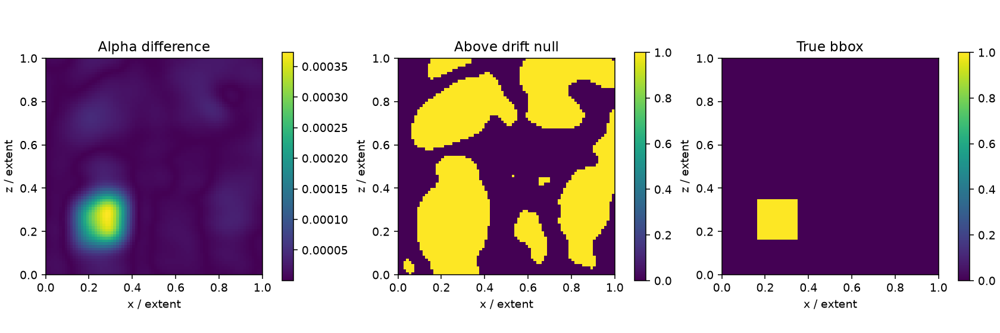
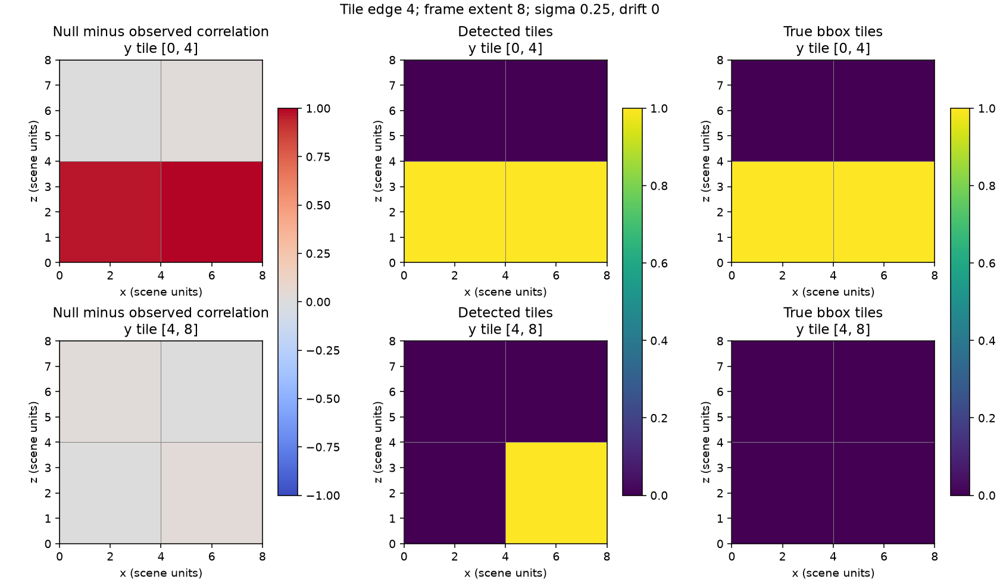

# Change detection: synthetic drift ladder

Squatch Stack research tool: `bench/change_detection.py`. This is an ungated
CPU experiment, not a capture-scale result or a promoted accuracy claim.

## Result

The drift-only null does **not** provide reliable localization on this fixture.
The raw difference peaks at the removed cluster, but finite-codebook sidelobes
from that actual removal exceed the unchanged-scene null over much of the box.
The primitive baseline is substantially better at low drift. Increasing drift
sometimes improves bundle IoU because it raises the null threshold; this is
not evidence that drift improves the representation. No threshold was selected
using the true bbox, and no spatial mask suppresses the observed sidelobes.

| sigma_rec (scene units) | sigma_pos (scene units) | IoU bundle | IoU baseline | false mass |
|---|---|---|---|---|
| 0.25 | 0 | 0.0124 | 0.9259 | 0.8704 |
| 0.25 | 0.05 | 0.0201 | 0.3385 | 0.8349 |
| 0.25 | 0.1 | 0.0457 | 0.1875 | 0.7520 |
| 0.25 | 0.2 | 0.1459 | 0.1600 | 0.6076 |
| 0.5 | 0 | 0.0088 | 0.3068 | 0.9036 |
| 0.5 | 0.05 | 0.0095 | 0.2647 | 0.9009 |
| 0.5 | 0.1 | 0.0123 | 0.2842 | 0.8896 |
| 0.5 | 0.2 | 0.0255 | 0.2577 | 0.8451 |
| 1 | 0 | 0.0075 | 0.1120 | 0.9408 |
| 1 | 0.05 | 0.0076 | 0.1125 | 0.9405 |
| 1 | 0.1 | 0.0079 | 0.1286 | 0.9399 |
| 1 | 0.2 | 0.0089 | 0.1317 | 0.9379 |



The figure is the first ladder cell (sigma_rec 0.25, sigma_pos 0), a y slice
through the removed bbox center. It decodes an 80 by 80 slice separately;
the table always evaluates the same 17 cubed 3-D grid, including endpoints.

## Reproduction and definitions

```sh
HDC_BACKEND=numpy OPENBLAS_NUM_THREADS=1 MPLCONFIGDIR=/tmp/change-mpl .venv/bin/python -m bench.change_detection /tmp/change-synthetic.json --synthetic --dim 4096 --seed 0 --figure out/change/synthetic.png
```

The seeded eight-unit world contains four separated cubes, each with 128
uniformly sampled primitive centers in a cube of side 1.5 scene units. Native
Gaussian standard deviation is 0.12 units and alpha is one. The first cluster
is removed exactly. Its true bbox is the min/max of its unperturbed centers,
not an opacity isosurface or a blur-expanded label. Before and after receive
independent position and amplitude draws, with sigma_amp 0.2 and split_frac
0.1. Position jitter is isotropic Gaussian; lognormal amplitude multipliers
have mean one and relative standard deviation sigma_amp. Selected splats
split into two identical half-amplitude copies. This preserves the field and
tests count ambiguity, but is not a model of displaced, covariance-changing
splits from a real optimizer.

All positions and covariances use one fixed normalized parent frame, with
sigma_box = sigma_units / extent. One 4,096-row iid Gaussian codebook is
sampled per run at frequency standard deviation extent / min(sigma_rec).
Every ladder cell reuses it. Recognition blur is mass-preserving render_mip;
alpha spectra use spectral_bundle; maps use abs(decode_field_phasor).
The real phasor decoder adds the sampling kernel's blur (0.25 scene units
here), and finite sampling causes sidelobes. It is not an importance-weighted
inverse Fourier transform. Before-minus-after would reverse the signed
spectrum; the implementation uses after-minus-before and takes magnitude
only at the map stage.

For each cell, the observed before is fixed. Three independent unchanged
re-optimizations of the original before supply a pooled 99th-percentile
voxel threshold. The baseline uses those exact same null scene realizations,
reference capture and grid, with its own 99th-percentile threshold because
its scores have different units. This is an empirical voxelwise threshold,
not a familywise confidence level; three draws are only a CPU smoke calibration.

The baseline field is the absolute difference between nearest-center distance
fields, each capped at radius sigma_box. Binning gives exact radius-limited
nearest neighbors without an additional dependency; dense bins are processed
in bounded blocks. This control ignores alpha, covariance and duplicate
splits. It is our baseline, not a published method reproduced from code.

IoU uses strict score > threshold and an inclusive bbox. False mass is the
sum of threshold-surviving change magnitude outside the bbox divided by all
threshold-surviving change magnitude (zero when nothing survives). It is not
the fraction of voxels flagged, nor a false-positive rate on an unchanged
scene. JSON includes both raw maps in C-flattened ij grid order, thresholds,
settings and the bbox; the grid coordinates are linspace(0, 1, grid).

The focused tests are deliberately separate from this difficult ladder. The
localization test uses an isolated Gaussian object with a 0.4-unit annotation
and sigma_rec 0.1, and the agreement test uses a coarse Cartesian grid through
isolated centers. Both use drift-null thresholds. The held-out unchanged
capture test measures surviving false magnitude relative to the reference
field's total magnitude, requiring less than 10%; it does not redefine the
ladder's false-mass metric. These passing tests do not establish success on
the larger fixture.

## Capture commands for the maintainer

Set SCENES to the capture directory. The generated edits below omit the
optional AFTER positional; --remove and --insert construct it, replacing
AFTER if supplied. All observed captures must already share physical axes;
this tool does not register them. No real files were present in this worktree.

```sh
HDC_BACKEND=numpy .venv/bin/python -m bench.change_detection /tmp/change-wilsons-creek.json "$SCENES/wilsons-creek.spz" --frame "$SCENES/wilsons-creek.spz" --remove "$SCENES/wilsons-creek-gun.spz" --sigma-units 0.5 --grid 48 --drift 0,0.05,0.1,0.2 --dim 8192
HDC_BACKEND=numpy .venv/bin/python -m bench.change_detection /tmp/change-redrock.json "$SCENES/redrock.spz" --frame "$SCENES/redrock.spz" --remove "$SCENES/redrock-cairn.spz" --sigma-units 0.5 --grid 48 --drift 0,0.05,0.1,0.2 --dim 8192
HDC_BACKEND=numpy .venv/bin/python -m bench.change_detection /tmp/change-library-cannon.json "$SCENES/research-library.spz" --frame "$SCENES/research-library.spz" --insert "$SCENES/cannon.spz" --at 2 0 0 --sigma-units 0.5 --grid 48 --drift 0,0.05,0.1,0.2 --dim 8192
```

The chosen cannon translation is +2 scene units along x, with y/z unchanged.
The object is selected with crop_box/build_scene_fixed in its own physical
cube, restored to physical coordinates, then encoded in the parent's frame.
Its native covariance scales consistently. Check bbox_box in the output to
see how much of the translated object falls within the evaluation cube;
that placement cannot be verified without the captures. The generated after
retains inserted splats outside the cube, but the scored domain is [0,1]^3.
Removal verifies raw position overlap in scene units before alpha/cube
filtering (default tolerance 1e-5), refuses overlap below 0.99, and reports the
measured fraction. All parent positions within tolerance of the crop are
removed, preserving the parent's surviving attributes. A crop with no
eligible in-frame primitive is refused. No capture overlap is claimed here.

A plain BEFORE AFTER comparison needs no synthetic edit. Because it has no
known true bbox, its IoUs and false mass are null rather than invented labels.
The same requested drift ladder perturbs both supplied inputs. Real mode
uses sigma_rec 0.5 and grid 48 by default; synthetic mode uses the complete
three-scale ladder and grid 17. Explicit --sigma-units, --grid and --drift
can narrow either run. run_synthetic() defaults to dim 4096; the CLI defaults
to 8192. The CPU commands above are reproducible starting points; the
maintainer can use the existing CUDA patch environment for capture-scale
encoding/decoding. Baseline spatial binning remains CPU work.

## Limits and prior art

A change smaller than sigma_rec can vanish; drift above sigma_rec can read
as change everywhere. Alpha-only fingerprints cannot detect pure colour
changes; RGB channels are follow-up work. Non-subset crops are refused rather
than scored. Shared-frame crop/alpha/scale selection inherits
build_scene_fixed's behavior and must not be mistaken for full-capture
coverage. Fixed finite codebooks and bbox discretization are material limits.

The abstracts of [arXiv:2605.07203](https://arxiv.org/abs/2605.07203) and
[arXiv:2512.22830](https://arxiv.org/abs/2512.22830) were read before design.
The former motivates primitive comparison with drift; the latter uses
multi-view aggregation. Our isotropic null, duplicate splitting, baseline
and scoring definitions are ours; neither method's code was reproduced.
A follow-up outside this lane should investigate calibration for change-induced
spectral sidelobes and validate richer drift models on real recaptures before
making localization claims. No changes outside the exclusive lane files and
its one permitted figure-provenance row were made.


## Tiles (synthetic)

The new `--tile E` path compares fixed physical tiles with zero translation
and zero yaw using the existing `tile_lattice`, `tile_fingerprints` and
`correlate` functions. The legacy path and JSON are unchanged without this
flag, checked against a pre-edit frozen JSON fixture with float32 tolerances.
The prior-art abstracts cited above were read; the tile/null/control
conventions here are ours and do not reproduce either paper's definitions.

The original four-cluster world now loses its first cluster and gains a copy
translated by four scene units along x, centered at (6, 2, 2). Truth is the
UNION of the separate removed/added center bboxes, not their enclosing box.
Each tile intersecting either bbox is positive, including inclusive boundaries.
The ladder uses zero overlap, alpha-only fingerprints, whitening exponent one,
dimension 4096 and seed zero. The 4-unit lattice has eight tiles, of which two
are true changes. The 8-unit lattice has one tile; its perfect bundle IoU is
whole-world detection and cannot establish localization. The old rows below
are historical removal-only voxel IoUs from the preceding section, included
for context, not a controlled comparison with the two-edit tile fixture.

| tile edge | sigma_rec | sigma_pos | IoU bundle-tile | IoU baseline-tile | false tiles | old difference / baseline voxel IoU |
|---|---|---|---|---|---|---|
| 4 | 0.25 | 0 | 0.6667 | 1.0000 | 1 | 0.0124 / 0.9259 |
| 4 | 0.25 | 0.05 | 0.6667 | 0.5000 | 1 | 0.0201 / 0.3385 |
| 4 | 0.25 | 0.1 | 1.0000 | 0.0000 | 0 | 0.0457 / 0.1875 |
| 4 | 0.25 | 0.2 | 1.0000 | 0.0000 | 0 | 0.1459 / 0.1600 |
| 4 | 0.5 | 0 | 0.5000 | 1.0000 | 2 | 0.0088 / 0.3068 |
| 4 | 0.5 | 0.05 | 0.6667 | 1.0000 | 1 | 0.0095 / 0.2647 |
| 4 | 0.5 | 0.1 | 0.6667 | 0.5000 | 1 | 0.0123 / 0.2842 |
| 4 | 0.5 | 0.2 | 0.6667 | 0.5000 | 1 | 0.0255 / 0.2577 |
| 4 | 1 | 0 | 0.6667 | 1.0000 | 1 | 0.0075 / 0.1120 |
| 4 | 1 | 0.05 | 0.6667 | 1.0000 | 1 | 0.0076 / 0.1125 |
| 4 | 1 | 0.1 | 0.6667 | 1.0000 | 1 | 0.0079 / 0.1286 |
| 4 | 1 | 0.2 | 1.0000 | 0.5000 | 0 | 0.0089 / 0.1317 |
| 8 | 0.25 | 0 | 1.0000 | 1.0000 | 0 | 0.0124 / 0.9259 |
| 8 | 0.25 | 0.05 | 1.0000 | 1.0000 | 0 | 0.0201 / 0.3385 |
| 8 | 0.25 | 0.1 | 1.0000 | 1.0000 | 0 | 0.0457 / 0.1875 |
| 8 | 0.25 | 0.2 | 1.0000 | 0.0000 | 0 | 0.1459 / 0.1600 |
| 8 | 0.5 | 0 | 1.0000 | 1.0000 | 0 | 0.0088 / 0.3068 |
| 8 | 0.5 | 0.05 | 1.0000 | 1.0000 | 0 | 0.0095 / 0.2647 |
| 8 | 0.5 | 0.1 | 1.0000 | 1.0000 | 0 | 0.0123 / 0.2842 |
| 8 | 0.5 | 0.2 | 1.0000 | 1.0000 | 0 | 0.0255 / 0.2577 |
| 8 | 1 | 0 | 1.0000 | 1.0000 | 0 | 0.0075 / 0.1120 |
| 8 | 1 | 0.05 | 1.0000 | 1.0000 | 0 | 0.0076 / 0.1125 |
| 8 | 1 | 0.1 | 1.0000 | 1.0000 | 0 | 0.0079 / 0.1286 |
| 8 | 1 | 0.2 | 1.0000 | 1.0000 | 0 | 0.0089 / 0.1317 |



The figure shows all y layers for the first 4-unit ladder cell. Small
correlation drops can cross the empirical null and create false tiles; the
signed drop color scale is fixed to [-1,1]. No threshold is tuned on truth.
The 4-unit bundle result ranges from IoU 0.5 to 1 with zero to two false tiles.
The primitive tile control ranges from zero to one: the maximum distance-field
null can saturate at its radius cap and suppress even a removed tile. This is
reported as a limitation, not overridden with ground-truth occupancy.

A separate exact cluster-edge-times-two smoke run uses E=3 (cluster edge 1.5),
sigma_rec=0.5 and sigma_pos=0. Its flush-edge lattice has 27 tiles, 15 retained
and three truth tiles: bundle-tile IoU 0.4286, baseline-tile IoU 1.0000,
four false tiles. Unlike the focused no-drift test, this ladder run perturbs
both observations' amplitudes and splits independently. Passing focused tests
does not establish a general no-false-tiles guarantee.

```sh
HDC_BACKEND=numpy OPENBLAS_NUM_THREADS=1 MPLCONFIGDIR=/tmp/change-mpl .venv/bin/python -m bench.change_detection /tmp/tiles4.json --synthetic --tile 4 --dim 4096 --seed 0 --figure out/change/tiles-synthetic.png
HDC_BACKEND=numpy OPENBLAS_NUM_THREADS=1 MPLCONFIGDIR=/tmp/change-mpl .venv/bin/python -m bench.change_detection /tmp/tiles8.json --synthetic --tile 8 --dim 4096 --seed 0
HDC_BACKEND=numpy OPENBLAS_NUM_THREADS=1 MPLCONFIGDIR=/tmp/change-mpl .venv/bin/python -m bench.change_detection /tmp/tiles3.json --synthetic --tile 3 --dim 4096 --seed 0 --sigma-units 0.5 --drift 0
HDC_BACKEND=numpy OPENBLAS_NUM_THREADS=1 MPLCONFIGDIR=/tmp/change-mpl .venv/bin/python -m bench.change_detection /tmp/change-synthetic.json --synthetic --dim 4096 --seed 0
```

Implementation and calibration:

- `tile_change` takes physical scenes, frame corner/extent, tile edge and
  positional drift in scene units; frequencies and sigma_box use tile units.
  Real inputs restore `build_scene_fixed` coordinates into the single frame
  capture's physical cube. The local helper matches `tile_scenes`' inclusive
  center and alpha selection. It stays local because the other tool is outside
  this lane's edit matrix. Existing fixed-frame loading remains unchanged.
- The full lattice is returned, including both-empty tiles. Any tile occupied
  in either observation is retained; no independent per-capture lattice or
  mass cutoff can discard an addition. Both-empty scores are one and are
  excluded from calibration; one-sided-empty scores are zero and always
  register as a change. No yaw or translation search conceals displacement.
- A single drifted copy of the observed before scene supplies the per-tile
  null, cropped on the same lattice. For each tile the cutoff is its own null
  correlation minus three population standard deviations of retained tiles'
  null scores. A 1e-6 score tolerance handles float32 equality. Independent
  observed before/after draws precede this calibration, with sigma_amp=0.2
  and split_frac=0.1. This single-draw empirical null has no familywise error
  guarantee and can miscalibrate heterogeneous or sparse tiles.
- The primitive control calls the existing radius-capped distance-field
  baseline on a 17-cubed local grid per tile, taking its maximum. The exact
  same null realization supplies a per-tile baseline cutoff of null maximum
  plus three population standard deviations across retained tiles (1e-9
  distance tolerance). It is quantized to the identical lattice and evaluated
  against identical truth. Its sampling grid stays fixed at 17 in tile mode;
  legacy `--grid` only controls the old voxel path.
- `--threshold` replaces the correlation cutoff with a specified value in
  [-1,1]; one-sided occupancy still registers. `--overlap` defaults to zero,
  and `--whiten` to one. IoU is intersection/union of tile labels (one for an
  empty union); false tiles counts predicted-positive, truth-negative tiles.
  Comparisons with no supplied edit have null truth/IoUs/false-tile count.
  JSON records corners, occupancy counts, retention, raw scores, signed drops,
  nulls, cutoffs and both methods' labels, plus physical bboxes and settings.

Real-case commands, each at tile edges four and eight (not executed: captures
and GPU are unavailable). Set SCENES to the capture directory:

```sh
for tile in 4 8; do
  HDC_BACKEND=numpy .venv/bin/python -m bench.change_detection "/tmp/change-wilsons-creek-tiles-${tile}.json" "$SCENES/wilsons-creek.spz" --frame "$SCENES/wilsons-creek.spz" --remove "$SCENES/wilsons-creek-gun.spz" --tile "$tile" --sigma-units 0.5 --drift 0,0.05,0.1,0.2 --dim 8192
  HDC_BACKEND=numpy .venv/bin/python -m bench.change_detection "/tmp/change-redrock-tiles-${tile}.json" "$SCENES/redrock.spz" --frame "$SCENES/redrock.spz" --remove "$SCENES/redrock-cairn.spz" --tile "$tile" --sigma-units 0.5 --drift 0,0.05,0.1,0.2 --dim 8192
  HDC_BACKEND=numpy .venv/bin/python -m bench.change_detection "/tmp/change-library-cannon-tiles-${tile}.json" "$SCENES/research-library.spz" --frame "$SCENES/research-library.spz" --insert "$SCENES/cannon.spz" --at 2 0 0 --tile "$tile" --sigma-units 0.5 --drift 0,0.05,0.1,0.2 --dim 8192
done
```

Alpha-only phase correlation can miss pure amplitude or color changes. Gaussian
jitter can cross tile boundaries. Inclusive/overlapping tiles and flush final
tiles duplicate coverage; tile IoU is not volume-weighted segmentation IoU.
The standalone helper accepts a caller's physical lattice; the CLI inherits
fixed-frame capture filtering, so out-of-frame edits are not validated here.
A follow-up outside the lane should validate null calibration on real repeated
captures, and the maintainer must update the derived tests.count claim.

Validation under HDC_BACKEND=numpy: focused file `17 passed in 3.06s`, slowest
individual test 0.68s; full suite `3 failed, 541 passed, 9 skipped in 43.94s`.
All three failures are tests.count consistency checks (registry 398, derived
405). Ruff passes; holo-quality reports `lint debt: 50 (baseline 50)`;
`holo-facts check --strict` reports `1 FAIL, 25 WARN`, with tests.count its only
FAIL. The registry is outside this lane and was left for the maintainer.
The figure was rendered and visually inspected. No commits or pushes were made.

## Tiles (captures)

Run on the 5090 on 2026-09-12 with the commands under "Capture commands
for the maintainer" plus `--tile 4` and `--tile 8` (d=8192, σ_rec 0.5
scene units, grid 48, whitening 1, drift ladder 0/0.05/0.1/0.2 with
`sigma_amp` 0.2 and `split_frac` 0.1, the CUDA dispatcher installed
before the tool). Only one of the three real cases could be built.

**The two removal cases are refused, and rightly.** `remove_subset`
requires 99% of the crop's positions to sit on a parent position within
`--tol`; the gun overlaps Wilson's Creek at 0.488 and the cairn overlaps
redrock at 0.638 (tolerance 1e-5). The tolerance is not the reason: at
1e-3 the fractions are 0.490 and 0.640, at 1e-2 rounding 0.667 and
0.832, and the nearest-parent distance of a crop splat has median
0.0016 / 0.0000 and 90th percentile 0.0105 / 0.0073 scene units. Both
parents hold exactly 480,000 splats and the "crops" hold 460,973 and
422,702, so each file is a separate 480,000-cap subsample of the same
trained model: the crop is a different draw from the region, not a
subset of the parent's draw. A removal built by deleting the matched
half would leave the other half of the gun in place and the truth box
would be wrong, so the refusal stands and the removal cases need a crop
exported from the parent file itself (a follow-up for the capture
pipeline, not for this tool). The 0.99 crop-in-parent localisation of
`results/place_recognition.md` is unaffected: it compares blurred
fields, not primitives.

**The insertion case runs.** The cannon crop, encoded in its own cube
and restored to physical units, is placed in research-library at +2
scene units along x; the frame is research-library's `crop_box` cube and
the true region is the placed crop's bbox quantised to the lattice.

| tile | σ_pos | retained / true tiles | bundle changed | IoU bundle-tile | false tiles | baseline changed | IoU baseline-tile |
|---|---|---|---|---|---|---|---|
| 4 | 0 | 52 / 4 | 5 | 0.500 | 2 | 7 | 0.571 |
| 4 | 0.05 | 52 / 4 | 6 | 0.429 | 3 | 2 | 0.500 |
| 4 | 0.1 | 52 / 4 | 3 | 0.400 | 1 | 1 | 0.250 |
| 4 | 0.2 | 52 / 4 | 1 | 0.250 | 0 | 0 | 0.000 |
| 8 | 0 | 8 / 4 | 4 | 1.000 | 0 | 3 | 0.750 |
| 8 | 0.05 | 8 / 4 | 5 | 0.800 | 1 | 3 | 0.750 |
| 8 | 0.1 | 8 / 4 | 0 | 0.000 | 0 | 4 | 1.000 |
| 8 | 0.2 | 8 / 4 | 0 | 0.000 | 0 | 1 | 0.250 |

Read against the whole-cube difference map of the first section (IoU
0.01–0.15 on synthetic data, never run on captures), the tile score is
the first change signal on a real capture that lands on the changed
region: at E=4 the cannon's four tiles are found at IoU 0.4–0.5 with one
to three false tiles through σ_pos 0.1, level with the primitive
baseline at zero drift and ahead of it from σ_pos 0.1. At E=8 the
lattice has eight tiles, the null spread over them rounds to zero, and
the calibration degenerates: perfect at zero drift because any drop
counts, blind at σ_pos 0.1 because the drifted null drops as far as the
change does. That is the same lesson as the synthetic ladder — eight
tiles do not calibrate a null — and the reason `--tile 4` is the
setting to report. The result is one capture and one inserted object;
the removal cases are the missing half of the evidence.
