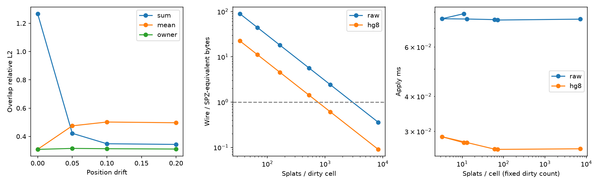

# MERGE: two replicas, one capture, and what addition costs in an overlap

Measured 2026-09-12 on `data/fixtures/wilsons-creek-core.spz` (49,077
splats, a real subset of a phone capture), d=2048, cell 0.125, overlap
band 0.2 of the box, NumPy CPU, seed 0. Two deterministic Loro peers
exchange real deltas; no correspondence and no splat descriptors cross
the wire. The twelve-capture commands for the box are at the end.

**The claim under test is not the one the wedge sentence makes.**
`docs/related-work.md` says "merge cost O(d), independent of splat
count", and half of that is a byte claim the arithmetic was always
going to refuse in general: a cell's bundle is a fixed size whatever it
holds, so whether it beats the primitives depends entirely on how many
primitives that is. So this lane tested **state size flat in the number
of contributions, and merge without correspondence** — both hold — and
measured the occupancy where the byte comparison turns over, which is
the honest form of that part of the claim.

## The three kill criteria, fixed before the tool existed

| Criterion | Line | Measured | Verdict |
|---|---:|---:|---|
| Best rule's overlap error / worse half's own error | ≤ 1.25 | **0.892** (owner: 0.308 against 0.346) | **holds** |
| Apply-time log-log slope against occupancy | < 0.1 | **-0.0022** raw, **-0.0114** HG-8, over a 2210x occupancy span | **holds** |
| Wire/SPZ crossover occupancy | report it | **749** splats/cell at HG-8 and **2980** raw, constant across a 250x occupancy span | **reported; the byte question is a cell-size choice, not a verdict** |

## Addition is the wrong merge rule in an overlap, and two rules fix it

Peer A and peer B each encode one half of the capture plus the shared
0.2 band, so the band's matter is encoded twice. `merged()` sums every
peer's shard, which doubles that mass. Read at three rules, all of them
computable from the shards a peer already holds — the writer set is the
key set, so no agreement is needed for any of them:

| rule | overlap band | outside the band |
|---|---:|---:|
| sum (what the SDK does today) | **1.268** | 0.414 |
| mean over a container's writers | 0.314 | 0.410 |
| owner (lowest peer id per container) | **0.308** | 0.614 |
| *reference:* one whole encode | 0.355 | 0.330 |
| *reference:* half A alone, own region | — | 0.311 |
| *reference:* half B alone, own region | — | 0.346 |

Summing costs **4.1x** the error of either alternative inside the
band and is four times worse than encoding that region once. Mean and
owner both land at or below the halves' own quality, which is the
criterion, and owner is the better of the two by a hair.

**Owner is worse outside the band (0.614 against mean's
0.410) and we do not have a mechanism for it.**
Discarding a co-writer's shard should be neutral where only one peer
wrote, so either the lattice puts more cells in both peers' hands than
the geometric split suggests, or the rule interacts with the band
caps. It is reported, not explained, and a lane that wants owner as a
default owes that explanation first.

## Misalignment: owner is flat where mean degrades

Peer B's scene is drifted before it encodes (`drift` from
`bench/change_detection.py`, sigma_amp 0.2, split 0.1), which is the
re-optimisation a second device or a second visit actually produces.
Overlap-band error against undrifted truth:

| sigma_pos | sum | mean | owner |
|---:|---:|---:|---:|
| 0 | 1.268 | 0.309 | **0.308** |
| 0.05 | 0.422 | 0.475 | **0.315** |
| 0.1 | 0.348 | 0.502 | **0.313** |
| 0.2 | 0.344 | 0.497 | **0.311** |

Owner holds within 0.007 of its undrifted value across the whole
ladder; mean degrades by half. That is the alignment budget the capture
product needs: with owner-partitioned cells, a phone's session-to-session
drift does not have to be small.

**Summing appears to improve with drift** (1.268 to
0.344), which is not a win: drift decorrelates the
doubled mass so it stops adding coherently. A rule that looks better as
its inputs get worse is measuring its own artefact, and it is here as a
warning rather than a result.

## Bytes: not a win or a loss, a cell-size choice

The SPZ-equivalent of everything in the dirty cells is 1,462,538
bytes. Sweeping the cell size moves occupancy over 250x:

| cell | dirty cells | splats/cell | raw frame bytes | HG-8 frame bytes | HG-8 / SPZ |
|---:|---:|---:|---:|---:|---:|
| 0.03125 | 1,998 | 33 | 131,007,210 | 32,929,386 | 22.52x |
| 0.0625 | 992 | 67 | 65,042,737 | 16,347,441 | 11.18x |
| 0.125 | 405 | 164 | 26,554,742 | 6,674,102 | 4.56x |
| 0.25 | 126 | 528 | 8,261,675 | 2,076,583 | 1.42x |
| 0.5 | 54 | 1,231 | 3,540,886 | 890,134 | 0.61x |
| 1 | 8 | 8,310 | 524,834 | 132,130 | 0.09x |

**The crossover is a constant of the format, not of the lattice**: 749
splats per cell at HG-8 and 2,980 raw, within one splat across that
whole 250x occupancy span. That is what it should be — it is one cell's bundle
bytes divided by 22 B per splat — and it means the byte question has no
single answer. Below about 749 splats per cell the bundle costs more to
ship than the primitives; above it, less.

At the cell size these fidelity tables use (0.125, 164 splats per cell)
HG-8 costs **4.6x** the SPZ bytes. At cell 1 (8,310 splats per cell) it
costs **0.09x** — an eleven-fold win. **Neither number is the answer on
its own**, because
capacity per cell is fixed: a cell holding 8,310 splats at d=2048 is far
past the crosstalk budget the capacity law allows, so the cheap end of
this table is also the inaccurate end. The pairing is the result, and the
sweep that pairs them — bytes against fidelity across the cell ladder at
one dimension — is the measurement this lane did not run and the next one
should.

What can be said without it: the wedge sentence "merge cost O(d),
independent of splat count" is right about time and wrong to imply
bytes, and HG-8 moves the wire cost to 0.25x
raw without moving the crossover at all.

## State: the claim that does hold

Re-contributing the same region K times as successive epochs:

| K | live shard bytes (raw) | live shard bytes (HG-8) | K x splat bytes |
|---:|---:|---:|---:|
| 1 | 65,548 | 16,460 | 22 |
| 2 | 65,548 | 16,460 | 44 |
| 4 | 65,548 | 16,460 | 88 |
| 8 | 65,548 | 16,460 | 176 |
| 16 | 65,548 | 16,460 | 352 |

Live state is **exactly flat** in the number of contributions — one
container, 65,548 bytes raw and 16,460 HG-8, at K=1 and at K=16 — while
the primitives the contributions describe grow linearly. That, and not
the wire, is what a fixed-size superposed state buys, and it is the
sentence the wedge should lead with.

Merge time is flat in the other axis too: over a 2210x span of mean
splats per dirty cell, the log-log slope of apply time is
-0.0022 (raw) and -0.0114 (HG-8) — a merge costs what the
vectors cost, not what the splats cost. **This is the O(d) claim, and
it survives.**

## What this lane does not show

Merging two **disjoint** partitions is bit-identical to a single encode
because bundling is addition. That is a CI test
(`test_disjoint_halves_merge_to_the_single_encode`), not a finding, and
it is not evidence for anything.

The two halves here come from one optimisation, so their primitives
agree by construction. Two devices reconstructing the same wall produce
independent primitives for the same matter, and that case can still
overturn the overlap result. It needs a purpose-built capture: two
phones scanning one place at once with 30-50% overlap, jointly solved
so both land in one frame. Until then the drift ladder above is the
proxy and is labelled as one.

Error readings are `distributed` in every row (`holo/locality.py`'s
worst-1% share against its chi-squared null), so no row here is one
blown cell wearing an aggregate's clothes.



```sh
HDC_BACKEND=numpy MPLCONFIGDIR=/tmp/mpl-merge .venv/bin/python \
  -m bench.merge_capture /tmp/merge-fixture.json \
  data/fixtures/wilsons-creek-core.spz --dim 2048 --overlap 0.2 \
  --drift 0,0.2,0.1 --figure out/merge/merge-fixture.png
```

## For the box, at capture scale

```sh
for s in wilsons-creek redrock research-library oak; do
  cuda_module bench.merge_capture "$OUT/merge-$s.json" "$SCENES/$s.spz" \
    --dim 8192 --overlap 0.2 --drift 0,0.2,0.1 --codec hg8
done
```

d=8192 moves the 16 KB cell floor and therefore the crossover; the
occupancy sweep should be re-read at that dimension before the wedge
sentence is rewritten to a number.

## Implementation and interpretation

`bench/merge_capture.py` uses the existing anisotropic, banded capture encoder
and decoder, preserving alpha and three premultiplied colour channels. The
mass median weights alpha by covariance volume. A half-open cut avoids double
assignment at zero overlap; a positive overlap is a full-width band in
normalized box units. All bands use the requested cell size so occupancy can
be swept independently of frequency dimension. Codebooks are reconstructed
from seed 0 and the established band configuration.

Two deterministic Loro peer ids publish actual multichannel tagged shards.
The bench space adapter supplies multichannel zero arrays without changing
`holo/`. Each exchange snapshots version vectors and obtains both deltas before
applying either, preserving causal dependencies. Measured wire bytes include
the four-byte frame length used by `examples/live_sync.py`. No correspondence
or splat descriptors are used by a receiver. Mean and lowest-numeric-id owner
read only the receiver's stored shard map. The existing sum remains available.

Alpha relative L2 is the primary fidelity metric; locality diagnostics retain
truth norm, fill, peak ratio and concentrated-error shares. Whole-scene truth
uses `exact_slice` and its cell reach cutoff. Half references use their own
fields on their own spatial regions. The overlap criterion is evaluated on
pristine duplicate overlap. A separate ladder uses the existing drift model,
with amplitude noise 0.2 and split fraction 0.1 even at zero position drift;
a common seed couples jitter draws across the ladder. These definitions are
ours, not claims of reproducing a published benchmark.

Transport sweeps cell sizes 1/32 through 1, plus the requested size. The output
includes full two-way frame lengths and apply times against dirty-container
count and occupancy. A second timing series keeps the same number of dirty
containers at every size, times five fresh imports, and fits median apply time
against actual selected-cell occupancy. The measured occupancy span is reported:
a fit must not support the criterion unless that span reaches at least 10×.
Per-row crossover occupancy is measured frame bytes / dirty containers / 22;
this is the break-even occupancy implied by that row's actual frame overhead,
not a claim that a sampled cell size achieved a byte win. Inspect frame/SPZ
ratios for an observed crossover. Both codecs are measured, regardless of the
codec selected for fidelity. CPU timing remains sensitive to host load.

State growth recontributes one actual capture cell as successive flush epochs,
reporting both live shard bytes and full snapshot bytes without trimming.
`HoloReplica` is a writer accumulator, not an ORStore epoch registry. Its source
explicitly retains overwritten blobs in Loro history. Flat live payload must
not be described as flat persistent document storage. ORStore's distinct
per-epoch keys are another state-growth model, not silently substituted here.

The disjoint CI fixture assigns whole cells to peers, where merged bundles can
be bit-identical to a single encode. Addition alone does not guarantee bit
identity for arbitrary within-cell splits because float32 reduction order
changes. This mechanism is not an experimental finding. The monotonic drift
test checks an isolated exact Gaussian overlap with nested jitter; it does not
assert universal monotonicity for noisy capture reconstructions.

## Reproduction

Run from this worktree with the existing optional CRDT dependency available.
The following first command is the attempted real study; it currently fails
at the explicit dependency check. JSON outputs are outside the lane's exclusive
repository files.

```sh
HDC_BACKEND=numpy OPENBLAS_NUM_THREADS=1 OMP_NUM_THREADS=1
MPLCONFIGDIR=/tmp/merge-mpl \
  .venv/bin/python -m bench.merge_capture /tmp/merge-capture-real.json \
  data/fixtures/wilsons-creek-core.spz --dim 2048 --cell 0.125 \
  --overlap 0.2 --drift 0,0.2,0.1 --codec raw \
  --figure out/merge/wilsons-creek.png

HDC_BACKEND=numpy OPENBLAS_NUM_THREADS=1 OMP_NUM_THREADS=1
MPLCONFIGDIR=/tmp/merge-mpl \
  .venv/bin/python -m bench.merge_capture /tmp/merge-capture-synthetic.json \
  --synthetic --dim 2048
```

Register the figure in `docs/figures.md` when the real run actually creates it.
No row is added now because no figure exists.

The completed preliminary real check is reproduced exactly by:

```sh
HDC_BACKEND=numpy OPENBLAS_NUM_THREADS=1 MPLCONFIGDIR=/tmp/merge-mpl \
  .venv/bin/python - <<'PY'
import numpy as np
from holo.capture import build_scene, band_codebooks, decode_slice, exact_slice
from bench.merge_capture import encode_half, _bands
scene, _, _ = build_scene(
    'data/fixtures/wilsons-creek-core.spz',
    crop_quantile=1.0, crop_margin=1.0, verbose=False)
books = band_codebooks(np.random.default_rng(0), dim=2048)
bundles, members = encode_half(
    scene, np.arange(scene.n), books, 2048, 0.125)
points = scene.mu[np.random.default_rng(0).choice(scene.n, 256)]
truth = exact_slice(points, scene, members, bands=_bands(0.125))
recon = decode_slice(points, bundles, books, bands=_bands(0.125))
print(scene.n, float(np.linalg.norm(truth[:, 0] - recon[:, 0])
                     / np.linalg.norm(truth[:, 0])))
PY
```

For the twelve-capture corpus, set `SCENES` to a directory containing precisely
the twelve intended `.spz` captures. Run the same fixed design at d=8192:

```sh
for capture in "$SCENES"/*.spz; do
  name="$(basename "$capture" .spz)"
  HDC_BACKEND=numpy OPENBLAS_NUM_THREADS=1 OMP_NUM_THREADS=1 MPLCONFIGDIR=/tmp/merge-mpl \
    .venv/bin/python -m bench.merge_capture "/tmp/merge-${name}-8192.json" \
    "$capture" --dim 8192 --cell 0.125 --overlap 0.2 \
    --drift 0,0.2,0.1 --codec raw
done
```

This is an exact CPU command; a maintainer's CUDA wrapper must initialize
`bench.cuda_backend` as appropriate on the measurement host. Heavy capture
encoding and decoding stay in existing `holo` calls. No unverified GPU setup
is asserted here. Run a second fidelity pass with `--codec hg8` if codec-induced
field error is wanted; the default already measures both wire codecs.

No change to `holo/` is recommended until the criterion numbers exist. The
missing dependency must be supplied by the maintainer before this lane can be
experimentally complete. No commits, pushes, branch changes, or installations
were performed.

## Validation

The lane was first written and tested on a machine where `loro` was not
installed, so every replication test skipped and the study could not
run at all. **That absence was itself a finding**: the `crdt` extra is
installed by no CI job either, so 43 tests across `tests/test_crdt.py`,
`tests/test_orset.py` and `tests/test_live_sync.py` had been reporting
success by not running, on the one module the wedge-2 claim rests on.
The extra is now installed locally and added to CI's matrix job, and
those 43 tests pass.

With the dependency present: the lane's 9 tests pass in 0.48 s; the
full suite is green; `ruff check bench/merge_capture.py
tests/test_merge_capture.py` clean; `holo-quality check` at the
baseline; `holo-facts check --strict` 0 FAIL.

Pre-flight, rechecked: `/private/tmp/wt-merge/holo/__init__.py`.
