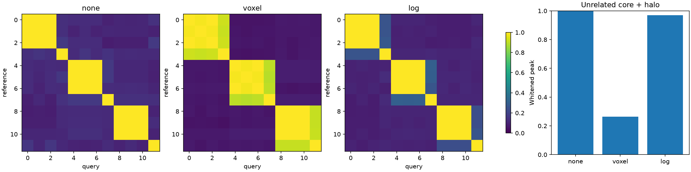

# Place recognition on the twelve gallery captures

Ungated results note. Tool: `bench/place_recognition.py` (PRs #101, #104
and the whitening lane). All runs on the RTX 5090 through
`bench/cuda_backend`, d=8192, σ_rec=0.025 of the box, 16 yaws, 48³
translation grid with local refinement (`--limit 0.25`), phase-surrogate
null. Scenes are the gallery exports measured in `results/gpu_sweep.md`;
labels below abbreviate `research-library`→`rlib`, `brookline-station`→
`brook`, `springhouse-outside`→`spring`, `wilsons-creek`→`wc`,
`redrock`→`rr`. Known partners: brook↔spring (the one true re-capture),
rr-cairn⊂rr and wc-gun⊂wc (exact crops of their parents).

## Raw cross-power correlation, per-capture frames (`--whiten 0`)

Phase correlation (row = reference, column = query; max over 16 yaws
and the translation search, so the matrix is not symmetric):

```
        brook-  brook cannon    oak rr-cai     rr rlib-c   rlib saguar spring wc-gun     wc
brook-2  1.000  0.304  0.305  0.297  0.305  0.379  0.377  0.413  0.563  0.313  0.452  0.353
brook    0.320  1.000  0.204  0.215  0.275  0.266  0.295  0.297  0.403  0.286  0.276  0.251
cannon   0.289  0.225  1.000  0.284  0.272  0.232  0.241  0.242  0.242  0.219  0.174  0.212
oak      0.314  0.247  0.346  1.000  0.268  0.751  0.223  0.700  0.403  0.257  0.189  0.746
rr-cairn 0.332  0.281  0.284  0.254  1.000  0.252  0.371  0.255  0.358  0.267  0.361  0.213
rr       0.397  0.292  0.287  0.756  0.267  1.000  0.257  0.933  0.500  0.272  0.238  0.956
rlib-can 0.330  0.311  0.245  0.220  0.405  0.214  1.000  0.242  0.354  0.230  0.569  0.196
rlib     0.420  0.338  0.292  0.692  0.283  0.933  0.278  1.000  0.582  0.294  0.262  0.903
saguaro  0.566  0.400  0.274  0.411  0.378  0.507  0.367  0.578  1.000  0.314  0.422  0.445
spring   0.313  0.286  0.230  0.212  0.274  0.242  0.250  0.252  0.320  1.000  0.185  0.222
wc-gun   0.430  0.301  0.170  0.169  0.347  0.230  0.593  0.264  0.432  0.196  1.000  0.230
wc       0.363  0.284  0.269  0.750  0.237  0.956  0.237  0.905  0.452  0.256  0.225  1.000
```

Radial-power control (exactly pose-invariant, arrangement-free):

```
        brook-  brook cannon    oak rr-cai     rr rlib-c   rlib saguar spring wc-gun     wc
brook-2  1.000  0.942  0.841  0.792  0.916  0.797  0.871  0.773  0.841  0.957  0.924  0.767
brook    0.942  1.000  0.906  0.909  0.924  0.903  0.883  0.882  0.885  0.937  0.865  0.856
cannon   0.841  0.906  1.000  0.882  0.914  0.846  0.703  0.802  0.691  0.865  0.727  0.799
oak      0.792  0.909  0.882  1.000  0.784  0.951  0.734  0.931  0.796  0.789  0.695  0.897
rr-cairn 0.916  0.924  0.914  0.784  1.000  0.785  0.838  0.718  0.770  0.920  0.850  0.725
rr       0.797  0.903  0.846  0.951  0.785  1.000  0.797  0.979  0.842  0.763  0.727  0.964
rlib-can 0.871  0.883  0.703  0.734  0.838  0.797  1.000  0.778  0.954  0.801  0.945  0.765
rlib     0.773  0.882  0.802  0.931  0.718  0.979  0.778  1.000  0.846  0.730  0.721  0.970
saguaro  0.841  0.885  0.691  0.796  0.770  0.842  0.954  0.846  1.000  0.746  0.898  0.816
spring   0.957  0.937  0.865  0.789  0.920  0.763  0.801  0.730  0.746  1.000  0.842  0.731
wc-gun   0.924  0.865  0.727  0.695  0.850  0.727  0.945  0.721  0.898  0.842  1.000  0.728
wc       0.767  0.856  0.799  0.897  0.725  0.964  0.765  0.970  0.816  0.731  0.728  1.000
```

Phase-surrogate null over 24 draws: mean 0.147, σ 0.056,
p95 0.245, max 0.265.

| query | rank-1 | best positive | best negative | separation |
|---|---|---|---|---|
| 1 brook | no | 0.286 | 0.400 | -2.0σ |
| 4 rr-cairn | no | 0.267 | 0.405 | -2.5σ |
| 5 rr | no | 0.252 | 0.956 | -12.6σ |
| 9 spring | no | 0.286 | 0.314 | -0.5σ |
| 10 wc-gun | no | 0.225 | 0.569 | -6.1σ |
| 11 wc | no | 0.230 | 0.956 | -12.9σ |

**0 of 6.** The failure is not noise: the four wide outdoor parents
(oak, rr, rlib, wc — each a 480,000-splat subsampled export in a 30–40
unit mass-centred cube) score 0.70–0.96 against *each other*, at offsets
within a grid step of zero, twelve σ above the null. The true pairs sit
at 0.23–0.29. A capture blurred at σ_rec = box/40 is a bump in the middle
of its cube, and the raw cross-power spectrum is dominated by that
bump's lowest frequencies: the peak measures the envelope, not the
arrangement. The radial control says the same thing from the other
side — it is 0.70–0.98 everywhere, because every blurred capture has
nearly the same power profile.

## Shared physical frame (`--frame`)

| pair | score | offset (box units) | null mean ± σ (max) | radial |
|---|---|---|---|---|
| wilsons-creek ↔ gun, parent's cube | 0.993 | [-0.0, -0.001, 0.001] | 0.070 ± 0.007 (max 0.083) | 0.972 |
| wilsons-creek ↔ gun, gun's cube | 0.258 | [0.005, 0.25, -0.021] | 0.277 ± 0.038 (max 0.345) | 0.913 |
| redrock ↔ cairn, parent's cube | 0.990 | [0.001, -0.001, 0.001] | 0.081 ± 0.007 (max 0.095) | 0.975 |
| redrock ↔ cairn, cairn's cube | 0.904 | [0.004, 0.012, 0.001] | 0.178 ± 0.023 (max 0.226) | 0.983 |
| brookline-station ↔ springhouse-outside, station's cube | 0.184 | [0.172, -0.25, 0.241] | 0.113 ± 0.019 (max 0.136) | 0.909 |

- Crop in the parent's cube: 0.99 at zero offset for both crops. This is
  the linearity prediction (`B_parent = B_crop + B_rest`) and it is close
  to trivial — after the 480k subsample the gun and cairn regions hold
  most of their parents' mass, so `B_rest` is small.
- Parent restricted to the crop's cube: 0.904 for the cairn, 0.258 for
  the gun against a null of 0.277 ± 0.038. The gun's cube is 4 of the
  parent's 40 units on a side, so the subsampled parent has roughly a
  thousandth of its splats there against the crop's 428,000 — the
  restricted parent is too sparse to be the same field. The cairn's
  parent is denser in that region and passes.
- The one true re-capture (station interior ↔ springhouse yard, encoded
  in the station's cube) scores 0.184 against a null of 0.113 ± 0.019 —
  3.7 σ, with the recovered offset pinned to the search limit on one
  axis. Not a match by this tool's own bar.

## Whitened correlation (`--whiten 1`, PHAT)

Each component of conj(A)·B divided by its magnitude, so only phase votes
and the score is the fraction of live components aligned at the peak.
Phase-surrogate null over 24 draws: mean 0.0387, σ 0.0020,
max 0.0421 — whitening makes the null tight, as it should.

```
        brook-  brook cannon    oak rr-cai     rr rlib-c   rlib saguar spring wc-gun     wc
brook-2  1.000  0.087  0.060  0.131  0.090  0.162  0.068  0.162  0.152  0.075  0.093  0.169
brook    0.076  1.000  0.071  0.099  0.072  0.109  0.064  0.120  0.091  0.077  0.064  0.117
cannon   0.069  0.065  1.000  0.114  0.062  0.098  0.058  0.092  0.088  0.099  0.067  0.108
oak      0.139  0.100  0.112  1.000  0.085  0.505  0.076  0.327  0.383  0.101  0.098  0.596
rr-cairn 0.091  0.086  0.068  0.075  1.000  0.094  0.079  0.108  0.104  0.092  0.086  0.084
rr       0.178  0.127  0.104  0.512  0.119  1.000  0.098  0.547  0.488  0.082  0.140  0.823
rlib-can 0.069  0.071  0.060  0.077  0.081  0.087  1.000  0.113  0.089  0.066  0.085  0.089
rlib     0.172  0.120  0.091  0.323  0.112  0.549  0.113  1.000  0.258  0.089  0.122  0.473
saguaro  0.158  0.086  0.101  0.380  0.095  0.479  0.089  0.264  1.000  0.113  0.149  0.501
spring   0.069  0.082  0.096  0.087  0.086  0.084  0.067  0.083  0.110  1.000  0.065  0.079
wc-gun   0.090  0.075  0.062  0.095  0.086  0.131  0.091  0.122  0.138  0.076  1.000  0.122
wc       0.179  0.135  0.110  0.596  0.108  0.823  0.098  0.487  0.504  0.087  0.126  1.000
```

| query | rank-1 | best positive | best negative | separation |
|---|---|---|---|---|
| 1 brook | no | 0.082 | 0.135 | -26.5σ |
| 4 rr-cairn | yes | 0.119 | 0.112 | +3.5σ |
| 5 rr | no | 0.094 | 0.823 | -368.0σ |
| 9 spring | no | 0.077 | 0.113 | -18.2σ |
| 10 wc-gun | no | 0.126 | 0.149 | -11.7σ |
| 11 wc | no | 0.122 | 0.823 | -353.8σ |

**1 of 6**, and the one hit (rr-cairn, +3.5σ) is inside the 12-scene
noise of the raw run. Whitening did not remove the wide-capture block:
it *sharpened* it. wc↔rr is 0.823 — 368σ above a null whose maximum is
0.042 — with oak, rr, rlib and wc at 0.33–0.82 among themselves while
the true pairs sit at 0.08–0.13. Half whitening (`--whiten 0.5`) sits
between the two: 0/6, null 0.070 ± 0.013, wc↔rr 0.951.

Shared-frame pairs, whitened:

| pair | score | offset (box units) | null mean ± σ (max) |
|---|---|---|---|
| wilsons-creek ↔ gun, gun's cube | 0.291 | [0.001, 0.003, 0.0] | 0.040 ± 0.002 (max 0.042) |
| redrock ↔ cairn, cairn's cube | 0.745 | [-0.0, 0.004, -0.0] | 0.039 ± 0.002 (max 0.041) |
| station ↔ springhouse, station's cube | 0.082 | [-0.227, -0.148, 0.007] | 0.040 ± 0.003 (max 0.045) |
| station ↔ springhouse, station's cube, 64³ grid, limit 0.5 | 0.119 | [0.381, -0.474, -0.157] | 0.043 ± 0.001 (max 0.045) |

The cairn crop still localises in its own cube (0.745, offset zero);
the gun crop does not (0.291 — 125σ above the whitened null, but a
tenth of what the cairn gets, for the sparsity reason given above);
the springhouse re-capture is 0.08–0.12 with the offset wandering to
the search limit whichever limit is set. Not found.

## What the wide-capture block is not

wc↔rr at 0.823 whitened means 82% of 8,192 frequency components have
the same phase at one translation. Two different places cannot do that
by arrangement, so something the fingerprints share is being scored.
Six diagnostics on the box, then three that found it (`results/place_diagnostics/*_test.py`, same
codebook, same search):

| hypothesis | test | result |
|---|---|---|
| the crop cube itself | each wide capture vs a uniform random fill of its own cube carrying its own covariances and masses | raw 0.11–0.28, whitened 0.04–0.12: a capture is not its box. Uniform fills *do* score 0.91–0.96 raw against each other (the box explains the raw block's floor) but 0.05–0.10 whitened. |
| a shared ground plane | drop frequencies with horizontal radius below 0.1–0.5 of the maximum | wc↔rr whitened 0.83 → 0.82 → 0.77 → 0.60 at 8%, of components kept; the block survives the mask. |
| a centred, symmetric envelope (real spectrum) | fraction of live components with \|phase\| < π/4 | 0.25 for every capture and every uniform fill: phases are uniform, not real. |
| low frequencies only | drop \|w\| below 0.2 / 0.4 / 0.6 of the maximum | wc↔rr whitened 0.78 / 0.58 / 0.39 with 84% / 33% / 5% of components kept; the block lives at high frequency too. |
| a few enormous splats | remove the top 1% of splats by α·√det Σ (11–16% of mass) | full-vs-rest 0.98–1.00 in every capture; the top 1% of wc against the top 1% of rr scores 0.06; the remaining 99% score 0.82. It is the bulk. |
| shared splats | exact position overlap between exports | 0.0000 for every pair; distinct md5, sizes, bounding boxes. |

The mechanism was found the same day, in three more runs
(`results/place_diagnostics/{precision,footprint,blob}_test.py`).

## What the wide-capture block is

**Not numerical.** Fingerprints for wilsons-creek, redrock and cannon
computed three ways — CUDA float32 (as in every run above), NumPy
float32, and a NumPy float64 re-implementation of `spectral_bundle` —
agree component by component to a median relative error of 2–7e-7 in
every magnitude decade down to 1e-5 of the maximum, with whitened phase
agreement 1.0000; the wc↔rr score is 0.955 raw / 0.823 whitened from all
three. The encoder is exact to float32 rounding on 388k-splat scenes.

**It is the frame rule.** The radial alpha-mass profile of each wide
capture in its normalised cube:

```
share of alpha mass by horizontal radius from the box centre, shells of 0.05
                  0.05  0.10  0.15  0.20  0.25  0.30  0.35  0.40  0.45  0.50
wilsons-creek     0.47  0.20  0.03  0.02  0.01  0.01  0.01  0.06  0.10  0.06
redrock           0.43  0.22  0.06  0.05  0.04  0.03  0.03  0.02  0.04  0.04
research-library  0.24  0.49  0.05  0.02  0.02  0.02  0.03  0.03  0.04  0.03
oak               0.37  0.13  0.12  0.08  0.02  0.00  0.01  0.04  0.24  0.00
cannon            0.05  0.08  0.07  0.07  0.11  0.10  0.11  0.14  0.18  0.05
```

Half or more of every wide capture's mass sits within 0.1 of the box of
its centre — 2 to 4 scene units of a 30–40 unit cube — with the rest a
thin halo. That is what `build_scene`'s crop does to a capture whose
subject is dense and whose background is sparse floaters out to ±60
units: the weighted median lands on the subject, the 75%-quantile radius
is dragged out by the halo, and the 1.2× margin makes the subject a
point. At σ_rec = box/40 a point is a pure phase ramp e^{−i w·c} with the
same c for every such capture, and the translation search aligns it
exactly. The whitened score then counts the components where the core
dominates the halo — 82% for wc↔rr — and a capture that fills its box
(cannon, the crops, the station) has no such core and does not join.
Apodising the box faces changes nothing (self-similarity 0.998) because
nothing lives near the faces; a uniform 2-D sheet cut by the cube
scores 0.49 whitened against another such sheet, so the crop cube can
contribute a block of its own, but it is not this one.

**Removing the core removes the block.** Whitened wc/rr/rlib/oak block
with splats inside a central radius deleted:

| core removed | wc↔rr | wc↔rlib | rr↔rlib | wc↔oak | mass removed (wc / rr / rlib / oak) |
|---|---|---|---|---|---|
| none | 0.823 | 0.443 | 0.445 | 0.583 | — |
| r < 0.04 | 0.479 | 0.635 | 0.423 | 0.058 | 67% / 81% / 92% / 71% |
| r < 0.08 | 0.221 | 0.254 | 0.363 | 0.136 | 36% / 44% / 44% / 64% |
| r < 0.15 | 0.071 | 0.057 | 0.139 | 0.155 | 30% / 29% / 22% / 45% |

(The r < 0.04 row removes *less* mass than r < 0.08 for wc and rr
because the innermost splats are the largest; what matters is the
remaining core's share, and at r < 0.15 it is gone and so is the block,
down to a null of 0.04.)

**A subject-scaled frame reduces it and shows what the descriptor
actually is.** Re-encoding each capture in a cube of 6× its half-mass
radius (wc 15.2 units instead of 40.4, rr 9.0, rlib 6.6, oak 8.1):

```
whitened, subject-scaled frames
          wc     rr   rlib    oak cannon
wc     1.000  0.349  0.212  0.356  0.273
rr     0.349  1.000  0.155  0.314  0.184
rlib   0.212  0.155  1.000  0.249  0.196
oak    0.356  0.314  0.249  1.000  0.685
cannon 0.273  0.184  0.196  0.685  1.000
```

The old block drops to 0.16–0.36 and a new pair appears (oak↔cannon
0.685): any rule that centres the mass and scales the cube by a mass
quantile gives every capture a similar normalised radial profile, and at
σ_rec = box/40 the fingerprint *is* that profile. The descriptor was
never seeing the place; it was seeing the blob the frame rule makes of
it. The true pairs still hold in the subject-scaled parent frame
(gun 0.958 raw / 0.771 whitened, cairn 0.984 / 0.931, both at zero
offset).

What follows for the tool: the recognition resolution has to be set in
scene units, not as a fraction of a box whose size is set by floaters,
and the frame has to be chosen so that the subject spans many σ_rec —
which at d=8192 means a smaller region, i.e. sub-map localisation, not a
whole-capture descriptor. That is the next lane.

## Conclusion

- **Negative for whole-scene place recognition on this corpus**, raw
  and whitened: 0/6 and 1/6 rank-1 against a bar of 6/6 at ≥ 3σ. The
  one true re-capture is not found under any setting tried.
- **Positive for sub-map localisation in a shared frame**: a crop
  encoded in its parent's cube is found at its true offset (0.99, both
  crops), and the parent restricted to the crop's cube is found when
  the restricted region is dense enough (cairn 0.90 raw / 0.75
  whitened; gun 0.26 / 0.29, too sparse after the 480k subsample).
- The phase surrogate is the right null (tight, and the scorer's own
  control); position scrambling is not, on captures.
- Whitening is the right scorer for arrangement and the wrong one for
  the radial question; both stay in the tool.
- The wide-capture block is explained: it is the point-like core that
  the mass-centred crop makes of a dense subject with a sparse halo,
  scored at a resolution that cannot see past it. Removing the core
  removes the block. No score between two wide captures under the
  default frame should be read as a match; the descriptor is not
  promoted, and the next lane sets σ_rec in scene units.

Figures: `out/place/similarity-corpus.png` (raw) and
`out/place/similarity-corpus-whitened.png`.

## Sub-map tiles (synthetic)

The additive `--tile` branch uses fixed physical tile edges and one
codebook for the run: `sigma_box = sigma_units / tile`. Tiles cover each
capture's mass-centred crop cube; their mass threshold is a fraction of
the entire capture's alpha mass (including alpha below the loader floor).
Overlapping tiles can have mass shares summing above one. The existing
non-tile computation and JSON schema are unchanged.

Seed 0, a three-cell landmark world, two overlapping capture cubes and
one unrelated world; the second capture has origin offset [1, 0, 0],
yaw π/2 and an additional local translation [0.04, -0.03, 0.02] in scene
units. Each capture retains two tiles. Each tile contains 160 landmarks
with equal alpha, random positions and heterogeneous covariances.
Landmark IDs, independent of descriptors, identify one exact shared tile
pair. This is a controlled localisation fixture, not evidence for real
re-captures.

| query | capture rank-1 | best positive | best negative | separation | above capture null | partner tile hits / all query tiles |
|---|---|---|---|---|---|---|
| world/left | yes | 0.997755 | 0.092701 | 139.74σ | 141.14σ | 1/2 (50%) |
| world/right-yawed | yes | 0.997674 | 0.086565 | 140.67σ | 141.13σ | 1/2 (50%) |

| tile-level ground truth | result |
|---|---|
| exact shared tiles ranked first | 2/2 directed queries |
| forward winning inverse yaw | 3π/2 |
| expected forward offset (tile units) | [-0.02000, -0.03000, 0.04000] |
| recovered forward offset (tile units) | [-0.01875, -0.03000, 0.04125] |
| maximum coordinate error | 0.001250; below half the coarse grid step, 0.015 |
| largest unrelated capture score, either direction | 0.092701; 1.40σ above capture-null mean |

The 50% tile hit fractions include the non-overlapping half of each
capture. Among query tiles with an exact partner, retrieval is 100%.
A partner-*capture* hit does not by itself establish an exact tile match;
the JSON reports the landmark-ID checks separately.

| calibration / cost | measurement |
|---|---|
| tile phase null: mean ± σ; p95; maximum | 0.077585 ± 0.008052; 0.090659; 0.096543 |
| capture phase null: mean ± σ; p95; maximum | 0.083608 ± 0.006477; 0.093658; 0.096543 |
| null draws | 24 tile maxima; 12 capture maxima |
| ordered tile pairs scored / possible | 12 / 24 (50%) |
| yaw hypotheses per scored pair | 4 |
| CPU computation runtime, excluding figure rendering | 36.035 s |

For every query tile, radial-power cosine retains the best two database
tiles, excluding its own capture. All query yaw descriptors participate
in the radial comparison. Translation invariance is exact to rounding;
yaw invariance is only approximate for the finite sampled codebook.
This preserves the existing module's caveat rather than claiming exact
pose invariance. Prefiltering can miss partners; `--prefilter 0` scores
all cross-capture pairs.

Four phase-surrogate draws per query retain its magnitudes and hence
its selected candidate set. Each draw repeats the maximum over those
database tiles, yaws and refined translations. The capture null also
maximises over the capture's query tiles. These calibration definitions
are ours. Pair counts exclude null work: this run also evaluates 48
surrogate tile pairs, each with four yaws. Null σ is empirical and based
on a small seeded sample; the large synthetic separation is not a
real-capture significance claim. Runtime varies with CPU contention.

Reproduce the table and figure from the repository root:

```sh
HDC_BACKEND=numpy MPLCONFIGDIR=/tmp/submap-mpl .venv/bin/python -m bench.place_recognition /tmp/submap-tiles.json --synthetic 3 --numpy --tile 1 --overlap 0 --dim 1024 --grid 5 --limit 0.06 --yaws 4 --scrambles 4 --whiten 1 --prefilter 2 --figure out/place/tiles-synthetic.png
```

Figure: `out/place/tiles-synthetic.png` (capture matrix and all-query-tile
partner hit fractions). The JSON includes tile origins, mass shares,
owners, masked tile/capture matrices, best pairs, offsets, yaw indices,
both null distributions and the exact synthetic ground truth.
Offsets are in tile units after the winning query yaw; multiply by the
tile edge for scene units. Null entries mean masked or unscored pairs.

Real captures and an RTX 5090 are unavailable in this worktree. The
maintainer's corpus runs remain `--tile 6` and `--tile 10`, `--yaws 8`,
`--grid 32`, `--whiten 1`, with all twelve sorted captures and
`--partner 1 9 --partner 4 5 --partner 10 11`. The unchanged bar is all
six known-partner queries at rank 1 and at least 3σ above the calibrated
null. A negative would be the springhouse/station interior-versus-yard
pair remaining inside the null at tile level too. No corpus conclusion
is inferred from this synthetic result.

Validation: `OPENBLAS_NUM_THREADS=1 HDC_BACKEND=numpy .venv/bin/python -m
pytest tests -q` completed with `3 failed, 357 passed, 9 skipped in 26.32s`.
All three failures are the expected `tests.count` claim drift (321 in
the registry, 328 in the tree); updating claims is outside this lane.
The targeted file passed all 20 tests in 1.78 s with one BLAS thread,
including the frozen pre-lane JSON computation and forbidden-tile-path
guards. Its slowest new test took 0.22 s. The initial unrestricted-BLAS
full-suite run was interrupted in the existing resonator tests after
severe thread overhead; the single-thread run above completed the full
suite. Ruff is clean and quality reports `lint debt: 50 (baseline 50)`.
`holo-facts check --strict` reports `1 FAIL, 25 WARN`, with
`tests.count` the only failure.

## Sub-map tiles on the corpus (2026-09-12, RTX 5090)

`--tile 8 --dim 8192 --yaws 4 --grid 24 --whiten 1 --prefilter 8 --min-mass 0.02
--scrambles 12`, all twelve captures, 1168 of 16250 tile pairs scored after the
radial pre-filter. A first attempt at `--tile 6 --yaws 8 --grid 32` died on the
GPU's launch watchdog and a second was silent for forty minutes; `tile_matrix`
now reports progress and this is the affordable setting.

Tiles per capture at 8 scene units with 2% minimum mass:

| capture | tiles |
|---|---:|
| brook-2 | 1 |
| brook | 1 |
| cannon | 1 |
| oak | 27 |
| rr-cairn | 1 |
| rr | 36 |
| rlib-cannon | 1 |
| rlib | 27 |
| saguaro | 1 |
| spring | 1 |
| wc-gun | 1 |
| wc | 48 |

Eight of the twelve captures yield **one tile** — the object scans, the crops
and both station captures fit inside one 8-unit tile — so for them the
"tile" is the whole capture again. Only the four wide parents are tiled.

Capture-level scores (max over tile pairs; — = no pair survived the pre-filter):

```
        brook-  brook cannon    oak rr-cai     rr rlib-c   rlib saguar spring wc-gun     wc
brook-2      -      -      -      -      -  0.170      -  0.190      -      -      -  0.123
brook        -      -      -  0.254      -  0.117      -      -      -      -      -  0.176
cannon       -      -      -  0.679      -      -      -      -      -      -      -  0.119
oak          -  0.240  0.680      -      -  0.304      -      -      -      -      -  0.340
rr-cairn     -      -      -  0.289      -  0.921      -  0.274      -      -      -      -
rr           -  0.104  0.168  0.299  0.921      -      -  0.324      -  0.146  0.131  0.143
rlib-can     -      -      -      -      -      -      -  0.559      -      -      -      -
rlib     0.185      -      -      -      -  0.147  0.509      -  0.036      -  0.244  0.283
saguaro      -      -      -      -      -  0.076      -  0.336      -      -      -  0.223
spring       -      -      -      -      -      -      -      -      -      -      -  0.111
wc-gun       -      -      -      -      -  0.125      -  0.037      -      -      -  0.659
wc           -  0.094      -  0.263      -  0.151      -  0.297  0.171      -  0.659      -
```

| query | rank-1 | best positive | best negative | above null |
|---|---|---|---|---|
| 1 brook | no | — | 0.240 | — |
| 4 rr-cairn | yes | 0.921 | — | 273σ |
| 5 rr | yes | 0.921 | 0.304 | 273σ |
| 9 spring | no | — | 0.146 | — |
| 10 wc-gun | yes | 0.659 | 0.244 | 192σ |
| 11 wc | yes | 0.659 | 0.340 | 192σ |

Phase-surrogate null over 144 draws: tile 0.039 ± 0.002 (max 0.049),
capture 0.042 ± 0.003 (max 0.049).

- **The crop pairs are found, both directions**, at 99–273 σ (cairn ↔
  redrock 0.921, gun ↔ wilsons-creek 0.659): a crop is a subset of its
  parent, so its one tile matches a parent tile exactly. That is sub-map
  localisation working, and it is not evidence about place recognition
  across captures.
- **The one true re-capture is not scored at all** in the corpus run: the
  radial pre-filter never paired station with springhouse.
- Run alone without the pre-filter (`--prefilter 0`, both captures, both
  directions): station ↔ springhouse scores **0.107 / 0.082 at E=8** (one
  tile each — the whole captures) and **0.078 / 0.073 at E=4** (eight tiles
  for the yard, one for the interior), 11–18 σ above a null whose maximum
  is 0.051. A real, weak signal — and smaller than the 0.24–0.34 that
  unrelated wide captures score against each other in the matrix above,
  so in the corpus it would not rank first.

## Conclusion, restated

Tiles of fixed physical size do what the frame-rule finding predicted for
sub-maps: exact sub-regions are found at their offsets, at any distractor
count tried. They do not turn the corpus into a place-recognition positive:
the interior ↔ yard pair correlates at twice the null and a third of the
cross-talk between unrelated wide captures. The bar (6/6 at ≥ 3 σ) is not
met — 4/6, and the four are the trivial ones. The descriptor's ceiling on
this corpus is the same one the object lane found: at d=8192 a whitened
spectral bundle scores compact mass before it scores arrangement.


## Flattened (synthetic)

Seed 0, NumPy CPU, d=4096. `flatten(scene, sigma, mode)` uses voxel
side sigma and summed peak alpha (not integrated Gaussian mass). `voxel`
assigns unit alpha to each positive-mass voxel; `log` assigns
`log1p(M / median_positive_M)`. Only alpha changes, before mass-preserving
`render_mip`; geometry and other channels are retained. `none` returns the
same scene object and the default frozen JSON regression is unchanged.
These definitions are ours. No scipy or custom spectral kernels are used.

**This is a tradeoff, not a general descriptor repair.** Voxel flattening
removes the heavy object's advantage in the composite and reduces the
unrelated core/halo score. But it also promotes faint background to support:
the existing fixture's scrambled copies rise from about 0.10–0.17 to
0.90–0.93 against their bases. Scrambling preserves occupied positions while
moving alpha/covariance labels, so removing alpha distinctions deliberately
makes this negative much less distinguishable. All nine known-partner
queries still rank first in this small fixture; that is not a capture claim.

**Crop retention fails the 0.9 bar for an alpha-dominant, support-small crop.**
The first twelve bright landmarks of `synthetic_scene` against their full
160-splat parent score 0.999941 / 0.263885 / 0.892563 for none / voxel / log.
Recovered offsets are [0,0,0] / [0.00375,0,0] / [0,0,0]. Thus location is
retained, but high similarity is not. The voxel score is not indistinguishable
from the roughly 0.04 phase null; it is a major similarity loss, not proof
that no arrangement remains. The separate support-dominant regression crop
(160 of 163 equal-alpha, equal-covariance splats) stays above 0.9 in all
three modes. Passing that control does not erase the bright-crop regression.
`bright_crop` in the study JSON records the harder control explicitly.

Uniform unit-alpha-per-voxel fields are unchanged up to rounding. Other
uniform fields change by a global amplitude scale; normalized correlation
is preserved. A dense blob plus a faint identical copy has a faint/heavy
raw peak ratio below 0.2, versus 0.9–1.1 after voxel flattening (seeded test,
d=2048). Voxels use a fixed origin: noninteger shifts and yaw can change
occupancies. The shifted same-place scores below expose that small loss.
Covariance determinants still weight integrated mass after flattening;
this experiment does not claim covariance-independent pure occupancy.

### Existing place fixture, three modes

Full ordered matrices, PHAT whiten=1, four yaw hypotheses, grid 9, limit
0.12, sigma=0.025. Labels 0–3 are place0 base/shift/yaw/scramble;
4–7 and 8–11 repeat that order for place1 and place2. Rows are references,
columns are queries. Translation of shifted copies is [0.07,-0.04,0.03].
Rounding below is to three decimals; the JSON retains full precision.

none:

| ref/query | 0 | 1 | 2 | 3 | 4 | 5 | 6 | 7 | 8 | 9 | 10 | 11 |
|---|---:|---:|---:|---:|---:|---:|---:|---:|---:|---:|---:|---:|
| 0 | 1.000 | 0.998 | 1.000 | 0.136 | 0.127 | 0.128 | 0.127 | 0.095 | 0.108 | 0.104 | 0.108 | 0.144 |
| 1 | 0.998 | 1.000 | 0.998 | 0.136 | 0.098 | 0.122 | 0.098 | 0.113 | 0.108 | 0.107 | 0.108 | 0.094 |
| 2 | 1.000 | 0.998 | 1.000 | 0.166 | 0.128 | 0.128 | 0.128 | 0.081 | 0.089 | 0.087 | 0.089 | 0.167 |
| 3 | 0.136 | 0.151 | 0.136 | 1.000 | 0.123 | 0.154 | 0.123 | 0.145 | 0.121 | 0.122 | 0.121 | 0.119 |
| 4 | 0.125 | 0.113 | 0.125 | 0.120 | 1.000 | 0.998 | 1.000 | 0.166 | 0.112 | 0.112 | 0.112 | 0.097 |
| 5 | 0.125 | 0.109 | 0.125 | 0.161 | 0.998 | 1.000 | 0.998 | 0.166 | 0.113 | 0.112 | 0.113 | 0.093 |
| 6 | 0.127 | 0.098 | 0.127 | 0.121 | 1.000 | 0.998 | 1.000 | 0.129 | 0.125 | 0.125 | 0.125 | 0.103 |
| 7 | 0.088 | 0.116 | 0.088 | 0.142 | 0.166 | 0.166 | 0.166 | 1.000 | 0.139 | 0.139 | 0.139 | 0.133 |
| 8 | 0.085 | 0.088 | 0.085 | 0.121 | 0.125 | 0.125 | 0.125 | 0.121 | 1.000 | 0.998 | 1.000 | 0.098 |
| 9 | 0.088 | 0.088 | 0.088 | 0.121 | 0.125 | 0.125 | 0.125 | 0.121 | 0.998 | 1.000 | 0.998 | 0.126 |
| 10 | 0.108 | 0.108 | 0.108 | 0.111 | 0.133 | 0.134 | 0.133 | 0.117 | 1.000 | 0.998 | 1.000 | 0.099 |
| 11 | 0.157 | 0.109 | 0.157 | 0.117 | 0.098 | 0.095 | 0.098 | 0.122 | 0.099 | 0.118 | 0.099 | 1.000 |

voxel:

| ref/query | 0 | 1 | 2 | 3 | 4 | 5 | 6 | 7 | 8 | 9 | 10 | 11 |
|---|---:|---:|---:|---:|---:|---:|---:|---:|---:|---:|---:|---:|
| 0 | 1.000 | 0.988 | 1.000 | 0.926 | 0.054 | 0.054 | 0.054 | 0.057 | 0.071 | 0.068 | 0.071 | 0.065 |
| 1 | 0.988 | 1.000 | 0.988 | 0.918 | 0.061 | 0.054 | 0.061 | 0.059 | 0.068 | 0.068 | 0.068 | 0.063 |
| 2 | 1.000 | 0.986 | 1.000 | 0.925 | 0.065 | 0.059 | 0.065 | 0.058 | 0.067 | 0.057 | 0.067 | 0.072 |
| 3 | 0.926 | 0.918 | 0.926 | 1.000 | 0.051 | 0.050 | 0.051 | 0.055 | 0.072 | 0.059 | 0.072 | 0.071 |
| 4 | 0.064 | 0.064 | 0.064 | 0.060 | 1.000 | 0.987 | 1.000 | 0.902 | 0.084 | 0.084 | 0.084 | 0.081 |
| 5 | 0.064 | 0.062 | 0.064 | 0.061 | 0.987 | 1.000 | 0.987 | 0.892 | 0.084 | 0.084 | 0.084 | 0.081 |
| 6 | 0.071 | 0.067 | 0.071 | 0.071 | 1.000 | 0.982 | 1.000 | 0.901 | 0.060 | 0.053 | 0.060 | 0.058 |
| 7 | 0.063 | 0.060 | 0.063 | 0.058 | 0.902 | 0.892 | 0.902 | 1.000 | 0.083 | 0.083 | 0.083 | 0.079 |
| 8 | 0.067 | 0.054 | 0.067 | 0.059 | 0.068 | 0.061 | 0.068 | 0.057 | 1.000 | 0.998 | 1.000 | 0.914 |
| 9 | 0.053 | 0.055 | 0.053 | 0.047 | 0.066 | 0.061 | 0.066 | 0.063 | 0.998 | 1.000 | 0.998 | 0.911 |
| 10 | 0.068 | 0.068 | 0.068 | 0.068 | 0.084 | 0.084 | 0.084 | 0.083 | 1.000 | 0.998 | 1.000 | 0.917 |
| 11 | 0.072 | 0.055 | 0.072 | 0.059 | 0.069 | 0.065 | 0.069 | 0.060 | 0.914 | 0.911 | 0.914 | 1.000 |

log:

| ref/query | 0 | 1 | 2 | 3 | 4 | 5 | 6 | 7 | 8 | 9 | 10 | 11 |
|---|---:|---:|---:|---:|---:|---:|---:|---:|---:|---:|---:|---:|
| 0 | 1.000 | 0.997 | 1.000 | 0.261 | 0.102 | 0.103 | 0.102 | 0.089 | 0.084 | 0.083 | 0.084 | 0.109 |
| 1 | 0.997 | 1.000 | 0.997 | 0.261 | 0.093 | 0.099 | 0.093 | 0.101 | 0.085 | 0.085 | 0.085 | 0.093 |
| 2 | 1.000 | 0.997 | 1.000 | 0.276 | 0.094 | 0.094 | 0.094 | 0.082 | 0.084 | 0.087 | 0.084 | 0.115 |
| 3 | 0.261 | 0.261 | 0.261 | 1.000 | 0.106 | 0.107 | 0.106 | 0.114 | 0.104 | 0.104 | 0.104 | 0.108 |
| 4 | 0.097 | 0.105 | 0.097 | 0.099 | 1.000 | 0.997 | 1.000 | 0.301 | 0.108 | 0.093 | 0.108 | 0.098 |
| 5 | 0.097 | 0.091 | 0.097 | 0.126 | 0.997 | 1.000 | 0.997 | 0.300 | 0.112 | 0.112 | 0.112 | 0.098 |
| 6 | 0.102 | 0.092 | 0.102 | 0.089 | 1.000 | 0.997 | 1.000 | 0.267 | 0.114 | 0.094 | 0.114 | 0.104 |
| 7 | 0.082 | 0.100 | 0.082 | 0.121 | 0.301 | 0.300 | 0.301 | 1.000 | 0.109 | 0.109 | 0.109 | 0.107 |
| 8 | 0.080 | 0.083 | 0.080 | 0.106 | 0.104 | 0.103 | 0.104 | 0.103 | 1.000 | 0.998 | 1.000 | 0.239 |
| 9 | 0.082 | 0.083 | 0.082 | 0.106 | 0.094 | 0.103 | 0.094 | 0.102 | 0.998 | 1.000 | 0.998 | 0.239 |
| 10 | 0.084 | 0.096 | 0.084 | 0.095 | 0.108 | 0.112 | 0.108 | 0.104 | 1.000 | 0.998 | 1.000 | 0.264 |
| 11 | 0.099 | 0.086 | 0.099 | 0.108 | 0.099 | 0.098 | 0.099 | 0.091 | 0.239 | 0.239 | 0.239 | 1.000 |

### Wide-block proxy

Two independently drawn captures each contain 160 core splats drawn from
N([0.5,0.5,0.5], 0.008² I), plus 160 halo splats uniform in [0.1,0.9]³.
Core alpha is 10, halo alpha 1; all Gaussian scales are 0.004. Geometry RNG
seed is 400. This deliberately isolates a compact alpha-dominant core and
is not a fitted model of the captures. Same grid and sigma, no yaw search.

| mode | unrelated whitened score | offset |
|---|---:|---|
| none | 0.999628 | [0.0, 0.0, 0.0] |
| voxel | 0.264316 | [0.0, 0.00375, 0.0] |
| log | 0.969003 | [0.0, 0.0, 0.0] |

Log retains enough core dominance that its score stays close to one.
Voxel reduces the block substantially but leaves a score above the fixture's
phase null. It is a partial improvement, not elimination of cross-talk.

Reproduce all three matrices, proxy, bright-crop control and figure:

```sh
OPENBLAS_NUM_THREADS=1 HDC_BACKEND=numpy MPLCONFIGDIR=/tmp/flatten-mpl \
  .venv/bin/python -m bench.place_recognition /tmp/flatten-place.json \
  --synthetic 3 --numpy --dim 4096 --grid 9 --limit 0.12 --yaws 4 \
  --scrambles 4 --whiten 1 --flatten-study \
  --figure out/place/flatten-synthetic.png
```

`--flatten-study` runs all three modes on identical seeded inputs; an ordinary
run takes `--flatten none|voxel|log`. Every yaw, scrambled-null and tile
fingerprint receives the selected mode. Tile selection and radial prefilter
rules are unchanged. Four null draws here are a smoke calibration, not a
reliable real-capture significance estimate.



### Exact maintainer capture commands (not run here)

Run in a shell with `SCENES` pointing at the capture directory. The helper
installs the existing CUDA dispatcher before importing either tool and
executes tools as modules. No new backend is implemented.

```sh
cuda_module() {
  .venv/bin/python -c 'import runpy, sys; import bench.cuda_backend as cb; cb.install(); module = sys.argv.pop(1); runpy.run_module(module, run_name="__main__")' "$@"
}
for mode in none voxel log; do
  cuda_module bench.place_recognition "/tmp/flatten-wide-$mode.json" \
    "$SCENES/wilsons-creek.spz" "$SCENES/redrock.spz" \
    --dim 8192 --sigma 0.025 --grid 48 --limit 0.25 --yaws 16 \
    --scrambles 24 --whiten 1 --flatten "$mode"
done
cuda_module bench.place_recognition /tmp/flatten-tiles-corpus.json \
  "$SCENES/brookline-station-2.spz" "$SCENES/brookline-station.spz" \
  "$SCENES/cannon.spz" "$SCENES/oak.spz" "$SCENES/redrock-cairn.spz" \
  "$SCENES/redrock.spz" "$SCENES/research-library-cannon.spz" \
  "$SCENES/research-library.spz" "$SCENES/saguaro.spz" \
  "$SCENES/springhouse-outside.spz" "$SCENES/wilsons-creek-gun.spz" \
  "$SCENES/wilsons-creek.spz" --tile 8 --dim 8192 --yaws 4 --grid 24 \
  --whiten 1 --prefilter 8 --min-mass 0.02 --scrambles 12 --flatten voxel \
  --partner 1 9 --partner 4 5 --partner 10 11
for mode in none voxel log; do
  cuda_module bench.place_recognition "/tmp/flatten-springhouse-$mode.json" \
    "$SCENES/brookline-station.spz" "$SCENES/springhouse-outside.spz" \
    --tile 8 --dim 8192 --yaws 4 --grid 24 --whiten 1 --prefilter 0 \
    --min-mass 0.02 --scrambles 12 --flatten "$mode" --partner 0 1
  cuda_module bench.place_recognition "/tmp/flatten-parent-crop-$mode.json" \
    "$SCENES/wilsons-creek.spz" "$SCENES/wilsons-creek-gun.spz" \
    --frame "$SCENES/wilsons-creek.spz" --dim 8192 --sigma 0.025 \
    --yaws 4 --grid 48 --whiten 1 --scrambles 24 --flatten "$mode" --partner 0 1
done
```

The last control must accompany any capture positive: the synthetic
bright-crop regression means flattening cannot be presumed harmless.
No real captures or GPU were available here. Claims/quality registries and
other lanes' diagnostics were left unchanged.

### Flatten lane validation

Pre-flight: `<worktree>/holo/__init__.py` (rechecked at completion).
Final full suite: `3 failed, 548 passed, 9 skipped in 68.34s (0:01:08)`.
All three failures are claim tests caused solely by `tests.count`:
registry 398 versus derived 410. Strict facts: `1 FAIL, 25 WARN`, with
`tests.count` the only FAIL. Updating claims is outside this lane.
Final combined lane suite: `89 passed in 30.84s`; slowest test 2.72 s.
Separate file checks before the final bright-crop reporting test:
place 30 passed in 1.90 s; resonator 58 passed in 20.95 s.
The existing test files and notes retain their original contents as exact
prefixes; all tests and result sections were appended. The frozen legacy
JSON regression passed untouched. Ruff: `All checks passed!` for all four
lane Python files. Quality: `lint debt: 50 (baseline 50)`. Diff whitespace
check is clean. The figure was visually inspected and registered.

```sh
OPENBLAS_NUM_THREADS=1 HDC_BACKEND=numpy MPLCONFIGDIR=/tmp/flatten-mpl \
  .venv/bin/python -m pytest tests -q --durations=5
OPENBLAS_NUM_THREADS=1 HDC_BACKEND=numpy MPLCONFIGDIR=/tmp/flatten-mpl \
  .venv/bin/python -m pytest tests/test_place_recognition.py tests/test_resonator_capture.py -q --durations=5
.venv/bin/ruff check bench/place_recognition.py bench/resonator_capture.py tests/test_place_recognition.py tests/test_resonator_capture.py
HDC_BACKEND=numpy .venv/bin/holo-quality check
HDC_BACKEND=numpy .venv/bin/holo-facts check --strict
```

No commits, pushes, branch changes, installs or changes outside the permitted
file matrix. Capture results are pending; both the composite positive and
the bright-crop similarity regression need to be tested on those captures.

## Flattened (captures)

Run on the 5090 on 2026-09-12 with the "Exact maintainer capture
commands" above (the tile runs invoked through `from
bench.place_recognition import main`, because `runpy.run_module` with
`run_name="__main__"` breaks the tool's own `patch(__name__ +
".load_scene_file")` inside `tile_scenes`; the whole-capture runs are as
written). Phase-surrogate null 0.036–0.040 ± 0.003 (max 0.047) in every
run. The prediction in the module docstring was tested on the three
faces of the mass-core ceiling and failed on all three.

| pair (setting) | none | voxel | log |
|---|---|---|---|
| wilsons-creek ↔ redrock, whole capture, grid 48, 16 yaws (the wide-capture block) | **0.823** at offset ~0 | 0.110 / 0.119, offset wanders to [−0.03, −0.18, −0.06] | 0.139 / 0.137, offset wanders to [0.20, −0.09, 0.25] |
| wilsons-creek ↔ gun, parent's cube (the crop control) | **0.878** at [−0.003, 0.001, 0.003] | 0.170, offset [0.17, −0.11, 0.24] | 0.183 / 0.186, offset [0.03, 0.00, 0.00] |
| station ↔ springhouse, E=8 tiles, one tile each (the true re-capture) | 0.078 (15σ above null) | 0.149 (41σ) | 0.101 (23σ) |

**The block collapses, and so does the crop.** Voxel flattening takes
the unrelated pair from 0.82 to 0.11 — the number the lane was built to
move — but it takes the gun in its parent's cube from 0.88 to 0.17 with
the offset wandering a quarter of the cube, which is the failure the
brief said to say loudly: the descriptor has nothing left. The
synthetic bright-crop regression (0.9999 → 0.264) was the warning. Log
flattening keeps the crop's offset but not its score (0.18) and does
not keep the block down any better (0.14 vs 0.11).

**The springhouse pair rises, and that is cross-talk, not
recognition.** 0.078 → 0.149 under voxel looks like the re-capture
surfacing, until the twelve-capture tile matrix at E=8 with
`--flatten voxel` (400 s on the GPU) is read beside the raw one from
"Sub-map tiles on the corpus": rank-1 is 0 of 6 (raw: 4 of 6), the crop
pairs fall from 0.921 and 0.659 to 0.105 and 0.148 / 0.178, and the best
*unrelated* pairs rise to 0.314 (redrock ↔ station), 0.323
(research-library ↔ wilsons-creek) and 0.273 (research-library-cannon ↔
wilsons-creek-gun). Every capture's best match under voxel flattening is
a wrong one, and springhouse's 0.149 sits under all of them. Turning
mass into support makes every capture look like every other capture's
support: it equalises the cores away and leaves the halos, and the halos
of different places correlate at 0.2–0.3 whitened. The synthetic note's
"promotes faint background to support" is exactly this on captures.

What this settles: the mass-core ceiling is not lifted by re-weighting
the alpha channel before the blur, in either form tried. The whitened
score of a d=8192 spectral bundle needs the compact mass to have a
signal at all; remove the mass and there is no arrangement signal
underneath it to reveal. Sub-map tiles at E=4–8 with the *raw*
fingerprint remain the working localiser, and the re-capture question
stays open at 0.08–0.11.
