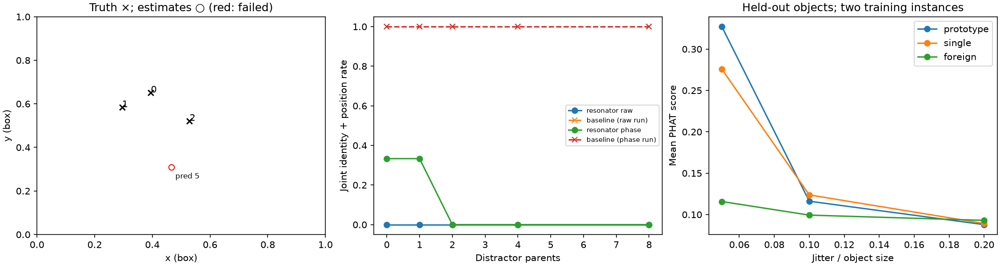

# Resonator capture experiment — Squatch Stack

CPU synthetic evidence, 2026-09-12. Correlation recovers the three held-out
identities at a sufficiently fine grid. The coarse resonator is a negative at
coarse=8 for this fixture; re-blurring does not rescue stage 1. Fine-stage
convergence is a separate diagnostic and does not establish joint recovery.
Captures and GPU measurements remain pending.

## Reproduction

```sh
HDC_BACKEND=numpy OPENBLAS_NUM_THREADS=1 MPLCONFIGDIR=/tmp/rescap-mpl \
  .venv/bin/python -m bench.resonator_capture /tmp/rescap-fix-synthetic.json \
  --synthetic --dim 4096 --values 16 --coarse 8 --top-r 4 --grid 32 \
  --band-floor 0.3 --prototype --figure out/resonator_capture/where.png
HDC_BACKEND=numpy OPENBLAS_NUM_THREADS=1 MPLCONFIGDIR=/tmp/rescap-mpl \
  .venv/bin/python -m pytest tests -q --durations=10
```

The synthetic run took 135.54 seconds. Seed 0; d=4096.
The maintainer’s fixture changes are retained: sigma=0.012 box unit and
object stretch 0.08–0.2. Each object has 40–80 splats. Diffuse background is
20% of total integrated Gaussian mass; each dictionary has four unused crops.
Distractor counts are added independently shifted copies of one unrelated
parent, re-encoded on the target frequencies. They are not extra dictionary rows.

## Definitions and the five findings

1. Identity and position must be measured separately. The prior pass confused
   identities despite finding nearby positions and required half a fine step.
   The new tolerance is **max(fine_step, sigma / 2)** in box units, also stated
   in JSON. With values=16, coarse=8 it is 1/120 = 0.0083333; sigma/2=0.006.
   Identity rate is truth coverage by any returned identity; position rate is
   truth coverage by any estimate within tolerance, irrespective of identity.
   Joint rate requires both in the same estimate. The baseline selects its
   highest-scoring K queries for K truths. The resonator includes the terminal
   failed attempt in these correctness rates; convergence is reported separately.
   Position coverage is not a one-to-one assignment. Error columns match by
   identity, including failed attempts, so confused identities can have large errors.
2. Shared envelopes correlate the raw identity codewords. The maximum absolute
   off-diagonal normalized Gram entry is **0.7753 raw**
   versus **0.0914 phase-only**. Reverse what-at cleanup
   now uses phase-only identities and an aligned phase-only scene.
3. Full PHAT needs the fine grid. The object-only control scores
   **0.04585 at grid 16** (weak_peak=true) versus
   **0.98813 at grid 32**. The grid is endpoint-inclusive
   `translation_grid(32, .5) + .5`, followed by the existing three local
   refinements. A score below 0.1 is flagged as weak, not classified as absence.
   Band-limited PHAT masks blur-envelope components below 0.3 before correlating;
   normalization uses retained components, so the band score has a different scale.
4. Two causes explain the resonator negative: correlated raw identity envelopes
   and coarse spacing 0.125, much wider than the native autocorrelation scale
   (approximately 0.017). Phase-only comparison addresses the first, not the second.
   Stage 1 re-blur multiplies scene and identity spectra by
   `exp(-(coarse_sigma**2-sigma**2)*|w|**2/2)`, zeroing multiplier values below
   1e-4; identity normalization follows filtering. Stage 2 uses native spectra.
   The table below reports a diagnostic sweep without solver tuning.
   Some refined attempts converge, including spurious fixed points; this is
   not the same as stage-1 convergence or correct recovery of all three objects.
   Exact refined trajectories varied between repeated NumPy CPU calls during
   validation, with identical inputs verified unchanged. The cause has not
   been isolated; floating-point sensitivity is a possibility, not an established
   diagnosis. These are observed single-run rates, not deterministic trajectory
   guarantees. Robust controls pass; core determinism investigation is outside
   this lane’s permitted files.
5. Two jittered training instances form a phase-only sum prototype. Training
   uses independent per-splat Gaussian position noise at the stated fraction
   of maximum object span, and independent amplitude multipliers in [0.8, 1.2].
   The unmodified object in the scene is held out. The first training instance
   is the single control. The foreign prototype uses two jittered instances of
   an independently seeded foreign object. All three 5% prototypes localize
   within sigma/2 and score at least twice their foreign controls. At 10% jitter
   the positive is unreliable; at 20% it is lost. These exact scores differ from
   the maintainer’s training draws; the qualitative jitter limit agrees.

No ground truth enters the search. `prototype_search` accepts centered training
spectra and returns scores, positions and null error_box values when truth is
unavailable. The synthetic/capture evaluator attaches errors afterward. Foreign
error is distance to the held-out target position, not an asserted foreign match.

## Objects × added distractor parents

All entries are percentages. I/P/J = identity / position / joint correctness.
R = resonator, B = baseline. C = refined convergence; coarse convergence is
listed separately. Both baseline columns use the same queries for raw/phase runs.

| Objects | Distractors | R raw I/P/J | R phase I/P/J | B full I/P/J | B band 0.3 I/P/J | C raw/phase | Coarse C raw/phase |
| ---: | ---: | --- | --- | --- | --- | --- | --- |
| 1 | 0 | 100.0/0.0/0.0 | 0.0/0.0/0.0 | 100.0/100.0/100.0 | 100.0/100.0/100.0 | 100.0/0.0 | 0.0/0.0 |
| 1 | 1 | 100.0/0.0/0.0 | 0.0/0.0/0.0 | 100.0/100.0/100.0 | 100.0/100.0/100.0 | 0.0/0.0 | 0.0/0.0 |
| 1 | 2 | 100.0/0.0/0.0 | 0.0/0.0/0.0 | 100.0/100.0/100.0 | 100.0/100.0/100.0 | 100.0/0.0 | 0.0/0.0 |
| 1 | 4 | 100.0/0.0/0.0 | 0.0/0.0/0.0 | 100.0/100.0/100.0 | 100.0/100.0/100.0 | 0.0/0.0 | 0.0/0.0 |
| 1 | 8 | 100.0/0.0/0.0 | 0.0/0.0/0.0 | 100.0/100.0/100.0 | 100.0/100.0/100.0 | 0.0/0.0 | 0.0/0.0 |
| 2 | 0 | 50.0/0.0/0.0 | 50.0/50.0/50.0 | 100.0/100.0/100.0 | 100.0/100.0/100.0 | 0.0/50.0 | 0.0/0.0 |
| 2 | 1 | 50.0/0.0/0.0 | 0.0/0.0/0.0 | 100.0/100.0/100.0 | 100.0/100.0/100.0 | 0.0/0.0 | 0.0/0.0 |
| 2 | 2 | 0.0/0.0/0.0 | 50.0/0.0/0.0 | 100.0/100.0/100.0 | 100.0/100.0/100.0 | 0.0/0.0 | 0.0/0.0 |
| 2 | 4 | 50.0/50.0/50.0 | 50.0/0.0/0.0 | 100.0/100.0/100.0 | 100.0/100.0/100.0 | 50.0/0.0 | 0.0/0.0 |
| 2 | 8 | 0.0/0.0/0.0 | 100.0/50.0/50.0 | 100.0/100.0/100.0 | 100.0/100.0/100.0 | 0.0/50.0 | 0.0/0.0 |
| 3 | 0 | 0.0/0.0/0.0 | 66.7/33.3/33.3 | 100.0/100.0/100.0 | 100.0/100.0/100.0 | 0.0/50.0 | 0.0/0.0 |
| 3 | 1 | 33.3/0.0/0.0 | 66.7/33.3/33.3 | 100.0/100.0/100.0 | 100.0/100.0/100.0 | 0.0/50.0 | 0.0/0.0 |
| 3 | 2 | 33.3/0.0/0.0 | 0.0/0.0/0.0 | 100.0/100.0/100.0 | 100.0/100.0/100.0 | 0.0/0.0 | 0.0/0.0 |
| 3 | 4 | 33.3/0.0/0.0 | 0.0/0.0/0.0 | 100.0/100.0/100.0 | 100.0/100.0/100.0 | 0.0/0.0 | 0.0/0.0 |
| 3 | 8 | 0.0/0.0/0.0 | 33.3/0.0/0.0 | 100.0/100.0/100.0 | 100.0/100.0/100.0 | 0.0/0.0 | 0.0/0.0 |

Fine loads per cell are 5, 6, 7 for one, two, three objects, respectively;
coarse loads are 0.625, 0.750, 0.875. Total fine work is four times per-cell load.
Load is candidate products / dimension, not a guarantee of convergence.
JSON also retains per-attempt iterations, identity-matched errors in box,
scene, coarse-cell and fine-step units, and all baseline queries.

### Three-object baseline peaks (no distractors)

| Identity | Present | Full score | Full error (box) | Band score | Band error (box) |
| ---: | --- | ---: | ---: | ---: | ---: |
| 0 | yes | 0.4074 | 0.00194 | 0.3963 | 0.00290 |
| 1 | yes | 0.5037 | 0.00171 | 0.4937 | 0.00171 |
| 2 | yes | 0.5089 | 0.00258 | 0.5113 | 0.00258 |
| 3 | no | 0.0961 | — | 0.1731 | — |
| 4 | no | 0.0896 | — | 0.1312 | — |
| 5 | no | 0.1001 | — | 0.1982 | — |
| 6 | no | 0.0764 | — | 0.1488 | — |

### Coarse-stage re-blur: three objects, seven candidates

Percentages are stage-1 C / refined C / joint correctness. The baseline for
each row uses the undistracted scene. No re-blurred stage-1 solve converges.
Native coarse=16 can converge on some residual attempts; the full negative
is therefore not a claim that every possible refined attempt always fails.

| Coarse grid | Coarse sigma | Raw C1/C2/J (%) | Phase C1/C2/J (%) |
| ---: | --- | --- | --- |
| 8 | native | 0.0/100.0/33.3 | 0.0/50.0/33.3 |
| 8 | 0.03125 | 0.0/50.0/0.0 | 0.0/50.0/33.3 |
| 8 | 0.0625 | 0.0/50.0/0.0 | 0.0/0.0/0.0 |
| 8 | 0.125 | 0.0/0.0/0.0 | 0.0/0.0/0.0 |
| 16 | native | 33.3/66.7/0.0 | 33.3/100.0/33.3 |
| 16 | 0.03125 | 0.0/100.0/0.0 | 0.0/66.7/33.3 |
| 16 | 0.0625 | 0.0/0.0/0.0 | 0.0/50.0/33.3 |
| 16 | 0.125 | 0.0/0.0/0.0 | 0.0/0.0/0.0 |

### Prototype versus single and foreign controls

| Object | Jitter | Prototype score | Single score | Foreign score | Prototype error (box) | Single error (box) | Foreign error (box) |
| ---: | ---: | ---: | ---: | ---: | ---: | ---: | ---: |
| 0 | 5% | 0.2887 | 0.2407 | 0.1137 | 0.0048 | 0.0048 | 0.3700 |
| 1 | 5% | 0.3672 | 0.3029 | 0.1109 | 0.0017 | 0.0037 | 0.0153 |
| 2 | 5% | 0.3255 | 0.2838 | 0.1226 | 0.0028 | 0.0067 | 0.5524 |
| 0 | 10% | 0.1486 | 0.0975 | 0.0826 | 0.0048 | 0.0099 | 0.0166 |
| 1 | 10% | 0.1283 | 0.1095 | 0.1098 | 0.0235 | 0.0140 | 0.0316 |
| 2 | 10% | 0.0715 | 0.1643 | 0.1056 | 0.4742 | 0.0089 | 0.5248 |
| 0 | 20% | 0.0906 | 0.0816 | 0.1043 | 0.3601 | 0.1739 | 0.3954 |
| 1 | 20% | 0.0849 | 0.1013 | 0.0830 | 0.0532 | 0.0417 | 0.0341 |
| 2 | 20% | 0.0879 | 0.0847 | 0.0916 | 0.0209 | 0.0567 | 0.0665 |

### Composite and capacity controls

- Two-parent shifted composite: resonator I/P/J 50.0/0.0/0.0% versus baseline 100.0/100.0/100.0%; refined convergence 0.0%.
- Six objects, d=1024: resonator I/P/J 33.3/0.0/0.0% versus baseline 100.0/83.3/83.3%; refined convergence 100.0%.

The thirty seeded comparison tests retain their independent fixtures and
check rate consistency and terminal-failure behavior. Old frozen seed rates
used a different blur and metric and are no longer asserted. `--trials 30`
remains an optional inexpensive grid-8 regression, not the grid-32 measurement.



## Capture template — maintainer GPU run pending

No real captures or GPU are available here. Scene positions are offsets from
the parent cube lower corner; physical errors multiply box errors by extent.
`--instances FIRST SECOND --frame-of parent` preserves the target parent’s
normalization and physical scale before independently centering each instance.
Providing training inputs runs prototype correlation automatically; `--prototype`
explicitly requests it and rejects missing training inputs. For crops requiring
their own source-parent metadata, retain two `--instance PARENT CROP` pairs.
That paired mode also retains the position-confounded Kanerva diagnostic and
two-parent composite. It is not evidence of cross-capture discovery.

```sh
HDC_BACKEND=numpy .venv/bin/python -m bench.resonator_capture /tmp/rescap-capture.json \
  "$SCENES/wilsons-creek.spz" --crop "$SCENES/wilsons-creek-gun.spz" \
  --instances "$SCENES/cannon.spz" "$SCENES/research-library-cannon.spz" \
  --frame-of parent --sigma-units 0.5 --dim 8192 --grid 32 --prototype
# Repeat with --band-floor 0.3; use the established CUDA launcher on the GPU.
# Repeat resonator diagnostics with --identity-phase-only and --coarse-sigma 0.0625.
```

Without --sigma-units, capture blur defaults to first target crop size / 8.
`--candidate PARENT CROP` supplies additional centered identities.
`--distractor PARENT` adds translated unrelated parents; `--shift` is in box units.
Queries outside the [0,1] search bounds cannot be located. All heavy spectral
evaluation routes through existing holo calls for backend dispatch. The batched
baseline shares the coarse multi-channel decode and is checked numerically
against `bench.place_recognition.correlate` at whitening 0, 0.5 and 1.

| Parent/query | Mode | Objects × distractors | Resonator/baseline | Error | Convergence | Prototype / Kanerva | Composite |
| --- | --- | --- | --- | --- | --- | --- | --- |
| Wilsons creek / gun | raw | pending | pending | pending | pending | pending | pending |
| Wilsons creek / gun | phase-only | pending | pending | pending | pending | pending | pending |
| Redrock / cairn | raw | pending | pending | pending | pending | n/a | pending |
| Redrock / cairn | phase-only | pending | pending | pending | pending | n/a | pending |

Our coarse-cell ranking, refinement, metrics and spectral-scene definitions
are ours, not a reproduction of the hierarchical translation/rotation network
in [arXiv:2208.12880](https://arxiv.org/abs/2208.12880); its abstract was read.

## Validation

Pre-flight: `<worktree>/holo/__init__.py`.
Full suite: **408 passed, 9 skipped in 40.78s**.
Lane suite: **55 passed in 20.86s**; slowest test **1.73s**.
Ruff: **All checks passed!** for both lane Python files.
Quality: **lint debt: 50 (baseline 50)**.
Strict facts: **0 FAIL, 25 WARN**; no tests.count failure.
The failure-serialization test uses the specified coarse_sigma=1/8 phase-only
three-object diagnostic. Re-blur tests check stage-1 nonconvergence independently
of refined convergence. The full synthetic sweep retains default native results.
Correlation acceptance tests use a fixed every-other-frequency subset of the
4096-frequency fixture to satisfy the CPU timing limit; all report measurements
use the full 4096 frequencies.
No commits, pushes, branch changes, package installs or core/library edits.
The existing figure registration row is retained; it already reproduces this figure.

## Captures (2026-09-12, RTX 5090, d=8192, σ_rec = 0.5 scene units, grid 32, band floor 0.3)

Parent `wilsons-creek` (cube 40.4 units), crop `wilsons-creek-gun`;
parent `redrock` (cube 19.2), crop `redrock-cairn`. Whitened one-shot
correlation is the reference; the resonator runs beside it.

| parent | distractor parents added | correlate: score, error | resonator |
|---|---:|---|---|
| wilsons-creek | 0 | 0.769, 0.004 box (0.15 units) | wrong position, not converged |
| wilsons-creek | 1 / 2 / 4 / 8 | 0.744 / 0.736 / 0.705 / 0.652, all 0.004 | wrong, not converged |
| redrock | 0 | 0.993, 0.028 box (0.5 units) | 0.028, converged |
| redrock | 1 / 2 / 4 / 8 | 0.634 → 0.318, error 0.744 (peak at the cube edge) | same wrong peak |

The resonator does not localise on captures, as on the fixture. The
correlate finds the gun in its parent under eight added parents, and
loses the cairn to the first one: a distractor parent translated by a
random shift carries mass out of the cube and the search stops at the
boundary, which is where the peak goes. That is a defect in the
distractor construction, not a result about the descriptor.

### The prototype question, with its controls

| target | probe | score | error (scene units) |
|---|---|---:|---:|
| wilsons-creek (gun) | prototype(cannon ⊕ research-library-cannon) | 0.436 | 0.72 |
| wilsons-creek (gun) | cannon alone | 0.307 | 2.34 |
| wilsons-creek (gun) | **foreign** prototype(cairn ⊕ saguaro) | 0.409 | 0.69 |
| wilsons-creek (gun) | **foreign** cairn alone | 0.471 | 0.38 |
| research-library (its cannon) | prototype(cannon ⊕ wilsons-creek-gun) | 0.317 | 1.33 |
| research-library (its cannon) | cannon alone | 0.399 | 2.53 |

The first row looked like discovery by association — two cannon
instances superposed find a third they have never seen — and the third
and fourth rows say it is not: a prototype of a rock pile and a cactus
finds the gun just as well, and the rock pile alone finds it better.
Anything compact correlates to the place where the parent's mass is
concentrated, and in Wilson's Creek that place is the gun
(`results/place_recognition.md`: half the capture's alpha mass sits
within 0.1 of the cube of its centre).

### The discriminating test (`results/resonator_diagnostics/composite_test.py`)

Two candidate objects in one frame: the gun where it is in
wilsons-creek, plus the cairn's splats placed at (0.2, 0.5, 0.2) of the
same cube. Which does each probe prefer?

```
probe                                 score   d(gun) d(cairn)  nearer
prototype(cannon, rlib-cannon)        0.481    0.413    0.005  cairn
cannon alone                          0.504    0.377    0.066  cairn
rlib-cannon alone                     0.506    0.407    0.005  cairn
prototype(saguaro, oak) [foreign]     0.434    0.417    0.060  cairn
cairn alone [the other object]        0.898    0.410    0.005  cairn
gun itself [ceiling]                  0.269    0.384    0.025  cairn
```

Every probe — the gun's own codeword included — lands on the cairn. The
placed cairn is 368k splats in a 3.8-unit region, denser than anything
in the parent, and at σ_rec = 0.5 units a whitened correlation against
a d=8192 fingerprint scores compact mass, not identity. Identity
discrimination between objects of a real capture does not happen at
this resolution and dimension; it is the same limit the place lane hit,
seen from the object side.

## Conclusion

- Resonator Stage 1: negative. The resonator does not converge on
  spectral bundles of captures; whitened correlation localises, and
  only when the target is the scene's dominant mass.
- The analogy question: **not answerable on this corpus by this
  descriptor.** The synthetic positive (5% jitter) is real but the
  captures show the score is carried by compact mass, and a foreign
  prototype matches as well as the class prototype. What would answer
  it: identity codewords that discard the mass envelope more fully
  than phase projection does (a resolution-matched, whitened *and*
  mass-normalised codeword), tested on a composite with two candidates
  of comparable mass — the test above, with the mass balanced.
