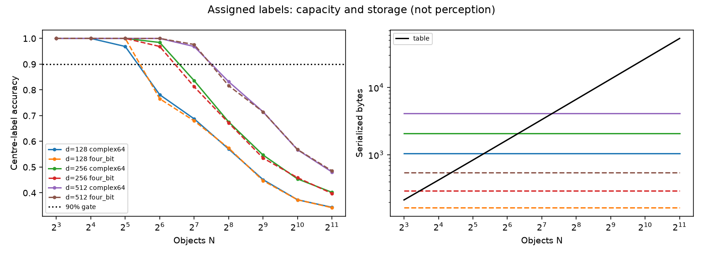

# Semantic memory: preregistered gates

1. **90% accuracy with strictly fewer bytes — PASS at four-bit magnitude +
   four-bit phase.** The first tested crossover is **N=8, d=128** in both
   runs: **100%** accuracy versus the exact table's **100%**, **165 B <
   215 B**. This is the lower end of the tested grid, not a measured minimum
   over smaller N. Complex64 has **no qualifying crossover** in either
   grid: for complex64 alone this is a **"queryable by algebra" wedge and
   not a "less memory" wedge**. The memory gate passes only at the measured
   quantized operating point, for the limited query contract below.
2. **Capacity knee within a factor of 2 — PASS, exactly on the upper
   boundary.** At d=128/256/512, predicted N is **256/512/1024** and the
   first measured accuracy <=50% occurs at **512/1024/2048**, respectively,
   in both runs. Measured/predicted is **2.00** in all six cases. The
   prediction uses sigma=sqrt(N R/(2d))=1, R=1. The knee is the
   preregistered 50% four-class accuracy threshold, not the 90% memory
   threshold. Powers-of-two sampling brackets rather than precisely locates
   the underlying knee; this is weak boundary evidence, not a fitted law.
3. **Frequency encoding separates pairs by at least 2 sigma — FAIL;
   select codewords.** At the preregistered N=512, d=256, the capture-region
   proxy gives **0.697 sigma < 2 sigma** and synthetic gives **0.679 sigma
   < 2 sigma**. The open-vocabulary form was **measured and rejected rather
   than not tried**, specifically for the fixed frequency-encoded continuous
   proxy below. It is not evidence that actual CLIP embeddings fail. No
   bandwidth, load, or dimensionality was retuned to rescue this rejection.

The gates and their operational definitions were written into
`bench/semantic_memory.py`'s module docstring in a separate write before
any experiment implementation. The attribute-field demo was read first.
The first experiment run used `data/fixtures/wilsons-creek-core.spz`;
synthetic measurements and tests followed it. No GPU was used.

## Inputs and query contract

The capture run partitions the genuine crop into occupied 3-cm voxels,
selects N regions without replacement, and assigns balanced class IDs
0..3 with seed 17. Each region represents all splats in its voxel; there
are no per-splat semantic payloads. Voxel centres and half-widths form
object-region proxies, not detected or human-labelled objects. This is
an assigned-payload check on capture-derived spatial support. It is not
a perception result or a benchmark of the scene's object statistics.

The synthetic fixture has separated 3-D boxes on a 0.1-spaced lattice,
centre jitter +/-0.005, and independent half-widths in [0.005, 0.01].
Both runs use four balanced classes, seed 17, a shared positional kernel
sigma=0.01, and the same complete structured input array for both stores.
All N object centres are queried. Exact nearest-centre lookup is the
baseline; its accuracy is 100% on every row. Holographic readout uses the
existing AttributeSplatField/accel path with the positive position sign.
There is no geometric-identity or perception stage. The table is a plain
uncompressed array with a brute-force nearest-neighbour query, not an
optimized spatial index or a claim about the best possible table codec.

The experiment tests class lookup at supplied centres, not arbitrary
within-extent queries, extent recovery, empty-space detection, or open-set
rejection. Extents are supplied identically and retained in the required
exact-table baseline; the semantic vector does not preserve individual
extents. Thus the two stores do not have equal reconstruction capability.
The hologram is not a lossless substitute for the table. A label-only or
compressed baseline is a separate comparison, and could remove the byte
advantage. The centre-only scope is material to this provisional memory
result.

`query_where_is(hologram, label, points)` filters external candidate
positions using decoded class membership; it retains no candidate list or
object positions. The table can enumerate exact stored positions without
candidates. The hologram's interface needs candidates and can return false
memberships at high load; it does not recover arbitrary continuous object
coordinates from the vector alone. If an application must retain an
object-centre candidate list solely to support this operation, add **12N B**
to the hologram side. At N=8 this would make **261 B > 215 B**, removing
that crossover for the combined service. The reported memory gate concerns
`what_is_at`, as preregistered, not equal standalone `where_is` capability.

## Byte arithmetic and timing

Both store objects retain only a serialized byte string. Every query
reconstructs its decoder from it; there is no retained scene cache, splat
list, codebook, embedding array, frequency matrix, or uncounted metadata.
The serialized sizes are checked against the actual byte strings, including
an odd-dimension quantization case.

* Exact table: 7-B `<2sBI` header (magic, version, object count) +
  N x (3 x float32 position + 3 x float32 extent + uint16 label) =
  **7 + 26N B**, with no record padding.
* Hologram: 21-B `<2sBIIHHfBB` header (magic, version, d, seed, class count,
  field count, sigma, encoding, precision) + d complex64 = **21 + 8d B**.
* Four-bit operating point: the same 21-B header + the existing HG codec's
  16-B header (magic, version, bits, dimension, scale, gamma) + separately
  packed four-bit magnitude and phase streams = **37 + 2 ceil(d/2) B**,
  or **37 + d B** for these even dimensions. This is eight bits total per
  complex component, not four bits total and not phase-only projection.
  Gamma is the existing fixed 0.5; decoded quantized values are actually
  queried. No analytic accuracy is substituted for measurement.

The four classes are numeric IDs; no external natural-language vocabulary
is assumed. Frequencies and deterministic FHRR codewords are regenerated
from counted metadata. Serialized persistent memory is the axis here, not
peak process RAM: Python objects, decoder workspace, and the external query
batch are excluded on both sides. In particular, frequency and class-channel
working arrays grow with d and class count, so a serialized byte result is
not a peak-RAM result. This fixed four-class test does not establish capacity
as the vocabulary grows; it needs no large-vocabulary factorized cleanup.

Latency is microseconds per point, computed from median wall time over
three full-centre query batches after one warmup. It includes deserialization,
regeneration of codebooks/frequencies, and readout or table scanning. It
excludes encoding and query-point construction, and amortizes setup across
N queries. These are CPU batch latencies, not isolated-request latency or
A100/5090 numbers. The expected small-N table advantage is visible. Run-to-run
timing variation does not affect the accuracy or byte gates.

Each table cell below is **accuracy % / serialized B / microseconds per
query**. All rows use R=1. Separate tables keep the first capture-derived
measurement distinct from the synthetic capacity fixture.

## Capture-derived regions (first run)

| N | d | sigma | Exact table: % / B / us | Complex64: % / B / us | Four-bit: % / B / us |
|---:|---:|---:|---:|---:|---:|
| 8 | 128 | 0.177 | 100.00 / 215 / 1.271 | 100.00 / 1045 / 19.364 | 100.00 / 165 / 21.000 |
| 8 | 256 | 0.125 | 100.00 / 215 / 1.088 | 100.00 / 2069 / 26.953 | 100.00 / 293 / 25.729 |
| 8 | 512 | 0.088 | 100.00 / 215 / 1.146 | 100.00 / 4117 / 33.661 | 100.00 / 549 / 36.766 |
| 16 | 128 | 0.250 | 100.00 / 423 / 0.849 | 100.00 / 1045 / 13.706 | 100.00 / 165 / 11.607 |
| 16 | 256 | 0.177 | 100.00 / 423 / 0.758 | 100.00 / 2069 / 13.242 | 100.00 / 293 / 14.474 |
| 16 | 512 | 0.125 | 100.00 / 423 / 0.753 | 100.00 / 4117 / 20.310 | 100.00 / 549 / 23.122 |
| 32 | 128 | 0.354 | 100.00 / 839 / 0.868 | 96.88 / 1045 / 6.133 | 100.00 / 165 / 6.634 |
| 32 | 256 | 0.250 | 100.00 / 839 / 0.828 | 100.00 / 2069 / 8.951 | 100.00 / 293 / 9.678 |
| 32 | 512 | 0.177 | 100.00 / 839 / 0.832 | 100.00 / 4117 / 13.270 | 100.00 / 549 / 16.074 |
| 64 | 128 | 0.500 | 100.00 / 1671 / 1.390 | 82.81 / 1045 / 4.365 | 82.81 / 165 / 6.283 |
| 64 | 256 | 0.354 | 100.00 / 1671 / 1.359 | 96.88 / 2069 / 7.299 | 96.88 / 293 / 7.313 |
| 64 | 512 | 0.250 | 100.00 / 1671 / 1.382 | 100.00 / 4117 / 13.419 | 100.00 / 549 / 13.375 |
| 128 | 128 | 0.707 | 100.00 / 3335 / 2.753 | 67.19 / 1045 / 3.463 | 60.94 / 165 / 3.539 |
| 128 | 256 | 0.500 | 100.00 / 3335 / 2.742 | 80.47 / 2069 / 5.962 | 80.47 / 293 / 6.144 |
| 128 | 512 | 0.354 | 100.00 / 3335 / 2.742 | 94.53 / 4117 / 11.090 | 92.97 / 549 / 11.305 |
| 256 | 128 | 1.000 | 100.00 / 6663 / 5.628 | 53.12 / 1045 / 3.132 | 54.69 / 165 / 3.342 |
| 256 | 256 | 0.707 | 100.00 / 6663 / 5.387 | 66.02 / 2069 / 5.658 | 64.45 / 293 / 5.505 |
| 256 | 512 | 0.500 | 100.00 / 6663 / 5.437 | 81.64 / 4117 / 11.078 | 81.64 / 549 / 10.538 |
| 512 | 128 | 1.414 | 100.00 / 13319 / 10.834 | 45.70 / 1045 / 0.871 | 43.55 / 165 / 2.703 |
| 512 | 256 | 1.000 | 100.00 / 13319 / 10.960 | 56.45 / 2069 / 5.190 | 57.03 / 293 / 5.240 |
| 512 | 512 | 0.707 | 100.00 / 13319 / 11.194 | 66.02 / 4117 / 11.483 | 65.04 / 549 / 7.091 |
| 1024 | 128 | 2.000 | 100.00 / 26631 / 21.053 | 38.87 / 1045 / 1.776 | 39.06 / 165 / 2.665 |
| 1024 | 256 | 1.414 | 100.00 / 26631 / 21.095 | 45.80 / 2069 / 5.033 | 46.09 / 293 / 5.090 |
| 1024 | 512 | 1.000 | 100.00 / 26631 / 21.023 | 54.30 / 4117 / 2.130 | 54.69 / 549 / 2.091 |
| 2048 | 128 | 2.828 | 100.00 / 53255 / 39.682 | 34.13 / 1045 / 0.542 | 33.94 / 165 / 0.590 |
| 2048 | 256 | 2.000 | 100.00 / 53255 / 39.851 | 38.87 / 2069 / 5.256 | 39.06 / 293 / 5.247 |
| 2048 | 512 | 1.414 | 100.00 / 53255 / 39.933 | 46.34 / 4117 / 10.051 | 46.29 / 549 / 10.113 |

## Seeded synthetic fixture

| N | d | sigma | Exact table: % / B / us | Complex64: % / B / us | Four-bit: % / B / us |
|---:|---:|---:|---:|---:|---:|
| 8 | 128 | 0.177 | 100.00 / 215 / 1.333 | 100.00 / 1045 / 23.052 | 100.00 / 165 / 30.323 |
| 8 | 256 | 0.125 | 100.00 / 215 / 1.151 | 100.00 / 2069 / 23.422 | 100.00 / 293 / 25.031 |
| 8 | 512 | 0.088 | 100.00 / 215 / 1.125 | 100.00 / 4117 / 32.240 | 100.00 / 549 / 35.604 |
| 16 | 128 | 0.250 | 100.00 / 423 / 0.836 | 100.00 / 1045 / 8.297 | 100.00 / 165 / 13.169 |
| 16 | 256 | 0.177 | 100.00 / 423 / 0.826 | 100.00 / 2069 / 9.680 | 100.00 / 293 / 10.935 |
| 16 | 512 | 0.125 | 100.00 / 423 / 0.773 | 100.00 / 4117 / 20.904 | 100.00 / 549 / 22.552 |
| 32 | 128 | 0.354 | 100.00 / 839 / 0.854 | 96.88 / 1045 / 4.306 | 100.00 / 165 / 4.901 |
| 32 | 256 | 0.250 | 100.00 / 839 / 0.918 | 100.00 / 2069 / 11.066 | 100.00 / 293 / 10.387 |
| 32 | 512 | 0.177 | 100.00 / 839 / 0.921 | 100.00 / 4117 / 16.044 | 100.00 / 549 / 16.969 |
| 64 | 128 | 0.500 | 100.00 / 1671 / 1.370 | 78.12 / 1045 / 4.468 | 76.56 / 165 / 5.645 |
| 64 | 256 | 0.354 | 100.00 / 1671 / 1.538 | 98.44 / 2069 / 3.244 | 96.88 / 293 / 3.472 |
| 64 | 512 | 0.250 | 100.00 / 1671 / 1.512 | 100.00 / 4117 / 12.571 | 100.00 / 549 / 13.352 |
| 128 | 128 | 0.707 | 100.00 / 3335 / 2.788 | 68.75 / 1045 / 1.456 | 67.97 / 165 / 1.620 |
| 128 | 256 | 0.500 | 100.00 / 3335 / 2.782 | 83.59 / 2069 / 6.339 | 81.25 / 293 / 6.092 |
| 128 | 512 | 0.354 | 100.00 / 3335 / 2.737 | 96.88 / 4117 / 3.425 | 97.66 / 549 / 11.585 |
| 256 | 128 | 1.000 | 100.00 / 6663 / 5.492 | 57.03 / 1045 / 3.410 | 57.42 / 165 / 3.017 |
| 256 | 256 | 0.707 | 100.00 / 6663 / 5.521 | 67.58 / 2069 / 1.551 | 67.19 / 293 / 1.786 |
| 256 | 512 | 0.500 | 100.00 / 6663 / 5.487 | 83.20 / 4117 / 10.538 | 81.64 / 549 / 10.875 |
| 512 | 128 | 1.414 | 100.00 / 13319 / 11.158 | 45.12 / 1045 / 2.661 | 44.73 / 165 / 0.867 |
| 512 | 256 | 1.000 | 100.00 / 13319 / 11.069 | 54.69 / 2069 / 5.266 | 53.52 / 293 / 5.332 |
| 512 | 512 | 0.707 | 100.00 / 13319 / 10.802 | 71.48 / 4117 / 2.243 | 71.48 / 549 / 2.301 |
| 1024 | 128 | 2.000 | 100.00 / 26631 / 21.035 | 37.30 / 1045 / 2.704 | 37.30 / 165 / 2.664 |
| 1024 | 256 | 1.414 | 100.00 / 26631 / 20.762 | 45.41 / 2069 / 1.097 | 45.90 / 293 / 1.125 |
| 1024 | 512 | 1.000 | 100.00 / 26631 / 20.649 | 56.74 / 4117 / 6.112 | 56.84 / 549 / 6.295 |
| 2048 | 128 | 2.828 | 100.00 / 53255 / 39.759 | 34.38 / 1045 / 0.566 | 34.23 / 165 / 0.566 |
| 2048 | 256 | 2.000 | 100.00 / 53255 / 40.561 | 40.19 / 2069 / 1.279 | 39.75 / 293 / 5.535 |
| 2048 | 512 | 1.414 | 100.00 / 53255 / 41.356 | 48.10 / 4117 / 10.474 | 48.54 / 549 / 10.780 |

## Crossover, capacity and encoding details

The first qualifying quantized N by d=128/256/512 is 8/16/32 in both
runs, and the global first tested crossover is N=8. No complex64 row has
both the accuracy and byte advantage. Nothing below N=8 was measured.

| d | Predicted sigma=1 N | Capture measured <=50% N | Synthetic measured <=50% N | Ratio, both | Side of factor-two gate |
|---:|---:|---:|---:|---:|---|
| 128 | 256 | 512 | 512 | 2.00 | PASS, upper boundary |
| 256 | 512 | 1024 | 1024 | 2.00 | PASS, upper boundary |
| 512 | 1024 | 2048 | 2048 | 2.00 | PASS, upper boundary |

Continuous inputs are four seeded normalized 32-D Gaussian embedding
proxies, transformed by unit-bandwidth Gaussian frequencies into complex
phasors. Matching pairs are a centre query and its assigned embedding;
nonmatching pairs are that query and each other embedding. Separation is
mean matching score minus mean nonmatching score, divided by the sample
standard deviation of nonmatching scores pooled across the target-load
query set. The measured floor includes finite-code correlations and spatial
interference; it is not an independently fitted Gaussian-noise model.
There is no CLIP dependency, language supervision, synonym test, or actual
image/text embedding corpus. The codeword branch is nearest-cleanup to the
four known IDs given as identical inputs to both stores.

| Input | Match mean | Nonmatch mean | Separation | Measured floor | Separation / floor | Required | Decision |
|---|---:|---:|---:|---:|---:|---:|---|
| Capture regions | 1.041880 | 0.326520 | 0.715361 | 1.026273 | 0.697047 | 2 | Reject; codewords |
| Synthetic | 0.837541 | 0.206160 | 0.631381 | 0.930272 | 0.678706 | 2 | Reject; codewords |

The encoding fork is one target-load call in each sweep and completed as
part of the CPU runs, well below one hour. Rejection is a result, not a
reason to add another bandwidth knob. The target load itself is already
past the codeword branch's 90% accuracy range.

Record payload tests exercise genuine RecordSpace role-filler sums with
R=1 and R=3 at d=256 and d=768, respectively. Signal-component power scales
with R; payload bytes are 2048 and 6144, plus the same 21-byte header.
Scaling d by R keeps 2d/R=512 and both low-load centre queries exact.
This tests the field-count budget, not a measured full multi-field capacity
curve; the main gate uses class-only R=1. Extent and colour reconstruction
were not claimed or tested by that curve.



## The memory line is not flat, and that is the wedge's real answer

The wedge in `docs/related-work.md` describes "the plot where the
hologram's memory line is flat while every baseline grows with N". The
rows above say it is not flat. Reading the smallest dimension that
still holds the 90% gate at each object count:

| objects | smallest d holding >=90% | four-bit bytes | exact table bytes | advantage |
|---:|---:|---:|---:|---:|
| 32 | 128 | 165 | 839 | 5.1x |
| 64 | 256 | 293 | 1,671 | 5.7x |
| 128 | 512 | 549 | 3,335 | 6.1x |
| 256 | none tested holds it | — | 6,663 | — |

**The dimension has to double as the object count doubles**, which is
what the capacity law says it must: holding `sigma ~ sqrt(N R / 2d)`
fixed while N grows requires d to grow with it. So the hologram's bytes
grow linearly in N exactly as the table's do, and what the
representation buys is **a constant factor of about 6x**, not an
asymptotic win. Three points is three, and d=512 was the largest tested
so the N=256 row is a grid limit rather than a wall — but the slope is
the point, and the slope is the same.

That is a correction to the wedge rather than to this experiment. A
constant factor of six at equal accuracy is still worth having, and it
sits beside the algebraic-query capability rather than replacing it.
What it is not is orders of magnitude, and the wedge should stop saying
so before anyone repeats it outside this repository.

The complex64 result sharpens the same point: at full precision there
is **no qualifying crossover at any tested N**, because the fixed
vector costs more than the table it is meant to replace until the load
where its own accuracy has already gone. The memory argument exists
only at the quantized operating point, which ties it directly to the
four-bit knee (`results/quant_lowbit.md`) — the knee is not a storage
curiosity, it is the precondition for this wedge having a claim at all.

## What a labelled real scene could change

A labelled scene can change object spacing and overlap, class imbalance,
label ambiguity, vocabulary size, embedding similarity, query offsets from
centres, extent-dependent answers, and the candidate-generation cost for
localization. The capture-derived regions here supply spatial support but
not those statistics or semantic ground truth. The maintainer's next pass
needs labelled objects and the same query contract on both stores; it
could shift or eliminate this small closed-set quantized crossover. This
capacity-and-budget result does not settle the embodied-agent spatial-memory
wedge, and no other paper's measurements are reproduced or compared here.

## Reproduction and verification

Run from this worktree, capture command first:

```sh
.venv/bin/python -c "import holo, bench; print(holo.__file__)"
HDC_BACKEND=numpy OPENBLAS_NUM_THREADS=1 MPLCONFIGDIR=/tmp/semantic-mpl .venv/bin/python -m bench.semantic_memory --capture data/fixtures/wilsons-creek-core.spz
HDC_BACKEND=numpy OPENBLAS_NUM_THREADS=1 MPLCONFIGDIR=/tmp/semantic-mpl .venv/bin/python -m bench.semantic_memory --synthetic --figure results/semantic_memory.png
HDC_BACKEND=numpy OPENBLAS_NUM_THREADS=1 MPLCONFIGDIR=/tmp/semantic-mpl .venv/bin/python -m pytest tests/test_semantic_memory.py -q --durations=6
HDC_BACKEND=numpy OPENBLAS_NUM_THREADS=1 MPLCONFIGDIR=/tmp/semantic-mpl .venv/bin/python -m pytest tests -q
.venv/bin/ruff check bench/semantic_memory.py tests/test_semantic_memory.py
HDC_BACKEND=numpy .venv/bin/holo-quality check
HDC_BACKEND=numpy .venv/bin/holo-facts check --strict
```

Pre-flight resolved `holo/__init__.py` inside this worktree (exact output
is in the final report). New tests: **6 passed in 14.34s**, each measured
call <=0.02s; the initial process included Matplotlib font-cache startup.
Full suite: **649 passed, 5 skipped in 49.46s**. Ruff: **All checks passed!**
Strict facts: **0 FAIL, 25 WARN** (no tests.count FAIL).

Quality exits successfully but prints **lint debt: 49 (baseline 50)**,
not the brief's expected 50. The ratchet comparison identifies the sole
improvement as pre-existing `holo/fit.py::PLR0915` (1 to 0). This lane did
not edit that file or the baseline, and did not add lint debt to force an
exact number. Repeating the console checks with `PYTHONPATH=.` gave the
same results. This discrepancy is the only unmet literal check expectation;
any baseline adjustment belongs to the maintainer outside this lane.

Files created: `bench/semantic_memory.py`, `tests/test_semantic_memory.py`,
`results/semantic_memory.md`, `results/semantic_memory.png`.
Modified: one provenance row in `docs/figures.md`. No commits, pushes,
branch changes, package installations, or out-of-lane source edits.

## Real annotations: the operating point is not where the knee is

Measured 2026-09-13 on **600 real ARKitScenes scans**
(`results/semantic_diagnostics/arkit_objects.py`). Only the 3D
object-detection annotation JSONs were fetched — about 7 MB in total —
because this experiment's unit is an object, not geometry. The full
3DOD release is 623 GB and none of it is needed to answer this.

**Real annotated rooms do not reach the knee, or anywhere near it.**

| objects per scan | min | p25 | median | p75 | p95 | max |
|---|---:|---:|---:|---:|---:|---:|
| 600 scans, 19 classes | 1 | 4 | **7** | 17 | 28 | 44 |

Twelve of six hundred scans hold 32 objects. **None holds 64**, and the
synthetic sweep's best case needed 128. So the 6x byte advantage
measured above is real but sits in a regime that a 19-class furniture
benchmark never enters.

At the counts these scans actually contain:

| d | four-bit accuracy | four-bit B | table B (median) | ratio | scans won at >=90% | complex64 B | complex64 wins |
|---:|---:|---:|---:|---:|---:|---:|---:|
| 32 | 78.2% | 69 | 189 | 2.74x | 245/600 | 277 | 2/600 |
| 64 | 90.7% | 101 | 189 | **1.87x** | 317/600 | 533 | 1/600 |
| 128 | 97.5% | 165 | 189 | 1.15x | 265/600 | 1045 | 0/600 |
| 256 | 99.8% | 293 | 189 | **0.65x** | 206/600 | 2069 | 0/600 |

**Read the last two columns first.** At d=256 the hologram answers
essentially perfectly and *costs more than the table it replaces*. At
complex64 it never wins: 2 scans of 600 at the most generous setting,
none at all past d=64. The only configuration that both holds 90% and
saves bytes is d=64 at four bits, and it wins on **317 of 600 scans** —
barely more than half, because a scan with four objects is already
cheap to store exactly.

So for wedge 1 as written, on this dataset, the answer is **no**. A
median room's objects fit in 189 bytes as an exact table with perfect
recall, and no fixed-size vector improves on that by a margin worth
having.

### What that does and does not settle

It settles the *closed-vocabulary* case, and only that. These are
ARKitScenes' 19 furniture classes — cabinet, chair, table, sink and so
on — so "how many objects are in a room" here means "how many pieces of
furniture a benchmark chose to annotate". ConceptGraphs and the
open-vocabulary line build hundreds of objects per scene by detecting
whatever is there, and that is the regime where the synthetic sweep
says the advantage reaches 6x.

The honest statement is therefore conditional, and it is sharper than
the wedge it replaces: **the memory advantage exists only where the
object vocabulary is open and dense. With a closed furniture
vocabulary there is nothing to win, because the baseline is already
tiny.** That is a testable next step rather than a dead end — count the
objects an open-vocabulary detector produces per scene, and if the
median lands past 64 the claim returns.

### A schema note worth keeping

The released files carry the boxes under `segments.obb`; `obbAligned`
sits beside it. The seam had been written against `obbAligned` alone,
from the benchmark scripts. Both exist in all 6,352 objects here, so
neither reading is wrong — but the fixture had been authored from
documentation rather than from a released file, and reading one
decided it. Annotation formats are worth confirming against a real
file before a lane depends on them.

```sh
python results/semantic_diagnostics/arkit_objects.py --scans 600
```
