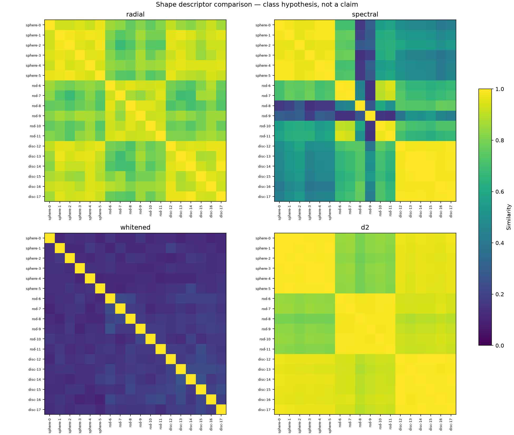

# Shape descriptors: synthetic hypothesis table

Squatch Stack research tooling. Twelve objects is a table, not a result.
No real captures or GPU were available; this is an end-to-end CPU fixture,
not evidence for capture classification.

The hypothesis under test is that independent spheres, rods and discs have
larger within-class than between-class similarity and can be retrieved by
leave-one-out nearest neighbor. The fixture has six independently sampled
filled ellipsoids per class, 96 alpha-weighted splat centres each, independent
aspect jitter, random scale, position and yaw. Pose here means yaw about y,
not arbitrary 3D rotation. This is an intentionally simple shape family.

| Descriptor | Within mean | Between mean | LOO accuracy |
| --- | ---: | ---: | ---: |
| (a) horizontal radial alpha mass | 0.939376 | 0.835741 | 18/18 = 1.000000 |
| (b) spectral radial power | 0.845095 | 0.553815 | 16/18 = 0.888889 |
| (c) searched whitened correlation | 0.171573 | 0.149216 | 11/18 = 0.611111 |
| (d) mass-weighted D2 | 0.992548 | 0.903615 | 18/18 = 1.000000 |

Seed 7; dimension 512; blur sigma 0.025 cube units; eight yaws;
three translations per axis in [-0.25, 0.25], with the existing correlation
refinement; 200,000 D2 pairs; 20 radial shells and 32-by-32 spectral bins.
Means exclude diagonals and count ordered pairs (90 within, 216 between).
The phase matrix remains directed: finite search can be asymmetric.
LOO excludes self, includes singleton classes in its denominator, and breaks
exact ties by first input index. This rule is recorded by the tool.



Reproduce the table, all four printed matrices, JSON and figure from repo root:

```sh
MPLCONFIGDIR=/tmp/shape-mpl HDC_BACKEND=numpy OPENBLAS_NUM_THREADS=1 \
  .venv/bin/python -m bench.shape_descriptor /tmp/shape-synthetic.json \
  --synthetic --dim 512 --yaws 8 --grid 3 --figure out/shape/synthetic.png
```

The smaller regression fixture deliberately uses another compute budget,
without tuning the seed to make all descriptors succeed:

| Descriptor | LOO accuracy (nine shapes) |
| --- | ---: |
| radial | 7/9 |
| spectral | 9/9 |
| whitened | 1/9 |
| D2 | 9/9 |

```sh
MPLCONFIGDIR=/tmp/shape-mpl HDC_BACKEND=numpy .venv/bin/python \
  -m bench.shape_descriptor /tmp/shape-test.json --synthetic \
  --dim 128 --yaws 4 --grid 1 --pairs 5000 --per-kind 3
```

`--grid 1` means the zero translation only. Failures are asserted as measured
in the seeded regression, as requested; higher accuracy is not assumed.
The large change in whitened accuracy underlines its dependence on search,
frequency sampling and independently sampled fine structure.

## Definitions and the requested invariance limits

Read prior-art summary: [Shape Distributions (2002)](https://gfx.cs.princeton.edu/gfx/pubs/Osada_2002_SD/index.php).
D2 there concerns distances between random surface points. Our adaptation
samples splat centres with alpha probabilities, with replacement and self
pairs, divided by the supplied cube extent. This is our implementation and
sampling definition, not a reproduction of a published codebase. Distances
use fixed bins from zero to sqrt(3); Gaussian covariance is not sampled.
Radial mass uses horizontal distance from the unit cube centre, default
shell width 0.05. Spectral power uses the existing horizontal-radius/signed-y
frequency bins and fingerprint blur. Phase similarity uses existing PHAT
correlation, taking the best supplied yaw.

The requested exact yaw invariance is mathematically incompatible with the
specified definitions. We retained the definitions instead of altering them:

- The lifted `core_box` uses coordinatewise weighted medians and a weighted
  L-infinity radius. Translation and uniform scale cancel when recropping,
  but both the centre and extent can change under yaw. Crop membership can
  change too. Real file quantization and existing scale clipping introduce
  additional rounding/boundary qualifications.
- In a fixed centred frame, radial mass and D2 are yaw invariant to rounding
  (D2 uses identical seeded pairs). Recomputing the core cube can break both.
- Existing finite iid `radial_power` bins are not an analytic azimuthal
  average. A seeded yaw counterexample yields cosine below 0.99; asserting
  equality to rounding would falsely certify the implementation.
- Whitened matching passes the requested 0.01 tolerance for inverse rotations
  on the search lattice. Arbitrary off-lattice yaw has no such guarantee.

Tests cover translation and scale cancellation including covariance, fixed
frame yaw, lattice yaw recovery, both counterexamples, mass-weighted D2,
report accounting, JSON round trips and a mocked capture-loader path through
`core_box` and `build_scene_fixed`. New tests run below the requested limits.

## Corpus hypothesis and command for the maintainer

The brief overlaps two classes: oak and redrock are both named objects and
wide parents. A single `{filename: class}` cannot give them both labels.
The primary hypothesis below gives precedence to the explicit object lists:
guns {cannon, research-library-cannon, wilsons-creek-gun}; plants {oak,
saguaro}; buildings {brookline-station, brookline-station-2,
springhouse-outside}; rock {redrock, redrock-cairn}; scenes contains the
remaining wide parents {research-library, wilsons-creek}. This yields twelve
files and preserves the requested object classes. It must be reviewed as a
hypothesis, not treated as ground truth.

Create the hypothesis file outside the lane's file matrix:

```sh
cat > /tmp/shape-labels.json <<'JSON'
{
  "cannon.spz": "guns",
  "research-library-cannon.spz": "guns",
  "wilsons-creek-gun.spz": "guns",
  "oak.spz": "plants",
  "saguaro.spz": "plants",
  "brookline-station.spz": "buildings",
  "brookline-station-2.spz": "buildings",
  "springhouse-outside.spz": "buildings",
  "redrock.spz": "rock",
  "redrock-cairn.spz": "rock",
  "research-library.spz": "scenes",
  "wilsons-creek.spz": "scenes"
}
JSON
HDC_BACKEND=numpy .venv/bin/python -m bench.shape_descriptor \
  /tmp/shape-corpus.json \
  "$SCENES/cannon.spz" "$SCENES/research-library-cannon.spz" \
  "$SCENES/wilsons-creek-gun.spz" "$SCENES/oak.spz" "$SCENES/saguaro.spz" \
  "$SCENES/brookline-station.spz" "$SCENES/brookline-station-2.spz" \
  "$SCENES/springhouse-outside.spz" "$SCENES/redrock.spz" \
  "$SCENES/redrock-cairn.spz" "$SCENES/research-library.spz" \
  "$SCENES/wilsons-creek.spz" --labels /tmp/shape-labels.json \
  --dim 8192 --yaws 16 --grid 32 --figure /tmp/shape-corpus.png
```

`SCENES` must be set to the capture directory. This is a reproducible CPU
command; capture-scale execution is deferred to the maintainer's GPU setup.
Encoding/decoding goes through existing holo dispatch calls. The GPU backend
can be installed by the existing `bench.cuda_backend.install()` wrapper
before invoking this module's `main`; do not force numpy in that GPU run.
The corpus figure goes to `/tmp` because adding another tracked figure and
registry row is outside this lane. If publishing it under `out/shape`, the
maintainer must add its provenance row.

A separate sensitivity hypothesis can relabel oak and redrock as `scenes`
to put all four wide parents together. That leaves plants and rock as
singletons; their unavoidable LOO misses must not be silently excluded.
No corpus run or alternate-label result is reported here.

## Validation

`HDC_BACKEND=numpy .venv/bin/python -m pytest tests -q` (with a writable
`MPLCONFIGDIR`): **359 passed, 9 skipped in 30.22s**. The new file alone:
**6 passed in 0.82s**, slowest test **0.18s**.

`.venv/bin/ruff check bench/shape_descriptor.py tests/test_shape_descriptor.py`:
**All checks passed!** `.venv/bin/holo-quality check`:
**lint debt: 50 (baseline 50)**. `.venv/bin/holo-facts check --strict`:
**0 FAIL, 25 WARN**; there was no `tests.count` failure to repair in this run.
The figure was rendered and visually inspected. No commits, pushes, branch
changes, package installs or changes outside the exclusive file matrix.
